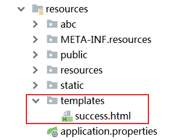

# 01、基础入门-SpringBoot-HelloWorld

## 系统要求

+ Java8
+ Maven3.3+

## Maven配置文件settings.xml

新添内容：

```xml
<mirrors>
	<mirror>
		<id>nexus-aliyun</id>
		<mirrorOf>central</mirrorOf>
		<name>Nexus aliyun</name>
		<url>http://maven.aliyun.com/nexus/content/groups/public</url>
	</mirror>
</mirrors>

<profiles>
	<profile>
		<id>jdk-1.8</id>

		<activation>
			<activeByDefault>true</activeByDefault>
			<jdk>1.8</jdk>
		</activation>

		<properties>
			<maven.compiler.source>1.8</maven.compiler.source>
			<maven.compiler.target>1.8</maven.compiler.target>
			<maven.compiler.compilerVersion>1.8</maven.compiler.compilerVersion>
		</properties>
	</profile>
</profiles>
```

## HelloWorld项目

需求：浏览器发送/hello请求，响应“Hello SpringBoot 2”

#### 创建Maven工程

**<span style="color:red">1、引入依赖</span>**

```xml
<parent>
	<groupId>org.springframework.boot</groupId>
	<artifactId>spring-boot-starter-parent</artifactId>
	<version>2.3.4.RELEASE</version>
</parent>

<dependencies>
	<dependency>
		<groupId>org.springframework.boot</groupId>
		<artifactId>spring-boot-starter-web</artifactId>
	</dependency>
</dependencies>
```

**<span style="color:red">2、创建主程序</span>**

```java
import org.springframework.boot.SpringApplication;
import org.springframework.boot.autoconfigure.SpringBootApplication;

@SpringBootApplication
public class MainApplication {

    public static void main(String[] args) {
        SpringApplication.run(MainApplication.class, args);
    }
}
```

**<span style="color:red">3、编写业务</span>**

```java
import org.springframework.web.bind.annotation.RequestMapping;
import org.springframework.web.bind.annotation.RestController;

@RestController
public class HelloController {
    @RequestMapping("/hello")
    public String handle01(){
        return "Hello, Spring Boot 2!";
    }
}
```

**<span style="color:red">4、运行&测试</span>**

+ 运行`MainApplication`类
+ 浏览器输入`http://localhost:8888/hello2`，将会输出`Hello, Spring Boot 2`

**<span style="color:red">5、设置配置信息</span>**

在Maven的resources文件夹中创建application.properties文件

```properties
# 设置端口号
server.port=8888
```

更多的配置信息：https://docs.spring.io/spring-boot/docs/2.3.7.RELEASE/reference/html/appendix-application-properties.html#common-application-properties-server

**<span style="color:red">6、打包部署</span>**

在pom.xml中添加

```xml
<build>
	<plugins>
		<plugin>
			<groupId>org.springframework.boot</groupId>
			<artifactId>spring-boot-maven-plugin</artifactId>
		</plugin>
	</plugins>
</build>
```

在IDEA的Maven插件上点击运行clean、package，把helloworld工程打成jar包

打好的jar包被生成在helloworld工程项目的jar文件夹内

用cmd运行`java -jar boot-01-helloworld-1.0-SNAPSHOT.jar`，就可以运行helloworld项目工程。

将jar包直接在目标服务器执行即可。

# 02、基础入门-SpringBoot-依赖管理特性

+ 父项目做依赖管理

```xml
依赖管理
<parent>
	<groupId>org.springframework.boot</groupId>
	<artifactId>spring-boot-starter-parent</artifactId>
	<version>2.3.4.RELEASE</version>
</parent>

上面项目的父项目如下：
<parent>
	<groupId>org.springframework.boot</groupId>
	<artifactId>spring-boot-dependencies</artifactId>
	<version>2.3.4.RELEASE</version>
</parent>

它几乎声明了所有开发中常用的依赖的版本号，自动版本仲裁机制
```

+ 开发导入starter场景启动器

  + 见到很多`spring-boot-starter-* `：就某种场景
  + 只要引入starter，这个场景的所有常规需要的依赖我们都自动引入
  + 见到的`*-spring-boot-starter`：第三方为我们提供的简化开发的场景启动器
  + 更多的SpringBoot所有支持的场景：https://docs.spring.io/spring-boot/docs/current/reference/html/using-spring-boot.html#using-boot-starter

  ```xml
  所有场景启动器最底层的依赖
  <dependency>
  	<groupId>org.springframework.boot</groupId>
  	<artifactId>spring-boot-starter</artifactId>
  	<version>2.3.4.RELEASE</version>
  	<scope>compile</scope>
  </dependency>
  ```

+ 无需关注版本号，自动版本仲裁

  + 引入依赖默认都可以不写版本
  + 引入非版本仲裁的jar,要写版本号

+ 可以修改默认的版本号 

  + 查看`spring-boot-dependencies`里面规定当前依赖的版本用的key
  + 在当前项目里重写配置，如下面的代码

  ```xml
  <properties>
  	<mysql.version>5.1.43</mysql.version>
  </properties>
  ```

# 03、基础入门-SpringBoot-自动配置特性

+ 自动配好Tomcat

  + 引入Tomcat依赖
  + 配置Tomcat

  ```XML
  <dependency>
  	<groupId>org.springframework.boot</groupId>
  	<artifactId>spring-boot-starter-tomcat</artifactId>
  	<version>2.3.4.RELEASE</version>
  	<scope>compile</scope>
  </dependency>
  ```

+ 自动配置好SpringMVC

  + 引入SpringMVC全套组件
  + 自动配好SpringMVC常用组件(功能)

+ 自动配好web常见功能：如：字符编码问题

  + SpringBoot帮我们配置好了所有web开发的常见场景

```java
public static void main(String[] args) {
    //1、返回我们IOC容器
    ConfigurableApplicationContext run = SpringApplication.run(MainApplication.class, args);

    //2、查看容器里面的组件
    String[] names = run.getBeanDefinitionNames();
    for (String name : names) {
        System.out.println(name);
    }
}
```

+ 默认的包结构

  + 主程序所在包以及其下面的所有子包里面的组件都会默认扫描出来
  + 无需以前的包扫描配置
  + 想要改变扫描路径
    + `@SpringBootApplication(scanBasePackages="com.key")`
    + `@ComponentScan指定扫描路径`

  ```java
  @SpringBootApplication
  等同于
  @SpringBootConfiguration
  @EnableAutoConfiguration
  @ComponentScan("com.key")
  ```

+ 各种配置拥有默认值

  + 默认配置最终都是映射到某个类上，如：`MultipartProperties`
  + 配置文件的值最终会绑定每个类上，这个类会在容器中创建对象

+ 按需加载所有自动配置项

  + 非常多的starter
  + 引入了哪些场景这个场景的自动配置才会自动开启
  + SpringBoot所有的自动配置功能都在`spring-boot-autoConfigure`包里面

# 04、底层注解-@Configuration详解

+ 基本使用

  + Full模式和Lite模式
  + 示例

  ```java
  /**
   * 1、配置类里面使用@Bean标注在方法上给容器注册组件，默认也是单实例的
   * 2、配置类本身也是组件
   * 3、proxyBeanMethods：代理bean的方法
   *      Full(proxyBeanMethods = true)（保证每个@Bean方法被调用多少次返回的组件都是单实例的）（默认）
   *      Lite(proxyBeanMethods = false)（每个@Bean方法被调用多少次返回的组件都是新创建的）
   */
  @Configuration(proxyBeanMethods = false) //告诉SpringBoot这是一个配置类 == 配置文件
  public class MyConfig {
  
      /**
       * Full:外部无论对配置类中的这个组件注册方法调用多少次获取的都是之前注册容器中的单实例对象
       * @return
       */
      @Bean //给容器中添加组件。以方法名作为组件的id。返回类型就是组件类型。返回的值，就是组件在容器中的实例
      public User user01(){
          User zhangsan = new User("zhangsan", 18);
          //user组件依赖了Pet组件
          zhangsan.setPet(tomcatPet());
          return zhangsan;
      }
  
      @Bean("tom")
      public Pet tomcatPet(){
          return new Pet("tomcat");
      }
  }
  ```

  @Configuration测试代码如下:

  ```java
  @SpringBootConfiguration
  @EnableAutoConfiguration
  @ComponentScan("com.atguigu.boot")
  public class MainApplication {
  
      public static void main(String[] args) {
      //1、返回我们IOC容器
          ConfigurableApplicationContext run = SpringApplication.run(MainApplication.class, args);
  
      //2、查看容器里面的组件
          String[] names = run.getBeanDefinitionNames();
          for (String name : names) {
              System.out.println(name);
          }
  
      //3、从容器中获取组件
          Pet tom01 = run.getBean("tom", Pet.class);
          Pet tom02 = run.getBean("tom", Pet.class);
          System.out.println("组件："+(tom01 == tom02));
  
      //4、com.atguigu.boot.config.MyConfig$$EnhancerBySpringCGLIB$$51f1e1ca@1654a892
          MyConfig bean = run.getBean(MyConfig.class);
          System.out.println(bean);
  
      //如果@Configuration(proxyBeanMethods = true)代理对象调用方法。SpringBoot总会检查这个组件是否在容器中有。
          //保持组件单实例
          User user = bean.user01();
          User user1 = bean.user01();
          System.out.println(user == user1);
  
          User user01 = run.getBean("user01", User.class);
          Pet tom = run.getBean("tom", Pet.class);
  
          System.out.println("用户的宠物："+(user01.getPet() == tom));
      }
  }
  ```

+ 最佳实战
  + 配置类组件之间**<span style="color:red">无依赖关系</span>**用Lite模式加速容器启动过程，减少判断
  + 配置类组件之间有依赖关系，方法会被调用得到之前单实例组件，用Full模式(默认)

# 05、底层注解-@Import导入组件

@Bean、@Component、@Controller、@Service、@Repository、它们都是Spring的基本标签，在SpringBoot中并未改变它们原来的功能

@Import{User.class,DBHelper.class}给容器中自动创建出这两个类型的组件、默认组件的名字就是全类名

```java
@Import({User.class, DBHelper.class})
@Configuration(proxyBeanMethods = false) //告诉SpringBoot这是一个配置类 == 配置文件
public class MyConfig {
}
```

测试类

```java

//1、返回我们IOC容器
ConfigurableApplicationContext run = SpringApplication.run(MainApplication.class, args);

//...

//5、获取组件
String[] beanNamesForType = run.getBeanNamesForType(User.class);

for (String s : beanNamesForType) {
    System.out.println(s);
}

DBHelper bean1 = run.getBean(DBHelper.class);
System.out.println(bean1);
```

# 06-底层注解-@Conditional条件装配

条件装配：满足Conditional指定的条件，则进行组件注入


用@ConditionalOnMissingBean举例说明

```java
@Configuration(proxyBeanMethods = false)
@ConditionalOnMissingBean(name = "tom")//没有tom名字的Bean时，MyConfig类的Bean才能生效。
public class MyConfig {

    @Bean
    public User user01(){
        User zhangsan = new User("zhangsan", 18);
        zhangsan.setPet(tomcatPet());
        return zhangsan;
    }

    @Bean("tom22")
    public Pet tomcatPet(){
        return new Pet("tomcat");
    }
}

public static void main(String[] args) {
    //1、返回我们IOC容器
    ConfigurableApplicationContext run = SpringApplication.run(MainApplication.class, args);

    //2、查看容器里面的组件
    String[] names = run.getBeanDefinitionNames();
    for (String name : names) {
        System.out.println(name);
    }

    boolean tom = run.containsBean("tom");
    System.out.println("容器中Tom组件："+tom);//false

    boolean user01 = run.containsBean("user01");
    System.out.println("容器中user01组件："+user01);//true

    boolean tom22 = run.containsBean("tom22");
    System.out.println("容器中tom22组件："+tom22);//true
}
```

# 07-底层注解-@ImportResource导入Spring配置文件

比如：公司使用bean.xml文件配置Bean，然后你为了省事，想继续复用bean.xml，这时@ImportResource粉墨登场。

**bean.xml**

```xml
<?xml version="1.0" encoding="UTF-8"?>
<beans ...">

    <bean id="haha" class="com.lun.boot.bean.User">
        <property name="name" value="zhangsan"></property>
        <property name="age" value="18"></property>
    </bean>

    <bean id="hehe" class="com.lun.boot.bean.Pet">
        <property name="name" value="tomcat"></property>
    </bean>
</beans>
```

**使用方法**

```java
@ImportResource("classpath:beans.xml")
public class MyConfig {
...
}
```

**测试类**

```java
public static void main(String[] args) {
    //1、返回我们IOC容器
    ConfigurableApplicationContext run = SpringApplication.run(MainApplication.class, args);

	boolean haha = run.containsBean("haha");
	boolean hehe = run.containsBean("hehe");
	System.out.println("haha："+haha);//true
	System.out.println("hehe："+hehe);//true
}
```

# 08-底层注解-@ConfigurationProperties配置绑定

如何使用Java读取到properties配置文件中的内容，并且把他封装到JavaBean中，以供随时使用

**传统方法**

```JAVA
public class getProperties {
     public static void main(String[] args) throws FileNotFoundException, IOException {
         Properties pps = new Properties();
         pps.load(new FileInputStream("a.properties"));
         Enumeration enum1 = pps.propertyNames();//得到配置文件的名字
         while(enum1.hasMoreElements()) {
             String strKey = (String) enum1.nextElement();
             String strValue = pps.getProperty(strKey);
             System.out.println(strKey + "=" + strValue);
             //封装到JavaBean。
         }
     }
 }

```

**<span style="color:red">SpringBoot方式一：配置绑定</span>**

**`@ConfigrationProperties +  @Component  `**

假设有配置文件 application.properties

```properties
mycar.brand=BYD
mycar.price=100000
```

只有在容器中的组件，才会拥有SpringBoot提供的强大功能

```java
@Component
@ConfigurationProperties(prefix = "mycar")
public class Car {
...
}
```

**<span style="color:red">SpringBoot方式二：配置绑定</span>**

`@EnableConfigurationProperties` + `ConfigurationProperties`

`@EnableConfigurationProperties `的作用：

​	1.把这个Car组件自动注册到容器中

​	2.开启Car配置绑定功能

```java
@ConfigurationProperties(prefix = "mycar")
public class Car {
...
}
```

```java
@SpringBootApplication
@EnableConfigurationProperties(value = Car.class)
public class MainApplication {
    ...
}
```

# 09、自动配置【源码分析】-自动包规则原理

SpringBoot应用的启动类：

```java
@SpringBootApplication
public class MainApplication {

    public static void main(String[] args) {
        SpringApplication.run(MainApplication.class, args);
    }
}
```

**`@SpringBootApplication注解分析` **

```java
@Target(ElementType.TYPE)
@Retention(RetentionPolicy.RUNTIME)
@Documented
@Inherited
@SpringBootConfiguration
@EnableAutoConfiguration
@ComponentScan(excludeFilters = { @Filter(type = FilterType.CUSTOM, classes = TypeExcludeFilter.class),
		@Filter(type = FilterType.CUSTOM, classes = AutoConfigurationExcludeFilter.class) })
public @interface SpringBootApplication {
    ...
}
```

重点分析`@springBootConfiguration、@EnableAutoConfigration、@ComponentScan`

## @SpringBootConfiguration

```java
@Target({ElementType.TYPE})
@Retention(RetentionPolicy.RUNTIME)
@Documented
@Configuration
public @interface SpringBootConfiguration {
    @AliasFor(
        annotation = Configuration.class
    )
    boolean proxyBeanMethods() default true;
}
```

`@Configuration：`代表当前是一个配置类

## @ComponentScan

指定扫描哪些Spring注解

## @EnableAutoConfiguration

```java
@Target(ElementType.TYPE)
@Retention(RetentionPolicy.RUNTIME)
@Documented
@Inherited
@AutoConfigurationPackage
@Import(AutoConfigurationImportSelector.class)
public @interface EnableAutoConfiguration {
    String ENABLED_OVERRIDE_PROPERTY = "spring.boot.enableautoconfiguration";

    Class<?>[] exclude() default {};

    String[] excludeName() default {};
}
```

重点分析`@AutoConfigurationPackage、@Import(AutoConfigurationImportSelector.class)`

### @AutoConfigurationPackage

注解名直译：自动配置包，指定了默认的包规则

```java
@Target(ElementType.TYPE)
@Retention(RetentionPolicy.RUNTIME)
@Documented
@Inherited
@Import(AutoConfigurationPackages.Registrar.class)
public @interface AutoConfigurationPackage {
    String[] basePackages() default {};

    Class<?>[] basePackageClasses() default {};
}
```

1. 利用Registrar给容器中导入一系列(批量)组件
2. 将指定的一个包下的所有组件导入进MainApplication所在包下。

### @Import(AutoConfigurationImportSelector.class)

1. 利用`getAutoConfigurationEntry`给容器导入一系列组件。

2. 调用`List<String> configurations = getCandidateConfigurations(annotationMetadata, attributes);`获取到所有需要导入到容器中的配置类

3. 利用工厂加载`SpringFactoriesLoader.loadFactoryNames(getSpringFactoriesLoaderFactoryClass(),getBeanClassLoader());`得到所有的组件

4. 从`META-INF/spring.factories`位置来加载一个文件。

   1. 默认扫描我们当前系统里面所有`META-INF/spring.factories` 位置的文件
   2. `spring-boot-autoconfigure-2.3.4.RELEASE.jar`包里面也有`META-INF/spring.factories`

   ```properties
   # 文件里面写死了spring-boot一启动就要给容器中加载的所有配置类
   # spring-boot-autoconfigure-2.3.4.RELEASE.jar/META-INF/spring.factories
   # Auto Configure
   org.springframework.boot.autoconfigure.EnableAutoConfiguration=\
   org.springframework.boot.autoconfigure.admin.SpringApplicationAdminJmxAutoConfiguration,\
   org.springframework.boot.autoconfigure.aop.AopAutoConfiguration,\
   ...
   ```

   虽然我们127个场景的所有自动配置启动的时候默认全部加载，但是`xxxxAutoConfiguration`会根据条件装配规则(`@Conditional`)，最终会按需配置。

   如`AopAutoConfiguration` 类：

   ```java
   @Configuration(
       proxyBeanMethods = false
   )
   @ConditionalOnProperty(
       prefix = "spring.aop",
       name = "auto",
       havingValue = "true",
       matchIfMissing = true
   )
   public class AopAutoConfiguration {
       public AopAutoConfiguration() {
       }
   	...
   }
   ```

# 10、自动配置【源码分析】-自动配置流程

以`DispatcherServletAutoConfiguration`的内部类`DispatcherServletConfiguration`为例：

```java
@Bean
@ConditionalOnBean(MultipartResolver.class)  //容器中有这个类型组件
@ConditionalOnMissingBean(name = DispatcherServlet.MULTIPART_RESOLVER_BEAN_NAME) //容器中没有这个名字 multipartResolver 的组件
public MultipartResolver multipartResolver(MultipartResolver resolver) {
	//给@Bean标注的方法传入了对象参数，这个参数的值就会从容器中找。
	//SpringMVC multipartResolver。防止有些用户配置的文件上传解析器不符合规范
	// Detect if the user has created a MultipartResolver but named it incorrectly
	return resolver;//给容器中加入了文件上传解析器；
}

```

SpringBoot默认会在底层配置好所有的组件，但是**<span style="color:red">如果用户自己配置了以用户的优先</span>**

**<span style="color:red">总结：</span>**

+ SpringBoot会先加载所有的自动配置类`xxxAutoConfiguration`
+ 每个自动配置类会按照条件进行生效，默认都会绑定配置文件指定的值。(xxxProperties里面读取,xxxProperties和配置文件进行了绑定)
+ 生效的配置类就会给容器中装配很多组件
+ 只要容器中有这些组件，相当于这些功能就有了
+ 定制化配置
  + 用户直接自己@Bean替换底层的组件
  + 用户去看这个组件是获取的配置文件中的什么值，就去修改。

**xxxAutoConfiguration -------  组件  -------   xxxProperties   ------  applicaiton.properties**

# 11、最佳实践-SpringBoot应用如何编写

+ 引入场景依赖
  + 官方文档：https://docs.spring.io/spring-boot/docs/current/reference/html/using-spring-boot.html#using-boot-starter
+ 查看自己配置了哪些(选做)
  + 自己分析，引入场景对应的自动配置一般都生效了
+ 是否需要修改
  + 参照文档修改配置项
    + 官方文档：https://docs.spring.io/spring-boot/docs/current/reference/html/appendix-application-properties.html#common-application-properties
    + 自己分析。xxxProperties绑定了配置文件的哪些。
  + 自定义加入或者替换组件
    + @Bean、@Component
  + 自定义器xxxCustomizer；

# 12、最佳实践-Lombok简化开发

Lombok用注解方式代替构造器、getter/setter、toString()等方法

SpringBoot已经管理Lombok，引入依赖：

```xml
 <dependency>
     <groupId>org.projectlombok</groupId>
     <artifactId>lombok</artifactId>
</dependency>
```

IDEA中File->Settings->Plugins，搜索安装Lombok插件。

```java
@NoArgsConstructor
//@AllArgsConstructor
@Data
@ToString
@EqualsAndHashCode
public class User {

    private String name;
    private Integer age;

    private Pet pet;

    public User(String name,Integer age){
        this.name = name;
        this.age = age;
    }
}
```

**简化日志开发**

```java
@Slf4j
@RestController
public class HelloController {
    @RequestMapping("/hello")
    public String handle01(@RequestParam("name") String name){
        log.info("请求进来了....");
        return "Hello, Spring Boot 2!"+"你好："+name;
    }
}
```

# 13、最佳实践-dev-tools

**添加依赖**

```xml
<dependencies>
    <dependency>
        <groupId>org.springframework.boot</groupId>
        <artifactId>spring-boot-devtools</artifactId>
        <optional>true</optional>
    </dependency>
</dependencies>
```

在IDEA中，项目修改之后：Ctrl+F9 

# 14、最佳实践-Spring-Initailizer

Spring Initailizr官网：https://start.spring.io/

在IDEA中，菜单栏New -> Project -> Spring Initailizr。

# 15、配置文件-yaml用法

YAML是“YAML Ain't Markup Language”（YAML 不是一种标记语言）的递归缩写。在开发的这种语言时，YAML的意思是：“Yet Another Markup Language”（仍是一种标记语言） 

**非常适合用来做以数据为中心的配置文件**

## 基本语法

+ key：value； value之前有空格
+ 大小写敏感
+ 使用缩进表示层级关系
+ 缩进不允许使用tab，只允许空格
+ 缩进的空格数量不重要，只要相同层级的元素左对齐即可
+ “#”表示注释
+ 字符串无需加引号，如果要加，单引号、双引号表示字符串内容会被转义、不转义。

## 数据类型

+ 字面量：单个的、不可再分的值。date、boolean、string、number、null

  ```properties
  k: v
  ```

+ 对象：键值对的集合。map，hash，set，object

```properties
# 行内写法：
k:{k1:v1,k2:v2,k3:v3}
#或者
k: 
 k1: v1
 k2: v2
 k3: v3
```

+ 数组：一组按次序排列的值。array，list，queue

```properties
#行内写法：
k: [v1,v2,v3]

#或者
k:
 - v1
 - v2
 - v3
```

## 示例

```java
@Data
public class Person {
    private String userName;
    private Boolean boss;
    private Date birth;
    private Integer age;
    private Pet pet;
    private String[] interests;
    private List<String> animal;
    private Map<String, Object> score;
    private Set<Double> salarys;
    private Map<String, List<Pet>> allPets;
}

@Data
public class Pet {
    private String name;
    private Double weight;
}
```

用YAML表示上面的对象

```yaml
person:
  userName: zhangsan
  boss: false
  birth: 2019/12/12 20:12:33
  age: 18
  pet: 
    name: tomcat
    weight: 23.4
  interests: [篮球,游泳]
  animal: 
    - jerry
    - mario
  score:
    english: 
      first: 30
      second: 40
      third: 50
    math: [131,140,148]
    chinese: {first: 128,second: 136}
  salarys: [3999,4999.98,5999.99]
  allPets:
    sick:
      - {name: tom}
      - {name: jerry,weight: 47}
    health: [{name: mario,weight: 47}]
```


# 16、配置文件-自定义类绑定的配置提示

自定义的类和配置文件绑定一般没有提示。若要提示，添加如下依赖：

```xml
<dependency>
    <groupId>org.springframework.boot</groupId>
    <artifactId>spring-boot-configuration-processor</artifactId>
    <optional>true</optional>
</dependency>

<!-- 下面插件作用是工程打包时，不将spring-boot-configuration-processor打进包内，让其只在编码的时候有用 -->
<build>
    <plugins>
        <plugin>
            <groupId>org.springframework.boot</groupId>
            <artifactId>spring-boot-maven-plugin</artifactId>
            <configuration>
                <excludes>
                    <exclude>
                        <groupId>org.springframework.boot</groupId>
                        <artifactId>spring-boot-configuration-processor</artifactId>
                    </exclude>
                </excludes>
            </configuration>
        </plugin>
    </plugins>
</build>
```

重新启动一下项目，就会有提示了。

# 17、web场景-web开发简介

Spring Boot provides auto-configuration for Spring MVC that **works well with most applications.(大多场景我们都无需自定义配置)**

The auto-configuration adds the following features on top of  Spring's defaults：

+ inclusion of `ContentNegotiatingViewResolver ` and  `BeanNameViewResolver`beans
  + 内容协商视图解析器和BeanName视图解析器
+ Support for serving static resources，including support for WebJars(covered later in this document)
  + 静态资源(包括webjars)
+ Automatic registration of `Converter`, `GenericConverter`, and `Formatter` beans.
  + 自动注册 `Converter，GenericConverter，Formatter`
+ Support for `HttpMessageConverters` (covered [later in this document](https://docs.spring.io/spring-boot/docs/current/reference/html/spring-boot-features.html#boot-features-spring-mvc-message-converters))
  + 支持 `HttpMessageConverters` （后来我们配合内容协商理解原理）
+ Automatic registration of `MessageCodesResolver` (covered [later in this document](https://docs.spring.io/spring-boot/docs/current/reference/html/spring-boot-features.html#boot-features-spring-message-codes)).
  + 自动注册 `MessageCodesResolver` （国际化用）
+ Static `index.html` support.
  + 静态index.html 页支持
+ Custom `Favicon` support (covered [later in this document](https://docs.spring.io/spring-boot/docs/current/reference/html/spring-boot-features.html#boot-features-spring-mvc-favicon)).
  + 自定义 `Favicon`
+ Automatic use of a `ConfigurableWebBindingInitializer` bean (covered [later in this document](https://docs.spring.io/spring-boot/docs/current/reference/html/spring-boot-features.html#boot-features-spring-mvc-web-binding-initializer)).
  + 自动使用 `ConfigurableWebBindingInitializer` ，（DataBinder负责将请求数据绑定到JavaBean上）

```
If you want to keep those Spring Boot MVC customizations and make more MVC customizations (interceptors, formatters, view controllers, and other features), you can add your own @Configuration class of type WebMvcConfigurer but without @EnableWebMvc.
不用@EnableWebMvc注解。使用 @Configuration + WebMvcConfigurer 自定义规则
```

```
If you want to provide custom instances of RequestMappingHandlerMapping, RequestMappingHandlerAdapter, or ExceptionHandlerExceptionResolver, and still keep the Spring Boot MVC customizations, you can declare a bean of type WebMvcRegistrations and use it to provide custom instances of those components.
声明 WebMvcRegistrations 改变默认底层组件
```

```
If you want to take complete control of Spring MVC, you can add your own @Configuration annotated with @EnableWebMvc, or alternatively add your own @Configuration-annotated DelegatingWebMvcConfiguration as described in the Javadoc of @EnableWebMvc.

使用 @EnableWebMvc+@Configuration+DelegatingWebMvcConfiguration 全面接管SpringMVC
```

# 18、web场景-静态资源规则与定制化

## 静态资源目录

只要静态资源放在类路径下： called `/static` (or `/public` or `/resources` or `/META-INF/resources`)

**<span style="color:red">访问：当前项目根路径/  + 静态资源名</span>**

原理：静态映射/**

​			请求进来，先去找Controller看能不能处理。不能处理的所有请求又都交给资源处理器。静态资源也找不到则响应404页面。

## 也可以改变默认的静态资源路径

`/static` ,`/public`，`/resources`，`/META-INF/resources`

```yaml
#修改静态资源路径
spring:
  resources:
    static-locations: classpath:/abc/
```

## 静态资源访问前缀

```yaml
spring:
  mvc:
    static-path-pattern: /res/**
```

当前项目 + static-path-pattern + 静态资源名 = 静态资源文件夹下找

## webjar

可用jar方式添加css，js等资源文件，

网址：https://www.webjars.org/

例如，添加jquery

```XML
<dependency>
    <groupId>org.webjars</groupId>
    <artifactId>jquery</artifactId>
    <version>3.5.1</version>
</dependency>
```

访问地址：[http://localhost:8080/webjars/**jquery/3.5.1/jquery.js**](http://localhost:8080/webjars/jquery/3.5.1/jquery.js) 后面地址要按照依赖里面的包路径。

# 19、web场景-welcome和favicon功能

官方文档：https://docs.spring.io/spring-boot/docs/2.3.8.RELEASE/reference/htmlsingle/#boot-features-spring-mvc-welcome-page

## 欢迎页配置

+ 静态资源路径下index.html
  + **<span style="color:red">可以配置静态资源路径</span>**
  + **<span style="color:red">但是不可以配置静态资源的访问前缀。否则导致index.html不能被默认访问</span>**
+ Controller能处理/index

```yaml
#修改静态资源路径
spring:
  resources:
    static-locations: [classpath:/abc/]
#配置静态资源访问路径前缀
#  mvc:
#    static-path-pattern: /res/**  这个会导致欢迎页无法访问
```

## 自定义Favicon

Favicon指的是网页标签上的小图标。

**<span style="color:red">只需要将favicon.ico放在静态资源目录下即可。</span>**

```yaml
spring:
#  mvc:
#    static-path-pattern: /res/**   这个会导致 Favicon 功能失效
```


# 20、web场景-【源码分析】-静态资源原理

+ SpringBoot启动默认加载xxxAutoConfiguration类(自动配置类)
+ SpringMVC功能的自动配置类`org.springframework.boot.autoconfigure.web.servlet.WebMvcAutoConfiguration`，生效

```java
@Configuration(proxyBeanMethods = false)
@ConditionalOnWebApplication(type = Type.SERVLET)
@ConditionalOnClass({ Servlet.class, DispatcherServlet.class, WebMvcConfigurer.class })
@ConditionalOnMissingBean(WebMvcConfigurationSupport.class)
@AutoConfigureOrder(Ordered.HIGHEST_PRECEDENCE + 10)
@AutoConfigureAfter({ DispatcherServletAutoConfiguration.class, TaskExecutionAutoConfiguration.class,
		ValidationAutoConfiguration.class })
public class WebMvcAutoConfiguration {
    ...
}
```

+ 给容器中配置的内容：

  + 配置文件的相关属性的绑定：WebMvcProperties == **spring.mvc**、ResourceProperties==**spring.resources**

  ```java
  	@Configuration(proxyBeanMethods = false)
  	@Import(EnableWebMvcConfiguration.class)
  	@EnableConfigurationProperties({ WebMvcProperties.class, ResourceProperties.class })
  	@Order(0)
  	public static class WebMvcAutoConfigurationAdapter implements WebMvcConfigurer{
          ...
      }
  ```

## 配置类只有一个有参构造器

有参构造器中的所有参数的值都会从容器中确定

```java
		public WebMvcAutoConfigurationAdapter(ResourceProperties resourceProperties, WebMvcProperties mvcProperties,
				ListableBeanFactory beanFactory, ObjectProvider<HttpMessageConverters> messageConvertersProvider,
				ObjectProvider<ResourceHandlerRegistrationCustomizer> resourceHandlerRegistrationCustomizerProvider,
				ObjectProvider<DispatcherServletPath> dispatcherServletPath,
				ObjectProvider<ServletRegistrationBean<?>> servletRegistrations) {
			this.resourceProperties = resourceProperties;
			this.mvcProperties = mvcProperties;
			this.beanFactory = beanFactory;
			this.messageConvertersProvider = messageConvertersProvider;
			this.resourceHandlerRegistrationCustomizer = resourceHandlerRegistrationCustomizerProvider.getIfAvailable();
			this.dispatcherServletPath = dispatcherServletPath;
			this.servletRegistrations = servletRegistrations;
		}
```

+ ResourceProperties resourceProperties：获取和spring.resources绑定的所有的值的对象
+ WebMvcProperties mvcProperties：获取和spring.mvc绑定的所有的值的对象
+ ListableBeanFactory beanFactory：spring的beanFactory
+ HttpMessageConverters：找到所有的HttpMessageConverters
+ ResourceHandlerRegistrationCustomizer：找到资源处理器的自定义器
+ DispatcherServletPath
+ ServletRegistrationBean：给应用注册Servlet、Filter

## 资源处理的默认规则

```java
		@Override
		public void addResourceHandlers(ResourceHandlerRegistry registry) {
			if (!this.resourceProperties.isAddMappings()) {
				logger.debug("Default resource handling disabled");
				return;
			}
			Duration cachePeriod = this.resourceProperties.getCache().getPeriod();
			CacheControl cacheControl = this.resourceProperties.getCache().getCachecontrol().toHttpCacheControl();
			if (!registry.hasMappingForPattern("/webjars/**")) {
				customizeResourceHandlerRegistration(registry.addResourceHandler("/webjars/**")
						.addResourceLocations("classpath:/META-INF/resources/webjars/")
						.setCachePeriod(getSeconds(cachePeriod)).setCacheControl(cacheControl));
			}
			String staticPathPattern = this.mvcProperties.getStaticPathPattern();
			if (!registry.hasMappingForPattern(staticPathPattern)) {
				customizeResourceHandlerRegistration(registry.addResourceHandler(staticPathPattern)
						.addResourceLocations(getResourceLocations(this.resourceProperties.getStaticLocations()))
						.setCachePeriod(getSeconds(cachePeriod)).setCacheControl(cacheControl));
			}
		}
```

根据上述代码，我们可以同时配置禁止所有静态资源规则

```yaml
spring:
  resources:
    add-mappings: false #默认true, 设置false 禁用所有静态资源规则
```

**<span style="color:red">静态资源的规则：</span>**

```java
@ConfigurationProperties(prefix = "spring.resources", ignoreUnknownFields = false)
public class ResourceProperties {

	private static final String[] CLASSPATH_RESOURCE_LOCATIONS = { "classpath:/META-INF/resources/",
			"classpath:/resources/", "classpath:/static/", "classpath:/public/" };
```

## 欢迎页的处理规则

```java
		@Bean
		public WelcomePageHandlerMapping welcomePageHandlerMapping(ApplicationContext applicationContext,
				FormattingConversionService mvcConversionService, ResourceUrlProvider mvcResourceUrlProvider) {
			WelcomePageHandlerMapping welcomePageHandlerMapping = new WelcomePageHandlerMapping(
					new TemplateAvailabilityProviders(applicationContext), applicationContext, getWelcomePage(),
					this.mvcProperties.getStaticPathPattern());
			welcomePageHandlerMapping.setInterceptors(getInterceptors(mvcConversionService, mvcResourceUrlProvider));
			welcomePageHandlerMapping.setCorsConfigurations(getCorsConfigurations());
			return welcomePageHandlerMapping;
		}
```

`WelcomePageHandlerMapping`的构造方法如下：

```java
	WelcomePageHandlerMapping(TemplateAvailabilityProviders templateAvailabilityProviders,
			ApplicationContext applicationContext, Optional<Resource> welcomePage, String staticPathPattern) {
		if (welcomePage.isPresent() && "/**".equals(staticPathPattern)) {
			logger.info("Adding welcome page: " + welcomePage.get());
			setRootViewName("forward:index.html");
		}
		else if (welcomeTemplateExists(templateAvailabilityProviders, applicationContext)) {
			logger.info("Adding welcome page template: index");
			setRootViewName("index");
		}
	}
```

这构造方法内的代码也解释了配置了`static-path-pattern`，欢迎页和小图标失效的问题。

# 21、请求处理-【源码分析】-REST映射及源码分析

REST请求映射：

+ REST风格支持(使用HTTP请求方式动词表示对资源的操作)

  + 以前：
    + /getUser 获取用户
    + /deleteUser 删除用户
    + /editUser  修改用户
    + /saveUser 保存用户
  + 现在：/user
    + GET-获取用户
    + DELETE-删除用户
    + PUT-修改用户
    + POST-保存用户
  + **<span style="color:red">核心Filter：HiddenHttpMethodFilter</span>**

+ 用法：

  + 在配置文件中开启表单的REST功能
  + 页面form表单中的属性method=post,隐藏域_method=put/delete等
  + 编写请求映射

  ```yaml
  spring:
    mvc:
      hiddenmethod:
        filter:
          enabled: true # 开启页面表单的REST功能
  ```

  ```html
  <form action="/user" method="get">
      <input value="REST-GET提交" type="submit" />
  </form>
  
  <form action="/user" method="post">
      <input value="REST-POST提交" type="submit" />
  </form>
  
  <form action="/user" method="post">
      <input name="_method" type="hidden" value="DELETE"/>
      <input value="REST-DELETE 提交" type="submit"/>
  </form>
  
  <form action="/user" method="post">
      <input name="_method" type="hidden" value="PUT" />
      <input value="REST-PUT提交"type="submit" />
  <form>
  
  ```

  ```java
  @GetMapping("/user")
  //@RequestMapping(value = "/user",method = RequestMethod.GET)
  public String getUser(){
      return "GET-张三";
  }
  
  @PostMapping("/user")
  //@RequestMapping(value = "/user",method = RequestMethod.POST)
  public String saveUser(){
      return "POST-张三";
  }
  
  @PutMapping("/user")
  //@RequestMapping(value = "/user",method = RequestMethod.PUT)
  public String putUser(){
      return "PUT-张三";
  }
  
  @DeleteMapping("/user")
  //@RequestMapping(value = "/user",method = RequestMethod.DELETE)
  public String deleteUser(){
      return "DELETE-张三";
  }
  ```

+ REST原理(表单提交要使用REST的时候)

  + 表单提交会带上`_method=PUT`

  + 请求过来被`HiddenHttpMethodFilter`拦截

    + 请求是否正常并且是POST

      + 获取`_method`的值
      + `_method`的值可以是**PUT**.**DELETE**.**PATCH**
      + 原生request，包装模式requestWrapper重写了getMethod方法，返回的是传入的值。
      + 过滤器放行的时候用wrapper。以后的方法调用getMethod是调用requestWrapper的。

      ```java
      public class HiddenHttpMethodFilter extends OncePerRequestFilter {
      
      	private static final List<String> ALLOWED_METHODS =
      			Collections.unmodifiableList(Arrays.asList(HttpMethod.PUT.name(),
      					HttpMethod.DELETE.name(), HttpMethod.PATCH.name()));
      
      	/** Default method parameter: {@code _method}. */
      	public static final String DEFAULT_METHOD_PARAM = "_method";
      
      	private String methodParam = DEFAULT_METHOD_PARAM;
      
      
      	/**
      	 * Set the parameter name to look for HTTP methods.
      	 * @see #DEFAULT_METHOD_PARAM
      	 */
      	public void setMethodParam(String methodParam) {
      		Assert.hasText(methodParam, "'methodParam' must not be empty");
      		this.methodParam = methodParam;
      	}
      
      	@Override
      	protected void doFilterInternal(HttpServletRequest request, HttpServletResponse response, FilterChain filterChain)
      			throws ServletException, IOException {
      
      		HttpServletRequest requestToUse = request;
      
      		if ("POST".equals(request.getMethod()) && request.getAttribute(WebUtils.ERROR_EXCEPTION_ATTRIBUTE) == null) {
      			String paramValue = request.getParameter(this.methodParam);
      			if (StringUtils.hasLength(paramValue)) {
      				String method = paramValue.toUpperCase(Locale.ENGLISH);
      				if (ALLOWED_METHODS.contains(method)) {
      					requestToUse = new HttpMethodRequestWrapper(request, method);
      				}
      			}
      		}
      
      		filterChain.doFilter(requestToUse, response);
      	}
      
      
      	/**
      	 * Simple {@link HttpServletRequest} wrapper that returns the supplied method for
      	 * {@link HttpServletRequest#getMethod()}.
      	 */
      	private static class HttpMethodRequestWrapper extends HttpServletRequestWrapper {
      
      		private final String method;
      
      		public HttpMethodRequestWrapper(HttpServletRequest request, String method) {
      			super(request);
      			this.method = method;
      		}
      
      		@Override
      		public String getMethod() {
      			return this.method;
      		}
      	}
      }
      ```

# 22、请求处理-【源码分析】-怎么改变默认的_method

```java
@Configuration(proxyBeanMethods = false)
@ConditionalOnWebApplication(type = Type.SERVLET)
@ConditionalOnClass({ Servlet.class, DispatcherServlet.class, WebMvcConfigurer.class })
@ConditionalOnMissingBean(WebMvcConfigurationSupport.class)
@AutoConfigureOrder(Ordered.HIGHEST_PRECEDENCE + 10)
@AutoConfigureAfter({ DispatcherServletAutoConfiguration.class, TaskExecutionAutoConfiguration.class,
		ValidationAutoConfiguration.class })
public class WebMvcAutoConfiguration {

    ...
    
    @Bean
    @ConditionalOnMissingBean(HiddenHttpMethodFilter.class)
    @ConditionalOnProperty(prefix = "spring.mvc.hiddenmethod.filter", name = "enabled", matchIfMissing = false)
    public OrderedHiddenHttpMethodFilter hiddenHttpMethodFilter() {
        return new OrderedHiddenHttpMethodFilter();
    }   
    ...
}
```

`@ConditionalOnMissingBean(WebMvcConfigurationSupport.class)`意味着在没有`HiddenHttpMethodFilter时`，才执行`hiddenHttpMethodFilter()`。因此，我们可以自定义filter，改变默认的`_method` 的值。例如：

```java
@Configuration
public class WebConfig {

    @Bean
    public HiddenHttpMethodFilter methodFilter(){
        HiddenHttpMethodFilter methodFilter = new HiddenHttpMethodFilter();
        methodFilter.setMethodParam("_m");
        return methodFilter;
    }
}
```

将`_method`改为`_m`

```html
<form action="/user" method="post">
    <input type="hidden" name="_method" value="DELETE">
    <input type="hidden" name="_m" value="DELETE">
    <input value="REST-DELETE 提交" type="submit"/>
</form>
```

# 23、请求处理-【源码分析】-请求映射原理


SpringMVC功能分析都从`org.springframework.web.servlet.DispatcherServlet` -> `doDispatch()`

```java
protected void doDispatch(HttpServletRequest request, HttpServletResponse response) throws Exception {
    HttpServletRequest processedRequest = request;
    HandlerExecutionChain mappedHandler = null;
    boolean multipartRequestParsed = false;

    WebAsyncManager asyncManager = WebAsyncUtils.getAsyncManager(request);

    try {
        ModelAndView mv = null;
        Exception dispatchException = null;

        try {
            processedRequest = checkMultipart(request);
            multipartRequestParsed = (processedRequest != request);

            // 找到当前请求使用哪个Handler（Controller的方法）处理
            mappedHandler = getHandler(processedRequest);

            //HandlerMapping：处理器映射。/xxx->>xxxx
    ...
}
```

`getHandler()`方法如下：

```JAVA
@Nullable
protected HandlerExecutionChain getHandler(HttpServletRequest request) throws Exception {
    if (this.handlerMappings != null) {
        for (HandlerMapping mapping : this.handlerMappings) {
            HandlerExecutionChain handler = mapping.getHandler(request);
            if (handler != null) {
                return handler;
            }
        }
    }
    return null;
}
```

`this.handlerMappings`在Debug模式下展现的内容：


其中，保存了所有的`@	RequestMapping`和`handler`的映射规则


所有请求映射在HandlerMapping中：

+ SpringBoot自动配置欢迎页的WelcomePa'geHandlerMapping。访问/ 能访问到index.html
+ SpringBoot自动配置了默认的RequestMappingHandlerMapping
+ 请求进来，挨个尝试所有的HandlerMapping看是否有请求信息。
  + 如果有就找到这个请求对应的handler
  + 如果没有就下一个HandlerMapping
+ 我们需要一些自定义的映射处理，我们也可以自己在容器中放**HandlerMapping**。自定义**HandlerMapping**

# 24、请求处理-常用参数注解使用

+ `@PathVariable`：路径变量
+ `@RequestHeader`：获取请求头
+ `@RequestParam`：获取请求参数(指的是问号后的参数，url?username=zhangsan)
+ `@CookieValue`：获取Cookie值
+ `@RequestBody`：获取请求体
+ `@RequestAttribute`：获取Request域的属性
+ `@MatrixVariable`：矩阵变量
+ `ModelAttribute`

**使用用例**

```java
@RestController
public class ParameterTestController {


    //  car/2/owner/zhangsan
    @GetMapping("/car/{id}/owner/{username}")
    public Map<String,Object> getCar(@PathVariable("id") Integer id,
                                     @PathVariable("username") String name,
                                     @PathVariable Map<String,String> pv,
                                     @RequestHeader("User-Agent") String userAgent,
                                     @RequestHeader Map<String,String> header,
                                     @RequestParam("age") Integer age,
                                     @RequestParam("inters") List<String> inters,
                                     @RequestParam Map<String,String> params,
                                     @CookieValue("_ga") String _ga,
                                     @CookieValue("_ga") Cookie cookie){

        Map<String,Object> map = new HashMap<>();

//        map.put("id",id);
//        map.put("name",name);
//        map.put("pv",pv);
//        map.put("userAgent",userAgent);
//        map.put("headers",header);
        map.put("age",age);
        map.put("inters",inters);
        map.put("params",params);
        map.put("_ga",_ga);
        System.out.println(cookie.getName()+"===>"+cookie.getValue());
        return map;
    }


    @PostMapping("/save")
    public Map postMethod(@RequestBody String content){
        Map<String,Object> map = new HashMap<>();
        map.put("content",content);
        return map;
    }
}
```

# 25、请求处理-@ReqeustAttribute

获取请求域中的值。

**示例：**

```java
@Controller
public class RequestController {

    @RequestMapping("/goto")
    public String gogoto(HttpServletRequest request){

        request.setAttribute("msg","成功了..");
        request.setAttribute("code",200);
        //转发到success
        return "forward:/success";
    }

    @ResponseBody
    @GetMapping("/success")
    public Map<String,Object> success(@RequestAttribute("msg")String msg,
                                      @RequestAttribute("code")Integer code,
                                      HttpServletRequest request){

        Map<String,Object> map = new HashMap<>();

        map.put("annotation_msg",msg);
        map.put("annotation_code",code);

        Object msg1 = request.getAttribute("msg");
        Object code1 = request.getAttribute("code");
        map.put("requestScope_msg",msg1);
        map.put("requestScope_code",code1);

        return map;
    }
}
```

# 26、请求处理-@MatrixVariable与 UrlPathHelper

+ 语法：请求路径：`/cars/sell;low=34;brand=byd,bens,audi`

+ **<span style="color:red">SpringBoot默认是禁用了矩阵变量的功能</span>**

  + **<span style="color:red">手动开启，UrlPathHelper的removeSemicolonContent设置为false，让其支持矩阵变量</span>**

    + **<span style="color:red">第一种手动开启方式：</span>**

    ```java
    @Configuration
    public class WebConfig implements WebMvcConfigurer {
    
        @Override
        public void configurePathMatch(PathMatchConfigurer configurer) {
    
            UrlPathHelper urlPathHelper = new UrlPathHelper();
            //设置RemoveSemicolonContent为false开启矩阵注解支持
            urlPathHelper.setRemoveSemicolonContent(false);
            configurer.setUrlPathHelper(urlPathHelper);
        }
    ```

    + **<span style="color:red">第二种手动开启方式：</span>**

    ```java
    @Configuration(proxyBeanMethods = false)
    public class WebConfig{
        @Bean
        public WebMvcConfigurer webMvcConfigurer(){
            return new WebMvcConfigurer() {
                            @Override
                public void configurePathMatch(PathMatchConfigurer configurer) {
                    UrlPathHelper urlPathHelper = new UrlPathHelper();
                    // 不移除；后面的内容。矩阵变量功能就可以生效
                    urlPathHelper.setRemoveSemicolonContent(false);
                    configurer.setUrlPathHelper(urlPathHelper);
                }
            }
        }
    }
    ```

+ **<span style="color:red">矩阵变量必须有url路径变量才能被解析</span>**

**代码示例**

```java
@RestController
public class MatrixVariableController {

    // /cars/sell;low=34;brand=byd,audi,yd
    @GetMapping("/cars/{path}")
    public Map<String, Object> carSell(@MatrixVariable("low")Integer low,
                                       @MatrixVariable("brand")List<String> brands,
                                       @PathVariable("path")String path) {
        Map<String, Object> map = new HashMap<>();
        map.put("low",low);
        map.put("brand",brands);
        map.put("path",path);
        return map;
    }
    
     //  /boss/1;age=20/2;age=10
    @GetMapping("/boss/{bossId}/{empId}")
    public Map<String, Object> carSell(@MatrixVariable(value = "age",pathVar = "bossId")Integer bossAge,
                                       @MatrixVariable(value = "age",pathVar = "empId")Integer empAge
                                       ) {
        Map<String, Object> map = new HashMap<>();
        map.put("bossAge",bossAge);
        map.put("empAge",empAge);
        return map;
    }
}
```

# 27、请求处理-【源码分析】-各种类型参数解析原理

这需要从`DispatchServlet`开始说起：

```java
public class DispatcherServlet extends FrameworkServlet {
    
    protected void doDispatch(HttpServletRequest request, HttpServletResponse response) throws Exception {
        HttpServletRequest processedRequest = request;
        HandlerExecutionChain mappedHandler = null;
        boolean multipartRequestParsed = false;

        WebAsyncManager asyncManager = WebAsyncUtils.getAsyncManager(request);

        try {
            ModelAndView mv = null;
            Exception dispatchException = null;

            try {
                processedRequest = checkMultipart(request);
                multipartRequestParsed = (processedRequest != request);

                // Determine handler for the current request.
                mappedHandler = getHandler(processedRequest);
                if (mappedHandler == null) {
                    noHandlerFound(processedRequest, response);
                    return;
                }

                // Determine handler adapter for the current request.
                HandlerAdapter ha = getHandlerAdapter(mappedHandler.getHandler());
                ...
```

+ `HandlerMapping`中找到能处理请求的`Handler`
+ 为当前`Handler`找一个适配器`HandlerAdapter`,用的最多 的是**RequestMappingHandlerAdapter**
+ 适配器执行目标方法并确定方法参数的每一个值

## HandlerAdapter

默认会加载所有的HandlerAdapter

```java
public class DispatcherServlet extends FrameworkServlet {

    /** Detect all HandlerAdapters or just expect "handlerAdapter" bean?. */
    private boolean detectAllHandlerAdapters = true;

    ...
    
    private void initHandlerAdapters(ApplicationContext context) {
        this.handlerAdapters = null;

        if (this.detectAllHandlerAdapters) {
            // Find all HandlerAdapters in the ApplicationContext, including ancestor contexts.
            Map<String, HandlerAdapter> matchingBeans =
                BeanFactoryUtils.beansOfTypeIncludingAncestors(context, HandlerAdapter.class, true, false);
            if (!matchingBeans.isEmpty()) {
                this.handlerAdapters = new ArrayList<>(matchingBeans.values());
                // We keep HandlerAdapters in sorted order.
                AnnotationAwareOrderComparator.sort(this.handlerAdapters);
            }
        }
     ...
```

有这些`HandlerAdapter`：


0：支持方法上标注RequestMapping注解的

1：支持函数式编程的

2：....

3：....

## 执行目标方法

```java
public class DispatcherServlet extends FrameworkServlet {
    
	protected void doDispatch(HttpServletRequest request, HttpServletResponse response) throws Exception {
        ModelAndView mv = null;
        
        ...

        // Determine handler for the current request.
        mappedHandler = getHandler(processedRequest);
        if (mappedHandler == null) {
            noHandlerFound(processedRequest, response);
            return;
        }

        // Determine handler adapter for the current request.
        HandlerAdapter ha = getHandlerAdapter(mappedHandler.getHandler());

        ...
		//本节重点
        // Actually invoke the handler.
        mv = ha.handle(processedRequest, response, mappedHandler.getHandler());

```

`HandlerAdapter`接口的主要实现类`RequestMappingHandlerAdapter`(主要用来处理`@RequestMapping`)

```java
public class RequestMappingHandlerAdapter extends AbstractHandlerMethodAdapter
		implements BeanFactoryAware, InitializingBean {

    ...
    
    //AbstractHandlerMethodAdapter类的方法，RequestMappingHandlerAdapter继承AbstractHandlerMethodAdapter
	public final ModelAndView handle(HttpServletRequest request, HttpServletResponse response, Object handler)
        throws Exception {

        return handleInternal(request, response, (HandlerMethod) handler);
    }

	@Override
	protected ModelAndView handleInternal(HttpServletRequest request,
			HttpServletResponse response, HandlerMethod handlerMethod) throws Exception {
    	ModelAndView mav;
        //handleInternal的核心
        mav = invokeHandlerMethod(request, response, handlerMethod);//解释看下节
		//...
		return mav;
    }
}
```

## 参数解析器

确定将要执行的目标方法的每一个参数的值是什么

**SpringMVC目标方法能写多少种参数类型，取决于参数解析器argumentResolvers**

```java
@Nullable
protected ModelAndView invokeHandlerMethod(HttpServletRequest request,
                                           HttpServletResponse response, HandlerMethod handlerMethod) throws Exception {

    ServletWebRequest webRequest = new ServletWebRequest(request, response);
    try {
        WebDataBinderFactory binderFactory = getDataBinderFactory(handlerMethod);
        ModelFactory modelFactory = getModelFactory(handlerMethod, binderFactory);

        ServletInvocableHandlerMethod invocableMethod = createInvocableHandlerMethod(handlerMethod);
        if (this.argumentResolvers != null) {//<-----关注点
            invocableMethod.setHandlerMethodArgumentResolvers(this.argumentResolvers);
        }
        
        ...

```

`this.argumentResolvers`在`afterPropertiesSet()`内初始化

```java
public class RequestMappingHandlerAdapter extends AbstractHandlerMethodAdapter
		implements BeanFactoryAware, InitializingBean {
	
    @Nullable
    private HandlerMethodArgumentResolverComposite argumentResolvers;
    
    @Override
    public void afterPropertiesSet() {
        ...
    	if (this.argumentResolvers == null) {//初始化argumentResolvers
        	List<HandlerMethodArgumentResolver> resolvers = getDefaultArgumentResolvers();
            this.argumentResolvers = new HandlerMethodArgumentResolverComposite().addResolvers(resolvers);
        }
        ...
    }

    //初始化了一堆的实现HandlerMethodArgumentResolver接口的
	private List<HandlerMethodArgumentResolver> getDefaultArgumentResolvers() {
		List<HandlerMethodArgumentResolver> resolvers = new ArrayList<>(30);

		// Annotation-based argument resolution
		resolvers.add(new RequestParamMethodArgumentResolver(getBeanFactory(), false));
		resolvers.add(new RequestParamMapMethodArgumentResolver());
		resolvers.add(new PathVariableMethodArgumentResolver());
		resolvers.add(new PathVariableMapMethodArgumentResolver());
		resolvers.add(new MatrixVariableMethodArgumentResolver());
		resolvers.add(new MatrixVariableMapMethodArgumentResolver());
		resolvers.add(new ServletModelAttributeMethodProcessor(false));
		resolvers.add(new RequestResponseBodyMethodProcessor(getMessageConverters(), this.requestResponseBodyAdvice));
		resolvers.add(new RequestPartMethodArgumentResolver(getMessageConverters(), this.requestResponseBodyAdvice));
		resolvers.add(new RequestHeaderMethodArgumentResolver(getBeanFactory()));
		resolvers.add(new RequestHeaderMapMethodArgumentResolver());
		resolvers.add(new ServletCookieValueMethodArgumentResolver(getBeanFactory()));
		resolvers.add(new ExpressionValueMethodArgumentResolver(getBeanFactory()));
		resolvers.add(new SessionAttributeMethodArgumentResolver());
		resolvers.add(new RequestAttributeMethodArgumentResolver());

		// Type-based argument resolution
		resolvers.add(new ServletRequestMethodArgumentResolver());
		resolvers.add(new ServletResponseMethodArgumentResolver());
		resolvers.add(new HttpEntityMethodProcessor(getMessageConverters(), this.requestResponseBodyAdvice));
		resolvers.add(new RedirectAttributesMethodArgumentResolver());
		resolvers.add(new ModelMethodProcessor());
		resolvers.add(new MapMethodProcessor());
		resolvers.add(new ErrorsMethodArgumentResolver());
		resolvers.add(new SessionStatusMethodArgumentResolver());
		resolvers.add(new UriComponentsBuilderMethodArgumentResolver());
		if (KotlinDetector.isKotlinPresent()) {
			resolvers.add(new ContinuationHandlerMethodArgumentResolver());
		}

		// Custom arguments
		if (getCustomArgumentResolvers() != null) {
			resolvers.addAll(getCustomArgumentResolvers());
		}

		// Catch-all
		resolvers.add(new PrincipalMethodArgumentResolver());
		resolvers.add(new RequestParamMethodArgumentResolver(getBeanFactory(), true));
		resolvers.add(new ServletModelAttributeMethodProcessor(true));

		return resolvers;
	}
    
}
```

我们看看`HandlerAdapterArgumentsResolver`的源码：

```java
public interface HandlerMethodArgumentResolver {

    //当前解析器是否支持解析这种参数
	boolean supportsParameter(MethodParameter parameter);

	@Nullable//如果支持，就调用 resolveArgument
	Object resolveArgument(MethodParameter parameter, @Nullable ModelAndViewContainer mavContainer,
			NativeWebRequest webRequest, @Nullable WebDataBinderFactory binderFactory) throws Exception;

}

```

## 返回值处理器

```java
@Nullable
protected ModelAndView invokeHandlerMethod(HttpServletRequest request,
                                           HttpServletResponse response, HandlerMethod handlerMethod) throws Exception {

    ServletWebRequest webRequest = new ServletWebRequest(request, response);
    try {
        WebDataBinderFactory binderFactory = getDataBinderFactory(handlerMethod);
        ModelFactory modelFactory = getModelFactory(handlerMethod, binderFactory);

        ServletInvocableHandlerMethod invocableMethod = createInvocableHandlerMethod(handlerMethod);
        if (this.argumentResolvers != null) {
            invocableMethod.setHandlerMethodArgumentResolvers(this.argumentResolvers);
        }
        if (this.returnValueHandlers != null) {//<---关注点
            invocableMethod.setHandlerMethodReturnValueHandlers(this.returnValueHandlers);
        }
     ...
```

`HandlerMethodValueHandler`接口：

```java
public interface HandlerMethodReturnValueHandler {

	boolean supportsReturnType(MethodParameter returnType);

	void handleReturnValue(@Nullable Object returnValue, MethodParameter returnType,
			ModelAndViewContainer mavContainer, NativeWebRequest webRequest) throws Exception;

}
```

## 回顾执行目标方法

```java
public class DispatcherServlet extends FrameworkServlet {
    ...
	protected void doDispatch(HttpServletRequest request, HttpServletResponse response) throws Exception {
        ModelAndView mv = null;
		...
        mv = ha.handle(processedRequest, response, mappedHandler.getHandler());

```

`RequestMappingHandlerAdapter`的`handle()`方法

```java
public class RequestMappingHandlerAdapter extends AbstractHandlerMethodAdapter
		implements BeanFactoryAware, InitializingBean {

    ...
    
    //AbstractHandlerMethodAdapter类的方法，RequestMappingHandlerAdapter继承AbstractHandlerMethodAdapter
	public final ModelAndView handle(HttpServletRequest request, HttpServletResponse response, Object handler)
        throws Exception {

        return handleInternal(request, response, (HandlerMethod) handler);
    }

	@Override
	protected ModelAndView handleInternal(HttpServletRequest request,
			HttpServletResponse response, HandlerMethod handlerMethod) throws Exception {
    	ModelAndView mav;
        //handleInternal的核心
        mav = invokeHandlerMethod(request, response, handlerMethod);//解释看下节
		//...
		return mav;
    }
}
```

`RequestMappingHandlerAdapter`的`invokeHandlerMethod()`方法

```java
public class RequestMappingHandlerAdapter extends AbstractHandlerMethodAdapter
		implements BeanFactoryAware, InitializingBean {
    
	protected ModelAndView invokeHandlerMethod(HttpServletRequest request,
			HttpServletResponse response, HandlerMethod handlerMethod) throws Exception {

		ServletWebRequest webRequest = new ServletWebRequest(request, response);
		try {
			...
            
            ServletInvocableHandlerMethod invocableMethod = createInvocableHandlerMethod(handlerMethod);
			if (this.argumentResolvers != null) {
				invocableMethod.setHandlerMethodArgumentResolvers(this.argumentResolvers);
			}
			if (this.returnValueHandlers != null) {
				invocableMethod.setHandlerMethodReturnValueHandlers(this.returnValueHandlers);
			}
			...

            //关注点：执行目标方法
			invocableMethod.invokeAndHandle(webRequest, mavContainer);
			if (asyncManager.isConcurrentHandlingStarted()) {
				return null;
			}

			return getModelAndView(mavContainer, modelFactory, webRequest);
		}
		finally {
			webRequest.requestCompleted();
		}
	}

```

`invokeAndHandle()`方法如下：

```java
public class ServletInvocableHandlerMethod extends InvocableHandlerMethod {

	public void invokeAndHandle(ServletWebRequest webRequest, ModelAndViewContainer mavContainer,
			Object... providedArgs) throws Exception {

		Object returnValue = invokeForRequest(webRequest, mavContainer, providedArgs);

        ...
        
		try {
            //returnValue存储起来
			this.returnValueHandlers.handleReturnValue(
					returnValue, getReturnValueType(returnValue), mavContainer, webRequest);
		}
		catch (Exception ex) {
			...
		}
	}
    
    @Nullable//InvocableHandlerMethod类的，ServletInvocableHandlerMethod类继承InvocableHandlerMethod类
	public Object invokeForRequest(NativeWebRequest request, @Nullable ModelAndViewContainer mavContainer,
			Object... providedArgs) throws Exception {

        获取方法的参数值
		Object[] args = getMethodArgumentValues(request, mavContainer, providedArgs);

        ...
       
		return doInvoke(args);
	}

    @Nullable
	protected Object doInvoke(Object... args) throws Exception {
		Method method = getBridgedMethod();//@RequestMapping的方法
		ReflectionUtils.makeAccessible(method);
		try {
			if (KotlinDetector.isSuspendingFunction(method)) {
				return CoroutinesUtils.invokeSuspendingFunction(method, getBean(), args);
			}
            //通过反射调用
			return method.invoke(getBean(), args);//getBean()指@RequestMapping的方法所在类的对象。
		}
		catch (IllegalArgumentException ex) {
			...
		}
		catch (InvocationTargetException ex) {
			...
		}
	}
}   
```

## 如何确定目标方法每一个参数的值

重点分析`ServletInvocableHandlerMethod`的`getMethodArgumentsValues`方法

```java
public class ServletInvocableHandlerMethod extends InvocableHandlerMethod {
    ...

	@Nullable//InvocableHandlerMethod类的，ServletInvocableHandlerMethod类继承InvocableHandlerMethod类
	public Object invokeForRequest(NativeWebRequest request, @Nullable ModelAndViewContainer mavContainer,
			Object... providedArgs) throws Exception {

        获取方法的参数值
		Object[] args = getMethodArgumentValues(request, mavContainer, providedArgs);

        ...
       
		return doInvoke(args);
	}
 
    //本节重点，获取方法的参数值
	protected Object[] getMethodArgumentValues(NativeWebRequest request, @Nullable ModelAndViewContainer mavContainer,
			Object... providedArgs) throws Exception {

		MethodParameter[] parameters = getMethodParameters();
		if (ObjectUtils.isEmpty(parameters)) {
			return EMPTY_ARGS;
		}

		Object[] args = new Object[parameters.length];
		for (int i = 0; i < parameters.length; i++) {
			MethodParameter parameter = parameters[i];
			parameter.initParameterNameDiscovery(this.parameterNameDiscoverer);
			args[i] = findProvidedArgument(parameter, providedArgs);
			if (args[i] != null) {
				continue;
			}
            //查看resolvers是否有支持
			if (!this.resolvers.supportsParameter(parameter)) {
				throw new IllegalStateException(formatArgumentError(parameter, "No suitable resolver"));
			}
			try {
                //支持的话就开始解析吧
				args[i] = this.resolvers.resolveArgument(parameter, mavContainer, request, this.dataBinderFactory);
			}
			catch (Exception ex) {
				....
			}
		}
		return args;
	}   
}
```

`this.resolvers`的类型为`HandlerMethodArgumentResolverComposite`

```java
public class HandlerMethodArgumentResolverComposite implements HandlerMethodArgumentResolver {
    
	@Override
	public boolean supportsParameter(MethodParameter parameter) {
		return getArgumentResolver(parameter) != null;
	}

	@Override
	@Nullable
	public Object resolveArgument(MethodParameter parameter, @Nullable ModelAndViewContainer mavContainer,
			NativeWebRequest webRequest, @Nullable WebDataBinderFactory binderFactory) throws Exception {

		HandlerMethodArgumentResolver resolver = getArgumentResolver(parameter);
		if (resolver == null) {
			throw new IllegalArgumentException("Unsupported parameter type [" +
					parameter.getParameterType().getName() + "]. supportsParameter should be called first.");
		}
		return resolver.resolveArgument(parameter, mavContainer, webRequest, binderFactory);
	}
    
    
    @Nullable
	private HandlerMethodArgumentResolver getArgumentResolver(MethodParameter parameter) {
		HandlerMethodArgumentResolver result = this.argumentResolverCache.get(parameter);
		if (result == null) {
            //挨个判断所有参数解析器那个支持解析这个参数
			for (HandlerMethodArgumentResolver resolver : this.argumentResolvers) {
				if (resolver.supportsParameter(parameter)) {
					result = resolver;
					this.argumentResolverCache.put(parameter, result);//找到了，resolver就缓存起来，方便稍后resolveArgument()方法使用
					break;
				}
			}
		}
		return result;
	}
}
```

## 小结

本节描述，一个请求发送到DispatcherServlet后的具体处理流程，也就是SpringMVC的主要原理。

本节内容较多且硬核，对日后编程很有帮助，需耐心对待。

可以运行一个示例，打断点，在Debug模式下，查看程序流程。

# 28、请求处理-【源码分析】-Servlet API 参数解析原理

- WebRequest
- ServletRequest
- MultipartRequest
- HttpSession
- javax.servlet.http.PushBuilder
- Principal
- InputStream
- Reader
- HttpMethod
- Locale
- TimeZone
- ZoneId

**ServletRequestMethodArgumentResolver**用来处理以上的参数

```JAVA
public class ServletRequestMethodArgumentResolver implements HandlerMethodArgumentResolver {

	@Nullable
	private static Class<?> pushBuilder;

	static {
		try {
			pushBuilder = ClassUtils.forName("javax.servlet.http.PushBuilder",
					ServletRequestMethodArgumentResolver.class.getClassLoader());
		}
		catch (ClassNotFoundException ex) {
			// Servlet 4.0 PushBuilder not found - not supported for injection
			pushBuilder = null;
		}
	}


	@Override
	public boolean supportsParameter(MethodParameter parameter) {
		Class<?> paramType = parameter.getParameterType();
		return (WebRequest.class.isAssignableFrom(paramType) ||
				ServletRequest.class.isAssignableFrom(paramType) ||
				MultipartRequest.class.isAssignableFrom(paramType) ||
				HttpSession.class.isAssignableFrom(paramType) ||
				(pushBuilder != null && pushBuilder.isAssignableFrom(paramType)) ||
				(Principal.class.isAssignableFrom(paramType) && !parameter.hasParameterAnnotations()) ||
				InputStream.class.isAssignableFrom(paramType) ||
				Reader.class.isAssignableFrom(paramType) ||
				HttpMethod.class == paramType ||
				Locale.class == paramType ||
				TimeZone.class == paramType ||
				ZoneId.class == paramType);
	}

	@Override
	public Object resolveArgument(MethodParameter parameter, @Nullable ModelAndViewContainer mavContainer,
			NativeWebRequest webRequest, @Nullable WebDataBinderFactory binderFactory) throws Exception {

		Class<?> paramType = parameter.getParameterType();

		// WebRequest / NativeWebRequest / ServletWebRequest
		if (WebRequest.class.isAssignableFrom(paramType)) {
			if (!paramType.isInstance(webRequest)) {
				throw new IllegalStateException(
						"Current request is not of type [" + paramType.getName() + "]: " + webRequest);
			}
			return webRequest;
		}

		// ServletRequest / HttpServletRequest / MultipartRequest / MultipartHttpServletRequest
		if (ServletRequest.class.isAssignableFrom(paramType) || MultipartRequest.class.isAssignableFrom(paramType)) {
			return resolveNativeRequest(webRequest, paramType);
		}

		// HttpServletRequest required for all further argument types
		return resolveArgument(paramType, resolveNativeRequest(webRequest, HttpServletRequest.class));
	}

	private <T> T resolveNativeRequest(NativeWebRequest webRequest, Class<T> requiredType) {
		T nativeRequest = webRequest.getNativeRequest(requiredType);
		if (nativeRequest == null) {
			throw new IllegalStateException(
					"Current request is not of type [" + requiredType.getName() + "]: " + webRequest);
		}
		return nativeRequest;
	}

	@Nullable
	private Object resolveArgument(Class<?> paramType, HttpServletRequest request) throws IOException {
		if (HttpSession.class.isAssignableFrom(paramType)) {
			HttpSession session = request.getSession();
			if (session != null && !paramType.isInstance(session)) {
				throw new IllegalStateException(
						"Current session is not of type [" + paramType.getName() + "]: " + session);
			}
			return session;
		}
		else if (pushBuilder != null && pushBuilder.isAssignableFrom(paramType)) {
			return PushBuilderDelegate.resolvePushBuilder(request, paramType);
		}
		else if (InputStream.class.isAssignableFrom(paramType)) {
			InputStream inputStream = request.getInputStream();
			if (inputStream != null && !paramType.isInstance(inputStream)) {
				throw new IllegalStateException(
						"Request input stream is not of type [" + paramType.getName() + "]: " + inputStream);
			}
			return inputStream;
		}
		else if (Reader.class.isAssignableFrom(paramType)) {
			Reader reader = request.getReader();
			if (reader != null && !paramType.isInstance(reader)) {
				throw new IllegalStateException(
						"Request body reader is not of type [" + paramType.getName() + "]: " + reader);
			}
			return reader;
		}
		else if (Principal.class.isAssignableFrom(paramType)) {
			Principal userPrincipal = request.getUserPrincipal();
			if (userPrincipal != null && !paramType.isInstance(userPrincipal)) {
				throw new IllegalStateException(
						"Current user principal is not of type [" + paramType.getName() + "]: " + userPrincipal);
			}
			return userPrincipal;
		}
		else if (HttpMethod.class == paramType) {
			return HttpMethod.resolve(request.getMethod());
		}
		else if (Locale.class == paramType) {
			return RequestContextUtils.getLocale(request);
		}
		else if (TimeZone.class == paramType) {
			TimeZone timeZone = RequestContextUtils.getTimeZone(request);
			return (timeZone != null ? timeZone : TimeZone.getDefault());
		}
		else if (ZoneId.class == paramType) {
			TimeZone timeZone = RequestContextUtils.getTimeZone(request);
			return (timeZone != null ? timeZone.toZoneId() : ZoneId.systemDefault());
		}

		// Should never happen...
		throw new UnsupportedOperationException("Unknown parameter type: " + paramType.getName());
	}


	/**
	 * Inner class to avoid a hard dependency on Servlet API 4.0 at runtime.
	 */
	private static class PushBuilderDelegate {

		@Nullable
		public static Object resolvePushBuilder(HttpServletRequest request, Class<?> paramType) {
			PushBuilder pushBuilder = request.newPushBuilder();
			if (pushBuilder != null && !paramType.isInstance(pushBuilder)) {
				throw new IllegalStateException(
						"Current push builder is not of type [" + paramType.getName() + "]: " + pushBuilder);
			}
			return pushBuilder;

		}
	}
}
```

用例：

```JAVA
@Controller
public class RequestController {

    @GetMapping("/goto")
    public String goToPage(HttpServletRequest request){

        request.setAttribute("msg","成功了...");
        request.setAttribute("code",200);
        return "forward:/success";  //转发到  /success请求
    }
}
```

# 29、请求处理-【源码分析】-Model、Map原理

复杂参数：

+ **Map**
+ **Model（map、model里面的数据会被放在request的请求域 request.setAttribute）**
+ Errors/BindingResult
+ **RedirectAttributes**
+ **ServletResponse**
+ SessionStatus
+ UriComponentsBuilder
+ ServletUriComponentsBuilder

用例：

```java
@GetMapping("/params")
public String testParam(Map<String,Object> map,
                        Model model,
                        HttpServletRequest request,
                        HttpServletResponse response){
    //下面三位都是可以给request域中放数据
    map.put("hello","world666");
    model.addAttribute("world","hello666");
    request.setAttribute("message","HelloWorld");

    Cookie cookie = new Cookie("c1","v1");
    response.addCookie(cookie);
    return "forward:/success";
}

@ResponseBody
@GetMapping("/success")
public Map success(@RequestAttribute(value = "msg",required = false) String msg,
                   @RequestAttribute(value = "code",required = false)Integer code,
                   HttpServletRequest request){
    Object msg1 = request.getAttribute("msg");

    Map<String,Object> map = new HashMap<>();
    Object hello = request.getAttribute("hello");//得出testParam方法赋予的值 world666
    Object world = request.getAttribute("world");//得出testParam方法赋予的值 hello666
    Object message = request.getAttribute("message");//得出testParam方法赋予的值 HelloWorld

    map.put("reqMethod_msg",msg1);
    map.put("annotation_msg",msg);
    map.put("hello",hello);
    map.put("world",world);
    map.put("message",message);

    return map;
}
```

- `Map<String,Object> map`
- `Model model`
- `HttpServletRequest request`
- 上面三个都是可以给request域中放数据，用`request.getAttribute()`获取

`Map<String,Object> map` 参数用`MapMethodProcessor`处理：

```java
public class MapMethodProcessor implements HandlerMethodArgumentResolver, HandlerMethodReturnValueHandler {

	@Override
	public boolean supportsParameter(MethodParameter parameter) {
		return (Map.class.isAssignableFrom(parameter.getParameterType()) &&
				parameter.getParameterAnnotations().length == 0);
	}

	@Override
	@Nullable
	public Object resolveArgument(MethodParameter parameter, @Nullable ModelAndViewContainer mavContainer,
			NativeWebRequest webRequest, @Nullable WebDataBinderFactory binderFactory) throws Exception {

		Assert.state(mavContainer != null, "ModelAndViewContainer is required for model exposure");
		return mavContainer.getModel();
	}
    
    ...   
}
```

`mavContainer.getModel()`如下：

```java
public class ModelAndViewContainer {

    ...

	private final ModelMap defaultModel = new BindingAwareModelMap();

	@Nullable
	private ModelMap redirectModel;

    ...

	public ModelMap getModel() {
		if (useDefaultModel()) {
			return this.defaultModel;
		}
		else {
			if (this.redirectModel == null) {
				this.redirectModel = new ModelMap();
			}
			return this.redirectModel;
		}
	}
    
    private boolean useDefaultModel() {
		return (!this.redirectModelScenario || (this.redirectModel == null && !this.ignoreDefaultModelOnRedirect));
	}
    ...   
}
```

`Model model` 用`ModelMethodProcessor`处理

```JAVA
public class ModelMethodProcessor implements HandlerMethodArgumentResolver, HandlerMethodReturnValueHandler {

	@Override
	public boolean supportsParameter(MethodParameter parameter) {
		return Model.class.isAssignableFrom(parameter.getParameterType());
	}

	@Override
	@Nullable
	public Object resolveArgument(MethodParameter parameter, @Nullable ModelAndViewContainer mavContainer,
			NativeWebRequest webRequest, @Nullable WebDataBinderFactory binderFactory) throws Exception {

		Assert.state(mavContainer != null, "ModelAndViewContainer is required for model exposure");
		return mavContainer.getModel();
	}
    ...
}

```

`return mavContainer.getModel()`这跟`MapMethodProcessor`的是同一个

接下来看看`Map<String,Object> map`与`Model model`值是如何做到`request.getAttribute`获取的。

众所周知，所有的数据都放在**ModelAndView中**，**ModelAndView**包含要去的页面地址View，还包含Model数据。

先看**ModelAndView**接下来是如何处理的？

```java
public class DispatcherServlet extends FrameworkServlet {
    
    ...
    
	protected void doDispatch(HttpServletRequest request, HttpServletResponse response) throws Exception {
		...

		try {
			ModelAndView mv = null;
            
            ...

			// Actually invoke the handler.
			mv = ha.handle(processedRequest, response, mappedHandler.getHandler());
            
            ...
            
			}
			catch (Exception ex) {
				dispatchException = ex;
			}
			catch (Throwable err) {
				// As of 4.3, we're processing Errors thrown from handler methods as well,
				// making them available for @ExceptionHandler methods and other scenarios.
				dispatchException = new NestedServletException("Handler dispatch failed", err);
			}
        	//处理分发结果
			processDispatchResult(processedRequest, response, mappedHandler, mv, dispatchException);
		}
        ...

	}

	private void processDispatchResult(HttpServletRequest request, HttpServletResponse response,
			@Nullable HandlerExecutionChain mappedHandler, @Nullable ModelAndView mv,
			@Nullable Exception exception) throws Exception {
        ...

		// Did the handler return a view to render?
		if (mv != null && !mv.wasCleared()) {
			render(mv, request, response);
			...
		}
		...
	}

	protected void render(ModelAndView mv, HttpServletRequest request, HttpServletResponse response) throws Exception {
		...

		View view;
		String viewName = mv.getViewName();
		if (viewName != null) {
			// We need to resolve the view name.
			view = resolveViewName(viewName, mv.getModelInternal(), locale, request);
			if (view == null) {
				throw new ServletException("Could not resolve view with name '" + mv.getViewName() +
						"' in servlet with name '" + getServletName() + "'");
			}
		}
		else {
			// No need to lookup: the ModelAndView object contains the actual View object.
			view = mv.getView();
			if (view == null) {
				throw new ServletException("ModelAndView [" + mv + "] neither contains a view name nor a " +
						"View object in servlet with name '" + getServletName() + "'");
			}
		}
		view.render(mv.getModelInternal(), request, response);
        
        ...
	}
}
```

Debug模式下，`view`属于`InternalResourceView`类

```java
public class InternalResourceView extends AbstractUrlBasedView {
    
 	@Override//该方法在AbstractView，AbstractUrlBasedView继承了AbstractView
	public void render(@Nullable Map<String, ?> model, HttpServletRequest request,
			HttpServletResponse response) throws Exception {
		
        ...
        
		Map<String, Object> mergedModel = createMergedOutputModel(model, request, response);
		prepareResponse(request, response);
        
        //看下一个方法实现
		renderMergedOutputModel(mergedModel, getRequestToExpose(request), response);
	}
    
    @Override
	protected void renderMergedOutputModel(
			Map<String, Object> model, HttpServletRequest request, HttpServletResponse response) throws Exception {

		// Expose the model object as request attributes.
        // 暴露模型作为请求域属性
		exposeModelAsRequestAttributes(model, request);//<---重点

		// Expose helpers as request attributes, if any.
		exposeHelpers(request);

		// Determine the path for the request dispatcher.
		String dispatcherPath = prepareForRendering(request, response);

		// Obtain a RequestDispatcher for the target resource (typically a JSP).
		RequestDispatcher rd = getRequestDispatcher(request, dispatcherPath);
		
        ...
	}
    
    //该方法在AbstractView，AbstractUrlBasedView继承了AbstractView
    protected void exposeModelAsRequestAttributes(Map<String, Object> model,
			HttpServletRequest request) throws Exception {

		model.forEach((name, value) -> {
			if (value != null) {
				request.setAttribute(name, value);
			}
			else {
				request.removeAttribute(name);
			}
		});
	}   
}
```

`exposeModelAsRequestAttributes`方法看出，`Map<String,Object> map`，`Model model`这两种类型数据可以给request域中放数据，用`request.getAttribute()`获取。

# 30、请求处理-【源码分析】-自定义参数绑定原理

```java
@RestController
public class ParameterTestController {

    /**
     * 数据绑定：页面提交的请求数据（GET、POST）都可以和对象属性进行绑定
     * @param person
     * @return
     */
    @PostMapping("/saveuser")
    public Person saveuser(Person person){
        return person;
    }
}
```

```java
/**
 *     姓名： <input name="userName"/> <br/>
 *     年龄： <input name="age"/> <br/>
 *     生日： <input name="birth"/> <br/>
 *     宠物姓名：<input name="pet.name"/><br/>
 *     宠物年龄：<input name="pet.age"/>
 */
@Data
public class Person {
    
    private String userName;
    private Integer age;
    private Date birth;
    private Pet pet;
    
}

@Data
public class Pet {

    private String name;
    private String age;

}

```

封装过程中用到`ServletModelAttributeMethodProcessor`

```java
public class ServletModelAttributeMethodProcessor extends ModelAttributeMethodProcessor {
	
    @Override//本方法在ModelAttributeMethodProcessor类，
	public boolean supportsParameter(MethodParameter parameter) {
		return (parameter.hasParameterAnnotation(ModelAttribute.class) ||
				(this.annotationNotRequired && !BeanUtils.isSimpleProperty(parameter.getParameterType())));
	}

	@Override
	@Nullable//本方法在ModelAttributeMethodProcessor类，
	public final Object resolveArgument(MethodParameter parameter, @Nullable ModelAndViewContainer mavContainer,
			NativeWebRequest webRequest, @Nullable WebDataBinderFactory binderFactory) throws Exception {

		...

		String name = ModelFactory.getNameForParameter(parameter);
		ModelAttribute ann = parameter.getParameterAnnotation(ModelAttribute.class);
		if (ann != null) {
			mavContainer.setBinding(name, ann.binding());
		}

		Object attribute = null;
		BindingResult bindingResult = null;

		if (mavContainer.containsAttribute(name)) {
			attribute = mavContainer.getModel().get(name);
		}
		else {
			// Create attribute instance
			try {
				attribute = createAttribute(name, parameter, binderFactory, webRequest);
			}
			catch (BindException ex) {
				...
			}
		}

		if (bindingResult == null) {
			// Bean property binding and validation;
			// skipped in case of binding failure on construction.
			WebDataBinder binder = binderFactory.createBinder(webRequest, attribute, name);
			if (binder.getTarget() != null) {
				if (!mavContainer.isBindingDisabled(name)) {
                    //web数据绑定器，将请求参数的值绑定到指定的JavaBean里面**
					bindRequestParameters(binder, webRequest);
				}
				validateIfApplicable(binder, parameter);
				if (binder.getBindingResult().hasErrors() && isBindExceptionRequired(binder, parameter)) {
					throw new BindException(binder.getBindingResult());
				}
			}
			// Value type adaptation, also covering java.util.Optional
			if (!parameter.getParameterType().isInstance(attribute)) {
				attribute = binder.convertIfNecessary(binder.getTarget(), parameter.getParameterType(), parameter);
			}
			bindingResult = binder.getBindingResult();
		}

		// Add resolved attribute and BindingResult at the end of the model
		Map<String, Object> bindingResultModel = bindingResult.getModel();
		mavContainer.removeAttributes(bindingResultModel);
		mavContainer.addAllAttributes(bindingResultModel);

		return attribute;
	}
}
```

WebDataBinder利用它里面的Converters将请求数据转成指定的数据类型。再次封装到JavaBean中。

在过程当中，用到**GenericConversionService**，在设置每一个值的时候，找到它里面的所有converter哪个可以将这个数据类型(request带来参数的字符串)转换成指定的类型。

# 31、请求处理-【源码分析】-自定义Converter原理

未来我们可以给WebDataBinder里面放自己的Converter；

下面演示将字符串**阿猫,3**转换成**Pet**对象

```java
    //1、WebMvcConfigurer定制化SpringMVC的功能
    @Bean
    public WebMvcConfigurer webMvcConfigurer(){
        return new WebMvcConfigurer() {

            @Override
            public void addFormatters(FormatterRegistry registry) {
                registry.addConverter(new Converter<String, Pet>() {

                    @Override
                    public Pet convert(String source) {
                        // 啊猫,3
                        if(!StringUtils.isEmpty(source)){
                            Pet pet = new Pet();
                            String[] split = source.split(",");
                            pet.setName(split[0]);
                            pet.setAge(Integer.parseInt(split[1]));
                            return pet;
                        }
                        return null;
                    }
                });
            }
        };
    }
```

# 32、响应处理-【源码分析】-ReturnValueHandler原理


**<span style="color:red">假设给前端自动返回JSON数据，需要引入相关的依赖</span>**

```XML
<dependency>
    <groupId>org.springframework.boot</groupId>
    <artifactId>spring-boot-starter-web</artifactId>
</dependency>

<!-- web场景中自动引入了JSON场景 -->
<dependency>
    <groupId>org.springframework.boot</groupId>
    <artifactId>spring-boot-starter-json</artifactId>
    <version>2.3.4.RELEASE</version>
    <scope>compile</scope>
</dependency>

```

控制层代码如下：

```JAVA
@Controller
public class ResponseTestController {
    
	@ResponseBody  //利用返回值处理器里面的消息转换器进行处理
    @GetMapping(value = "/test/person")
    public Person getPerson(){
        Person person = new Person();
        person.setAge(28);
        person.setBirth(new Date());
        person.setUserName("zhangsan");
        return person;
    }

}
```

**返回值处理器：`ReturnValueHandler`**，直接看重点：

```java
public class RequestMappingHandlerAdapter extends AbstractHandlerMethodAdapter
		implements BeanFactoryAware, InitializingBean {

    ...
    
	@Nullable
	protected ModelAndView invokeHandlerMethod(HttpServletRequest request,
			HttpServletResponse response, HandlerMethod handlerMethod) throws Exception {

		ServletWebRequest webRequest = new ServletWebRequest(request, response);
		try {
			
            ...
            
            ServletInvocableHandlerMethod invocableMethod = createInvocableHandlerMethod(handlerMethod);
                
			if (this.argumentResolvers != null) {
				invocableMethod.setHandlerMethodArgumentResolvers(this.argumentResolvers);
			}
			if (this.returnValueHandlers != null) {//<----关注点
				invocableMethod.setHandlerMethodReturnValueHandlers(this.returnValueHandlers);
			}

            ...

			invocableMethod.invokeAndHandle(webRequest, mavContainer);//看下块代码
			if (asyncManager.isConcurrentHandlingStarted()) {
				return null;
			}

			return getModelAndView(mavContainer, modelFactory, webRequest);
		}
		finally {
			webRequest.requestCompleted();
		}
	}

```

```java
public class ServletInvocableHandlerMethod extends InvocableHandlerMethod {
    
	public void invokeAndHandle(ServletWebRequest webRequest, ModelAndViewContainer mavContainer,
			Object... providedArgs) throws Exception {

		Object returnValue = invokeForRequest(webRequest, mavContainer, providedArgs);
		
        ...
        
		try {
            //关注点------->   看下块代码
			this.returnValueHandlers.handleReturnValue(
					returnValue, getReturnValueType(returnValue), mavContainer, webRequest);
		}
		catch (Exception ex) {
			...
		}
	}

```

```java
public class HandlerMethodReturnValueHandlerComposite implements HandlerMethodReturnValueHandler {
    
    ...
    
	@Override
	public void handleReturnValue(@Nullable Object returnValue, MethodParameter returnType,
			ModelAndViewContainer mavContainer, NativeWebRequest webRequest) throws Exception {

        //selectHandler()实现在下面
		HandlerMethodReturnValueHandler handler = selectHandler(returnValue, returnType);
		if (handler == null) {
			throw new IllegalArgumentException("Unknown return value type: " + returnType.getParameterType().getName());
		}
        //开始处理
		handler.handleReturnValue(returnValue, returnType, mavContainer, webRequest);
	}
    
   	@Nullable
	private HandlerMethodReturnValueHandler selectHandler(@Nullable Object value, MethodParameter returnType) {
		boolean isAsyncValue = isAsyncReturnValue(value, returnType);
		for (HandlerMethodReturnValueHandler handler : this.returnValueHandlers) {
			if (isAsyncValue && !(handler instanceof AsyncHandlerMethodReturnValueHandler)) {
				continue;
			}
			if (handler.supportsReturnType(returnType)) {
				return handler;
			}
		}
		return null;
	}
```

在方法上标注解`@ResponseBody`，是`RequestResponseBodyMethodProcessor`来处理，它实现`HandlerMethodReturnValueHandler`接口

```java
public class RequestResponseBodyMethodProcessor extends AbstractMessageConverterMethodProcessor {

    ...
    
	@Override
	public void handleReturnValue(@Nullable Object returnValue, MethodParameter returnType,
			ModelAndViewContainer mavContainer, NativeWebRequest webRequest)
			throws IOException, HttpMediaTypeNotAcceptableException, HttpMessageNotWritableException {

		mavContainer.setRequestHandled(true);
		ServletServerHttpRequest inputMessage = createInputMessage(webRequest);
		ServletServerHttpResponse outputMessage = createOutputMessage(webRequest);

        // 使用消息转换器进行写出操作，本方法下一章节介绍：
		// Try even with null return value. ResponseBodyAdvice could get involved.
		writeWithMessageConverters(returnValue, returnType, inputMessage, outputMessage);
	}
}
```

# 33、响应处理-【源码分析】-HttpMessageConverter原理

返回值处理器`ReturnValueHandler`原理：

1. 首先返回值处理器会判断是否支持这种类型的返回值`supportReturnType`

2. 返回值处理器调用`handlerReturnValue`进行处理

3. `RequestResponseBodyMethodProcessor`可以处理返回值标了`@ResponseBody`注解的。

   1. 利用`MessageConverters`进行处理 将数据写为JSON

   2. 内容协商（浏览器会告诉服务器它可以接收的数据类型）

   3. 服务器最终会根据自身的能力，决定生产出什么类型的数据内容

   4. SpringMVC会挨个遍历所有容器底层的`HttpMessageConverter`，看谁能处理？

      1. 得到`MappingJackson2HttpMessageConverter`可以将对象写为json
      2. 利用`MappingJackson2HttpMessageConverter`将对象转为json再写出

      ```java
      
      //RequestResponseBodyMethodProcessor继承这类
      public abstract class AbstractMessageConverterMethodProcessor extends AbstractMessageConverterMethodArgumentResolver
      		implements HandlerMethodReturnValueHandler {
      
          ...
          
          //承接上一节内容
          protected <T> void writeWithMessageConverters(@Nullable T value, MethodParameter returnType,
                      ServletServerHttpRequest inputMessage, ServletServerHttpResponse outputMessage)
                      throws IOException, HttpMediaTypeNotAcceptableException, HttpMessageNotWritableException {
      
                  Object body;
                  Class<?> valueType;
                  Type targetType;
      
                  if (value instanceof CharSequence) {
                      body = value.toString();
                      valueType = String.class;
                      targetType = String.class;
                  }
                  else {
                      body = value;
                      valueType = getReturnValueType(body, returnType);
                      targetType = GenericTypeResolver.resolveType(getGenericType(returnType), returnType.getContainingClass());
                  }
      
      			...
      
                  //内容协商（浏览器默认会以请求头(参数Accept)的方式告诉服务器他能接受什么样的内容类型）
                  MediaType selectedMediaType = null;
                  MediaType contentType = outputMessage.getHeaders().getContentType();
                  boolean isContentTypePreset = contentType != null && contentType.isConcrete();
                  if (isContentTypePreset) {
                      if (logger.isDebugEnabled()) {
                          logger.debug("Found 'Content-Type:" + contentType + "' in response");
                      }
                      selectedMediaType = contentType;
                  }
                  else {
                      HttpServletRequest request = inputMessage.getServletRequest();
                      List<MediaType> acceptableTypes = getAcceptableMediaTypes(request);
                      //服务器最终根据自己自身的能力，决定服务器能生产出什么样内容类型的数据
                      List<MediaType> producibleTypes = getProducibleMediaTypes(request, valueType, targetType);
      
                      if (body != null && producibleTypes.isEmpty()) {
                          throw new HttpMessageNotWritableException(
                                  "No converter found for return value of type: " + valueType);
                      }
                      List<MediaType> mediaTypesToUse = new ArrayList<>();
                      for (MediaType requestedType : acceptableTypes) {
                          for (MediaType producibleType : producibleTypes) {
                              if (requestedType.isCompatibleWith(producibleType)) {
                                  mediaTypesToUse.add(getMostSpecificMediaType(requestedType, producibleType));
                              }
                          }
                      }
                      if (mediaTypesToUse.isEmpty()) {
                          if (body != null) {
                              throw new HttpMediaTypeNotAcceptableException(producibleTypes);
                          }
                          if (logger.isDebugEnabled()) {
                              logger.debug("No match for " + acceptableTypes + ", supported: " + producibleTypes);
                          }
                          return;
                      }
      
                      MediaType.sortBySpecificityAndQuality(mediaTypesToUse);
      
                      //选择一个MediaType
                      for (MediaType mediaType : mediaTypesToUse) {
                          if (mediaType.isConcrete()) {
                              selectedMediaType = mediaType;
                              break;
                          }
                          else if (mediaType.isPresentIn(ALL_APPLICATION_MEDIA_TYPES)) {
                              selectedMediaType = MediaType.APPLICATION_OCTET_STREAM;
                              break;
                          }
                      }
      
                      if (logger.isDebugEnabled()) {
                          logger.debug("Using '" + selectedMediaType + "', given " +
                                  acceptableTypes + " and supported " + producibleTypes);
                      }
                  }
      
              	
                  if (selectedMediaType != null) {
                      selectedMediaType = selectedMediaType.removeQualityValue();
                      //本节主角：HttpMessageConverter
                      for (HttpMessageConverter<?> converter : this.messageConverters) {
                          GenericHttpMessageConverter genericConverter = (converter instanceof GenericHttpMessageConverter ?
                                  (GenericHttpMessageConverter<?>) converter : null);
                          
                          //判断是否可写
                          if (genericConverter != null ?
                                  ((GenericHttpMessageConverter) converter).canWrite(targetType, valueType, selectedMediaType) :
                                  converter.canWrite(valueType, selectedMediaType)) {
                              body = getAdvice().beforeBodyWrite(body, returnType, selectedMediaType,
                                      (Class<? extends HttpMessageConverter<?>>) converter.getClass(),
                                      inputMessage, outputMessage);
                              if (body != null) {
                                  Object theBody = body;
                                  LogFormatUtils.traceDebug(logger, traceOn ->
                                          "Writing [" + LogFormatUtils.formatValue(theBody, !traceOn) + "]");
                                  addContentDispositionHeader(inputMessage, outputMessage);
      							//开始写入
                                  if (genericConverter != null) {
                                      genericConverter.write(body, targetType, selectedMediaType, outputMessage);
                                  }
                                  else {
                                      ((HttpMessageConverter) converter).write(body, selectedMediaType, outputMessage);
                                  }
                              }
                              else {
                                  if (logger.isDebugEnabled()) {
                                      logger.debug("Nothing to write: null body");
                                  }
                              }
                              return;
                          }
                      }
                  }
      			...
              }
      
      ```

`HttpMessageConverter`接口：

```java
/**
 * Strategy interface for converting from and to HTTP requests and responses.
 */
public interface HttpMessageConverter<T> {

	/**
	 * Indicates whether the given class can be read by this converter.
	 */
	boolean canRead(Class<?> clazz, @Nullable MediaType mediaType);

	/**
	 * Indicates whether the given class can be written by this converter.
	 */
	boolean canWrite(Class<?> clazz, @Nullable MediaType mediaType);

	/**
	 * Return the list of {@link MediaType} objects supported by this converter.
	 */
	List<MediaType> getSupportedMediaTypes();

	/**
	 * Read an object of the given type from the given input message, and returns it.
	 */
	T read(Class<? extends T> clazz, HttpInputMessage inputMessage)
			throws IOException, HttpMessageNotReadableException;

	/**
	 * Write an given object to the given output message.
	 */
	void write(T t, @Nullable MediaType contentType, HttpOutputMessage outputMessage)
			throws IOException, HttpMessageNotWritableException;

}
```

`HttpMessageConverter`：看是否支持将此`Class`类型的对象，转为`MediaType`类型的数据

例子：`Person`对象转为json，或者json转为`Person`，这将用到`MappingJackson2HttpMessageConverter`


```java
public class MappingJackson2HttpMessageConverter extends AbstractJackson2HttpMessageConverter {
	...
}
```

关于`MaapingJackson2HttpMessageConverter`的实例下面会写。


# 34、响应处理-【源码分析】-内容协商原理

根据客户端接收能力不同，返回不同媒体类型的数据。

引入XML依赖：

```xml
 <dependency>
     <groupId>com.fasterxml.jackson.dataformat</groupId>
     <artifactId>jackson-dataformat-xml</artifactId>
</dependency>
```

可以使用Postman软件分别测试返回json和xml，只需要改变请求头中Accept字段(application/json、application/xml)。

**Http协议中规定的Accept字段告诉服务器客户端(浏览器)可以接收的数据类型**

**<span style="color:red">内容协商原理：</span>**

1. 判断当前响应头是否已经有确定的媒体类型`MediaType`
2. 获取客户端支持接收的内容类型。(获取客户端Accept请求头字段application/xml)
   1. `contentNegotionManager`内容协商管理器 默认使用基于请求头的策略
   2. `HeaderContentNegotiationStrategy`确定客户端可以接收的内容类型
3. 遍历所有的`MessageConverter`，看谁支持操作这个对象(Person)
4. 找到支持操作Person的Conveter，把conveter支持的媒体类型统计出来
5. 客户端需要application/xml，服务端有10种MediaType
6. 进行内容协商的最佳匹配媒体类型
7. 用 支持 将对象转为 最佳匹配媒体类型 的converter。调用它进行转化 。

```java

//RequestResponseBodyMethodProcessor继承这类
public abstract class AbstractMessageConverterMethodProcessor extends AbstractMessageConverterMethodArgumentResolver
		implements HandlerMethodReturnValueHandler {

    ...
    
    //跟上一节的代码一致
    protected <T> void writeWithMessageConverters(@Nullable T value, MethodParameter returnType,
                ServletServerHttpRequest inputMessage, ServletServerHttpResponse outputMessage)
                throws IOException, HttpMediaTypeNotAcceptableException, HttpMessageNotWritableException {

            Object body;
            Class<?> valueType;
            Type targetType;

            if (value instanceof CharSequence) {
                body = value.toString();
                valueType = String.class;
                targetType = String.class;
            }
            else {
                body = value;
                valueType = getReturnValueType(body, returnType);
                targetType = GenericTypeResolver.resolveType(getGenericType(returnType), returnType.getContainingClass());
            }

			...

            //本节重点
            //内容协商（浏览器默认会以请求头(参数Accept)的方式告诉服务器他能接受什么样的内容类型）
            MediaType selectedMediaType = null;
            MediaType contentType = outputMessage.getHeaders().getContentType();
            boolean isContentTypePreset = contentType != null && contentType.isConcrete();
            if (isContentTypePreset) {
                if (logger.isDebugEnabled()) {
                    logger.debug("Found 'Content-Type:" + contentType + "' in response");
                }
                selectedMediaType = contentType;
            }
            else {
                HttpServletRequest request = inputMessage.getServletRequest();
                List<MediaType> acceptableTypes = getAcceptableMediaTypes(request);
                //服务器最终根据自己自身的能力，决定服务器能生产出什么样内容类型的数据
                List<MediaType> producibleTypes = getProducibleMediaTypes(request, valueType, targetType);

                if (body != null && producibleTypes.isEmpty()) {
                    throw new HttpMessageNotWritableException(
                            "No converter found for return value of type: " + valueType);
                }
                List<MediaType> mediaTypesToUse = new ArrayList<>();
                for (MediaType requestedType : acceptableTypes) {
                    for (MediaType producibleType : producibleTypes) {
                        if (requestedType.isCompatibleWith(producibleType)) {
                            mediaTypesToUse.add(getMostSpecificMediaType(requestedType, producibleType));
                        }
                    }
                }
                if (mediaTypesToUse.isEmpty()) {
                    if (body != null) {
                        throw new HttpMediaTypeNotAcceptableException(producibleTypes);
                    }
                    if (logger.isDebugEnabled()) {
                        logger.debug("No match for " + acceptableTypes + ", supported: " + producibleTypes);
                    }
                    return;
                }

                MediaType.sortBySpecificityAndQuality(mediaTypesToUse);

                //选择一个MediaType
                for (MediaType mediaType : mediaTypesToUse) {
                    if (mediaType.isConcrete()) {
                        selectedMediaType = mediaType;
                        break;
                    }
                    else if (mediaType.isPresentIn(ALL_APPLICATION_MEDIA_TYPES)) {
                        selectedMediaType = MediaType.APPLICATION_OCTET_STREAM;
                        break;
                    }
                }

                if (logger.isDebugEnabled()) {
                    logger.debug("Using '" + selectedMediaType + "', given " +
                            acceptableTypes + " and supported " + producibleTypes);
                }
            }

        	
            if (selectedMediaType != null) {
                selectedMediaType = selectedMediaType.removeQualityValue();
                //本节主角：HttpMessageConverter
                for (HttpMessageConverter<?> converter : this.messageConverters) {
                    GenericHttpMessageConverter genericConverter = (converter instanceof GenericHttpMessageConverter ?
                            (GenericHttpMessageConverter<?>) converter : null);
                    
                    //判断是否可写
                    if (genericConverter != null ?
                            ((GenericHttpMessageConverter) converter).canWrite(targetType, valueType, selectedMediaType) :
                            converter.canWrite(valueType, selectedMediaType)) {
                        body = getAdvice().beforeBodyWrite(body, returnType, selectedMediaType,
                                (Class<? extends HttpMessageConverter<?>>) converter.getClass(),
                                inputMessage, outputMessage);
                        if (body != null) {
                            Object theBody = body;
                            LogFormatUtils.traceDebug(logger, traceOn ->
                                    "Writing [" + LogFormatUtils.formatValue(theBody, !traceOn) + "]");
                            addContentDispositionHeader(inputMessage, outputMessage);
							//开始写入
                            if (genericConverter != null) {
                                genericConverter.write(body, targetType, selectedMediaType, outputMessage);
                            }
                            else {
                                ((HttpMessageConverter) converter).write(body, selectedMediaType, outputMessage);
                            }
                        }
                        else {
                            if (logger.isDebugEnabled()) {
                                logger.debug("Nothing to write: null body");
                            }
                        }
                        return;
                    }
                }
            }
			...
        }

```

# 35、响应处理-【源码分析】-基于请求参数的内容协商原理

## 开启浏览器参数方式内容协商功能

在applicaiton.properties开启内容协商

```yaml
spring:
  mvc:
    contentnegotiation:
      favor-parameter: true  #开启请求参数内容协商模式
```

然后在浏览器地址输入带format参数的URL：

```
http://localhost:8080/test/person?format=json
或
http://localhost:8080/test/person?format=xml
```

# 36、视图解析-Thymeleaf初体验

```
Thymeleaf官方文档：https://www.thymeleaf.org/documentation.html
```

**SpringBoot帮我们自动配置好了Thymeleaf**

```java
@Configuration(proxyBeanMethods = false)
@EnableConfigurationProperties(ThymeleafProperties.class)
@ConditionalOnClass({ TemplateMode.class, SpringTemplateEngine.class })
@AutoConfigureAfter({ WebMvcAutoConfiguration.class, WebFluxAutoConfiguration.class })
public class ThymeleafAutoConfiguration {
    ...
}
```

自动配置的策略：

1. 所有thymeleaf的配置都在ThymeleafProperties中
2. 配好了模板引擎`SpringTemplateEngine`
3. 配好了`ThymeleafViewResolver`
4. 我们只需要进行开发即可

```
public static final String DEFAULT_PREFIX = "classpath:/templates/";//模板放置处
public static final String DEFAULT_SUFFIX = ".html";//文件的后缀名
```

## Thymeleaf使用

**<span style="color:red">1、引入thymeleaf场景器</span>**

```xml
<dependency>
   <groupId>org.springframework.boot</groupId>
   <artifactId>spring-boot-starter-thymeleaf</artifactId>
</dependency>
```

**<span style="color:red">2、在resources目录下创建templates目录，将页面放入templates</span>**



**<span style="color:red">3、在html页面中的htnl标签中引入thymeleaf</span>**

```html
xmlns:th="http://www.thymeleaf.org"
```

**<span style="color:red">4、这样就可以使用thymeleaf了</span>**

```html
<!DOCTYPE html>
<html lang="en" xmlns:th="http://www.thymeleaf.org">
<head>
    <meta charset="UTF-8">
    <title>Title</title>
</head>
<body>
<h1 th:text="${msg}">nice</h1>
<h2>
    <a href="www.baidu.com" th:href="${link}">去百度</a>  <br/>
    <a href="www.google.com" th:href="@{/link}">去百度</a>
</h2>
</body>
</html>
```

**<span style="color:red">5、设置应用前缀</span>**

```yaml
server:
  servlet:
    context-path: /app #设置应用名
```

## 基本语法

**<span style="color:red">1、表达式</span>**

| 表达式名字 | 语法 | 用途                               |
| ---------- | ---- | ---------------------------------- |
| 变量取值   | ${…} | 获取请求域、session域、对象等值    |
| 选择变量   | *{…} | 获取上下文对象值                   |
| 消息       | #{…} | 获取国际化等值                     |
| 链接       | @{…} | 生成链接                           |
| 片段表达式 | ~{…} | jsp:include 作用，引入公共页面片段 |

**<span style="color:red">2、字面量</span>**

- 文本值: **‘one text’** **,** **‘Another one!’** **,…**
- 数字: **0** **,** **34** **,** **3.0** **,** **12.3** **,…**
- 布尔值: **true** **,** **false**
- 空值: **null**
- 变量： one，two，… 变量不能有空格

**<span style="color:red">3、文本操作</span>**

- 字符串拼接: **+**
- 变量替换: **|The name is ${name}|**

**<span style="color:red">4、数学运算</span>**

- 运算符: + , - , * , / , %

**<span style="color:red">5、布尔运算</span>**

- 运算符: **and** **,** **or**
- 一元运算: **!** **,** **not**

**<span style="color:red">6、比较运算</span>**

- 比较: **>** **,** **<** **,** **>=** **,** **<=** **(** **gt** **,** **lt** **,** **ge** **,** **le** **)**
- 等式: **==** **,** **!=** **(** **eq** **,** **ne** **)**

**<span style="color:red">7、条件运算</span>**

- If-then: **(if) ? (then)**
- If-then-else: **(if) ? (then) : (else)**
- Default: (value) **?: (defaultvalue)**

**<span style="color:red">8、特殊操作</span>**

- 无操作： _

**<span style="color:red">9、设置属性值</span>**

- 设置单个值

```html
<form action="subscribe.html" th:attr="action=@{/subscribe}">
  <fieldset>
    <input type="text" name="email" />
    <input type="submit" value="Subscribe!" th:attr="value=#{subscribe.submit}"/>
  </fieldset>
</form>
```

+ 设置多个值

```html

```

**<span style="color:red">10、迭代</span>**

```html
<tr th:each="prod : ${prods}">
    <td th:text="${prod.name}">Onions</td>
    <td th:text="${prod.price}">2.41</td>
    <td th:text="${prod.inStock}? #{true} : #{false}">yes</td>
</tr>
```

```html
<tr th:each="prod,iterStat : ${prods}" th:class="${iterStat.odd}? 'odd'">
    <td th:text="${prod.name}">Onions</td>
    <td th:text="${prod.price}">2.41</td>
    <td th:text="${prod.inStock}? #{true} : #{false}">yes</td>
</tr>
```

**<span style="color:red">11、条件运算</span>**

```html
<a href="comments.html"
	th:href="@{/product/comments(prodId=${prod.id})}"
	th:if="${not #lists.isEmpty(prod.comments)}">view</a>
```

```html
<div th:switch="${user.role}">
      <p th:case="'admin'">User is an administrator</p>
      <p th:case="#{roles.manager}">User is a manager</p>
      <p th:case="*">User is some other thing</p>
</div>
```