# 1、SpringSecurity框架简介

## 1.1 概要

Spring是非常流行和成功的Java应用开发框架，SpringSecurity 正是Spring家族中的成员。SpringSecurity基于Spring框架，提供了一套Web应用安全性的完整解决方案。

关于安全方面的两个主要区域是**<span style="color:red">“认证” 和“授权”（或者访问控制）</span>**，一般来说，Web应用的安全性包括**<span style="color:red">用户认证（Authentication）和用户授权（Authorization）</span>**两个部分，这两点也是SpringSecurity的重要核心功能。

（1）用户认证指的是：验证某个用户是否为系统中的合法主体，也就是说用户能否访问该系统。用户认证一般要求用户提供用户名和密码。系统通过校验用户名和密码来完成认证过程。**<span style="color:blue">通俗点说就是系统认为用户是否能登录</span>**

（2）用户授权指的是验证某个用户是否有权限执行某个操作。在一个系统中，不同用户所具有的权限是不同的。比如对一个文件来说，有的用户只能读取，有的用户可以进行修改。一般来说，系统会为不同的用户分配不同的角色，而每个角色则对应一系列的权限。**<span style="color:blue">通俗点来讲就是系统判断用户是否有权限去做某些事情。</span>**

## 1.2 SpringSecurity历史

```
“Spring Security开始于2003年年底,““spring的acegi安全系统”。 起因是Spring开发者邮件列表中的一个问题,有人提问是否考虑提供一个基于spring的安全实现。
2007年底正式成为了Spring组合项目，更名为"Spring Security"。
```

## 1.3 同款产品比较

+ SpringSecurity
  + 特点：
    + 和Spring无缝整合
    + 全面的权限控制
    + 专门为Web开发而设计
      + 旧版本不能脱离web环境使用
      + 新版本对整个框架进行了分层抽取，分成了核心模块和web模块。单独引入核心模块就可以脱离web模块
    + 重量级
+ Shiro：Apache旗下的轻量级权限控制框架
  + 特点：
    + 轻量级
    + 通用性
      + 好处：不局限于Web环境，可以脱离web环境
      + 缺陷：在Web环境下一些特定的需求需要手动编写定制代码

## 1.4 SpringSecurity模块的划分

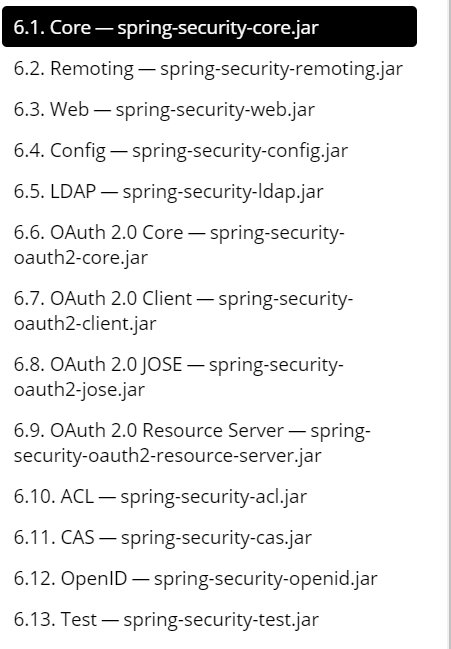

# 2、SpringSecurity入门案例

## 2.1 创建一个SpringBoot工程

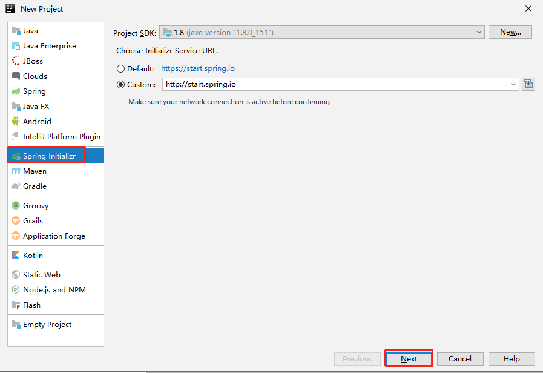

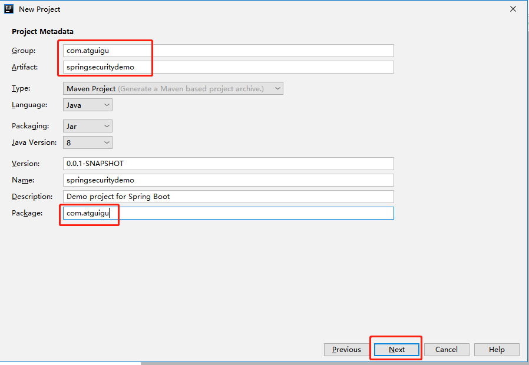

## 2.2 引入security相关依赖

```xml
		<dependency>
			<groupId>org.springframework.boot</groupId>
			<artifactId>spring-boot-starter-web</artifactId>
		</dependency>

		<dependency>
			<groupId>org.springframework.boot</groupId>
			<artifactId>spring-boot-starter-security</artifactId>
		</dependency>
```

## 2.3 编写Controller

```java
@RestController
public class SecurityController {

    @GetMapping("/hello")
    public String hello(){

        return "hello springsecurity!";
    }
}
```

## 2.4 启动项目，访问`http://localhost:8080/hello`

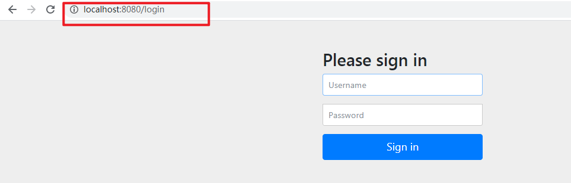

+ 访问资源后会跳转到一个登录页
  + 用户名：user
  + 密码：IDEA控制台会打印一个随机的密码，**<span style="color:red">注意每次启动的时候密码都会发生变化！</span>**

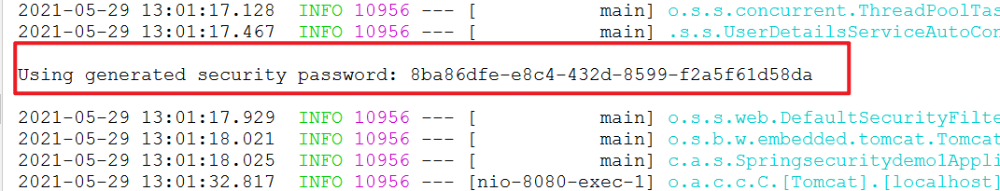

输入完用户名和密码后，就可以访问资源了！这就是认证

## 2.5 权限管理中的相关概念

+ 主体
  + 使用系统的用户或设备或从其他系统远程登录来的用户等等。简单说谁使用系统谁就是主体
+ 认证
  + 权限管理系统确认一个主体的身份，允许主体进入该系统。简单说就是“主体”证明自己是谁
  + 笼统的认为就是登录操作。
+ 授权：
  + 将操作系统的“权力”授予主体，这样主体就具备了操作系统中特定功能的能力。
  + 授权就是给用户分配权限。

## 2.6 SpringSecurity基本原理

**<span style="color:red">SpringSecurity本质是一个过滤器链。</span>**

从启动是可以获取到过滤器链：

```java
org.springframework.security.web.context.request.async.WebAsyncManagerIntegrationFilter
org.springframework.security.web.context.SecurityContextPersistenceFilter
org.springframework.security.web.header.HeaderWriterFilter
org.springframework.security.web.csrf.CsrfFilter
org.springframework.security.web.authentication.logout.LogoutFilter
org.springframework.security.web.authentication.UsernamePasswordAuthenticationFilter
org.springframework.security.web.authentication.ui.DefaultLoginPageGeneratingFilter
org.springframework.security.web.authentication.ui.DefaultLogoutPageGeneratingFilter
org.springframework.security.web.savedrequest.RequestCacheAwareFilter
org.springframework.security.web.servletapi.SecurityContextHolderAwareRequestFilter
org.springframework.security.web.authentication.AnonymousAuthenticationFilter
org.springframework.security.web.session.SessionManagementFilter
org.springframework.security.web.access.ExceptionTranslationFilter
org.springframework.security.web.access.intercept.FilterSecurityInterceptor
```

+ **代码底层流程：重点看三个过滤器**

  + **`FilterSecurityInterceptor`：**是一个方法级的权限过滤器，基本位于过滤链的最底层。

  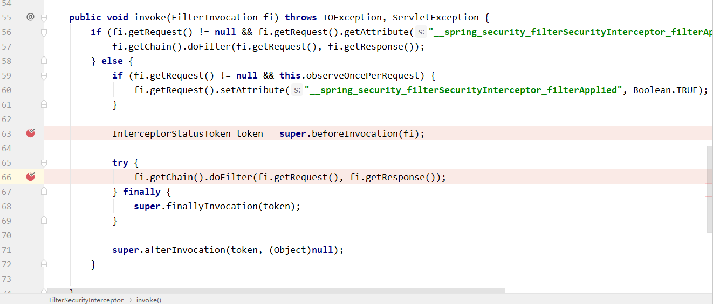

  **`super.beforeInvocation(fi)`：**表示查看之前的过滤器是否通过

  **`fi.getChain().doFilter(fi.getRequest(), fi.getResponse());`：**真正的调用后台服务

  + **`ExceptionTranslationFilter：`**是个异常过滤器，用来处理在认证授权过程中抛出的异常

  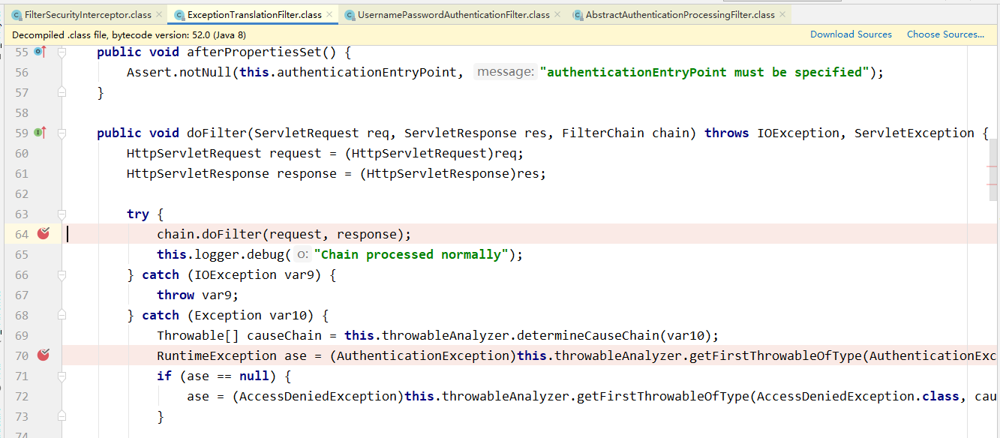

  

  + **`UsernamePasswordAuthenticationFilter：`**对/login的POST请求做拦截，校验表单中用户名、密码

  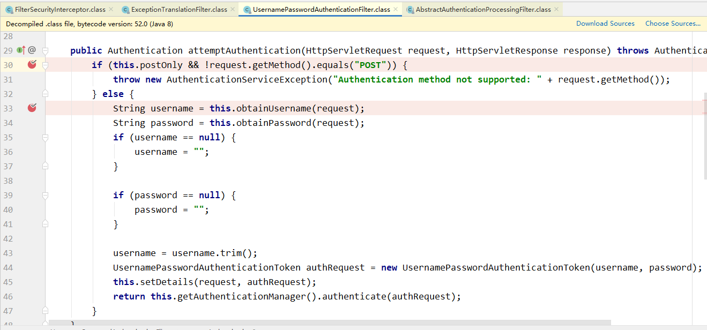

## 2.7 SpringSecurity是如何加载过滤器的

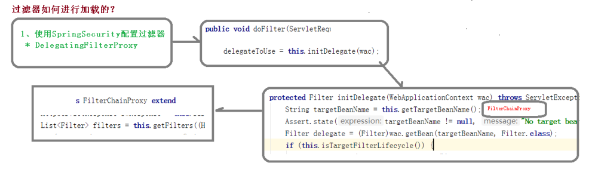


## 2.8 UserDetailsService接口讲解

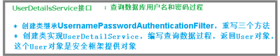

当什么都没有配置的时候，帐号和密码都是由SpringSecurity定义生成的，而在实际项目中，帐号和密码都是从数据库中查询出来的。所以我们要通过自定义逻辑控制认证逻辑。

如果需要自定义逻辑时，只需要实现`UserDetailsService`接口即可。接口定义如下：

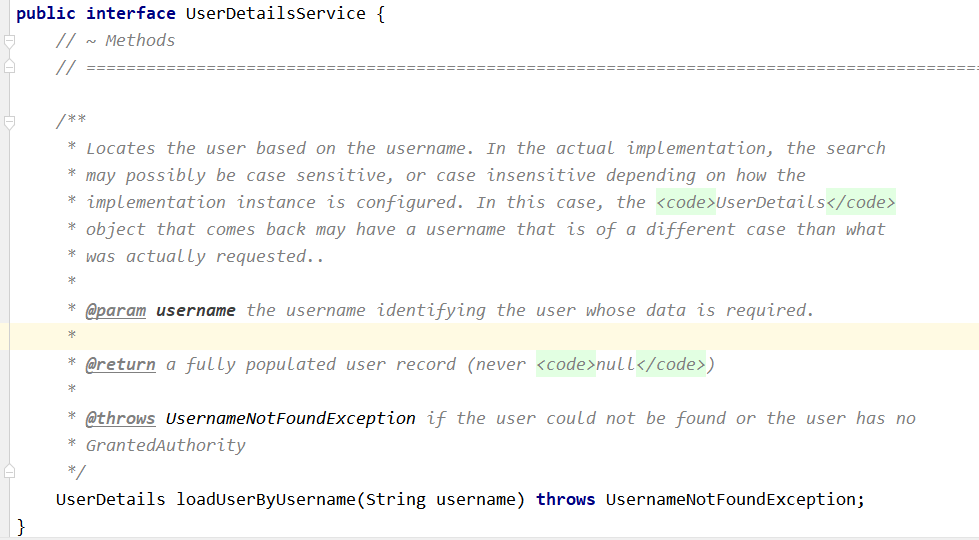

+ **返回值UserDetails：**这个类是系统提供的默认**<span style="color:red">“主体”</span>**

```java
// 表示获取登录用户所有权限 
Collection<? extends GrantedAuthority> getAuthorities(); 
// 表示获取密码
String getPassword(); 
// 表示获取用户名 
String getUsername(); 
// 表示判断账户是否过期 
boolean isAccountNonExpired(); 
// 表示判断账户是否被锁定
boolean isAccountNonLocked(); 
// 表示凭证{密码}是否过期
boolean isCredentialsNonExpired();
// 表示当前用户是否可用 
boolean isEnabled();
```

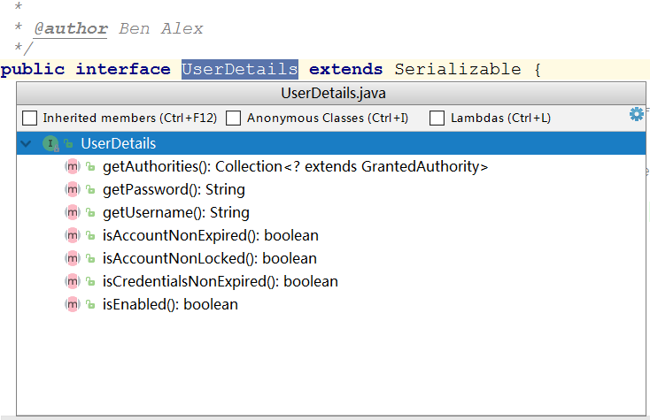

**<span style="color:red">以后我们只需要使用User这个实体类即可</span>**

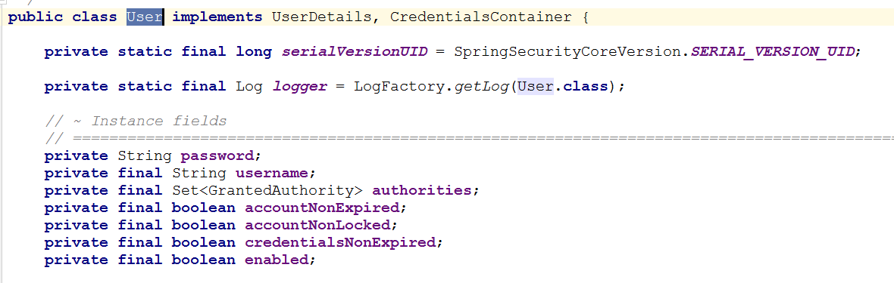

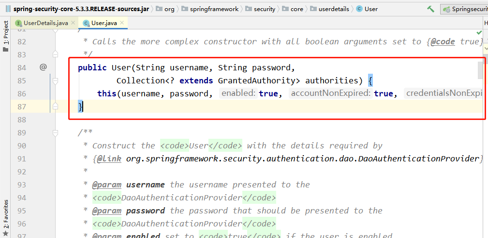

方法参数：username

表示用户名。此值是客户端表单传递过来的数据。默认情况下必须叫username。否则无法接收。


## 2.9 PasswordEncoder 接口讲解


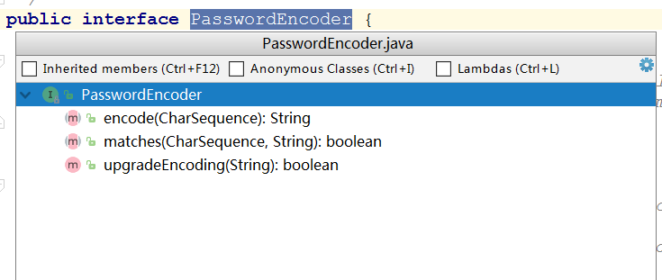

```java
// 表示把参数按照特定的解析规则进行解析 
String encode(CharSequence rawPassword); 
// 表示验证从存储中获取的编码密码与编码后提交的原始密码是否匹配。如果密码匹配，则返回true；如果不匹配，则返回false。第一个参数表示需要被解析的密码。第二个参数表示存储的密码。 
boolean matches(CharSequence rawPassword, String encodedPassword);
// 表示如果解析的密码能够再次进行解析且达到更安全的结果则返回true，否则返回false。默认返回false
default boolean upgradeEncoding(String encodedPassword){ 
    return false; 
}
```

**`PasswordEncoder`接口的实现类如下：**

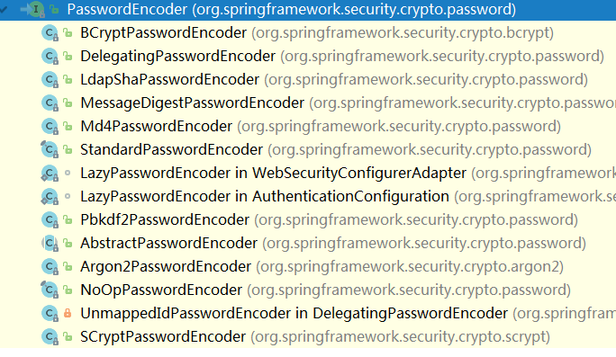

**`BCryptPasswordEncoder`**是Spring Security官方推荐的密码解析器，平时多使用这个解析器。
BCryptPasswordEncoder是对bcrypt强散列方法的具体实现。是基于Hash算法实现的单向加密。可以通过strength控制加密强度，默认10.

**BcryptPasswordEncoder方法示例：**

```java
@Test public void test01(){ 
    // 创建密码解析器 
    BCryptPasswordEncoder bCryptPasswordEncoder = new BCryptPasswordEncoder(); 
    // 对密码进行加密
    String atguigu = bCryptPasswordEncoder.encode("atguigu"); 
    // 打印加密之后的数据 
    System.out.println("加密之后数据：\t"+atguigu); 
    //判断原字符加密后和加密之前是否匹配 
    boolean result = bCryptPasswordEncoder.matches("atguigu", atguigu);
    // 打印比较结果 
    System.out.println("比较结果：\t"+result); 
}
```

# 3、SpringSecurity Web权限方案

## 3.1 设置登录帐号和密码 

+ **SpringSecurity有三种方式设置用户名和密码**

  + 配置文件方式

  ```properties
  spring.security.user.name=jay
  spring.security.user.password=123
  ```

  + 配置类方式

    + 编写一个类继承**`WebSecurityConfigureAdapter`**

    ```java
    @Configuration
    public class SpringSecurityConfig extends WebSecurityConfigurerAdapter {
        /**
         * 设置帐号和密码
         * @param auth
         * @throws Exception
         */
        @Override
        protected void configure(AuthenticationManagerBuilder auth) throws Exception {
            auth.inMemoryAuthentication().
                    withUser("ak").
                    password(passwordEncoder().encode("123")).
                    roles("boss");
        }
    
        //将BCryptPasswordEncoder注入到Spring容器中
        @Bean
        public BCryptPasswordEncoder passwordEncoder(){
            return new BCryptPasswordEncoder();
        }
    }
    ```

  + **<span style="color:red">使用自定义方式实现用户名密码的设置</span>**

    + 需要在配置类中指定使用哪个**`UserDetailsService`**实现类

    ```java
    @Configuration
    public class SpringSecurityConfigTest extends WebSecurityConfigurerAdapter {
    
        @Autowired
        private UserDetailsService userDetailsService;
    
        /**
         * 设置帐号和密码，这里指定userDetailsService
         * @param auth
         * @throws Exception
         */
        @Override
        protected void configure(AuthenticationManagerBuilder auth) throws Exception {
            auth.userDetailsService(userDetailsService).passwordEncoder(passwordEncoder());
        }
    
        //将BCryptPasswordEncoder注入到Spring容器中
        @Bean
        public static BCryptPasswordEncoder passwordEncoder(){
            return new BCryptPasswordEncoder();
        }
    }
    ```

    + 编写**`UserDetailsService`**实现类，返回User对象,User对象有用户名、密码和权限操作

    ```java
    //需要指定bean的name=userDetailsService
    @Service("userDetailsService")
    public class MyUserDetailsService implements UserDetailsService {
    
        @Override
        public UserDetails loadUserByUsername(String username) throws UsernameNotFoundException {
            List<GrantedAuthority> auths = AuthorityUtils.commaSeparatedStringToAuthorityList("role");
            return new User("mary", SpringSecurityConfigTest.passwordEncoder().encode("123"),auths);
        }
    }
    ```

## 3.2 实现数据库认证来完成用户登录

### 1.创建数据库表

```sql
create table users(
id bigint primary key auto_increment,
username varchar(20) unique not null,
password varchar(100)
);
```

### 2.引入相关依赖

```xml
		<dependency>
		<groupId>org.springframework.boot</groupId>
		<artifactId>spring-boot-starter-web</artifactId>
	</dependency>

		<dependency>
			<groupId>org.springframework.boot</groupId>
			<artifactId>spring-boot-starter-security</artifactId>
		</dependency>

		<dependency>
			<groupId>com.baomidou</groupId>
			<artifactId>mybatis-plus-boot-starter</artifactId>
			<version>3.0.5</version>
		</dependency>

		<dependency>
			<groupId>mysql</groupId>
			<artifactId>mysql-connector-java</artifactId>
		</dependency>

		<dependency>
			<groupId>org.projectlombok</groupId>
			<artifactId>lombok</artifactId>
		</dependency>
```

### 3.在配置文件中添加数据库连接信息

```properties
#mysql数据库连接
spring.datasource.driver-class-name=com.mysql.cj.jdbc.Driver 
spring.datasource.url=jdbc:mysql://localhost:3306/security?serverTimezone=GMT%2B8 
spring.datasource.username=root 
spring.datasource.password=root
```

### 4.创建实体类

```java
@Data
@NoArgsConstructor
@AllArgsConstructor
@ToString
public class Users {
    private Integer id;
    private String username;
    private String password;

}
```

### 5.创建Mapper接口

```java
@Repository
public interface UsersMapper extends BaseMapper<Users> {
}
```

### 6.编写UserDetailsService实现类，实现查询数据库认证用户信息

```java
//需要指定bean的name=userDetailsService
@Service("userDetailsService")
public class MyUserDetailsService implements UserDetailsService {

    @Autowired
    private UsersMapper usersMapper;
    @Override
    public UserDetails loadUserByUsername(String username) throws UsernameNotFoundException {

        QueryWrapper<Users> wrapper = new QueryWrapper<>();
        wrapper.eq("username",username);
        Users user = usersMapper.selectOne(wrapper);
        if (user == null){
            throw new UsernameNotFoundException("用户名不存在");
        }

        List<GrantedAuthority> auths = AuthorityUtils.commaSeparatedStringToAuthorityList("role");
        return new User(user.getUsername(), SpringSecurityConfigTest.passwordEncoder().encode(user.getPassword()),auths);
    }
}
```

### 7.在配置类中指定UserDetailsService实现类

在`configure(AuthenticationManagerBuilder)`中指定`UserDetailsService`实现类

```java

    /**
     * 设置帐号和密码，这里指定userDetailsService
     * @param auth
     * @throws Exception
     */
    @Override
    protected void configure(AuthenticationManagerBuilder auth) throws Exception {
        auth.userDetailsService(userDetailsService).passwordEncoder(passwordEncoder());
    }
```

### 8.在主启动类上添加`@MapperScan`注解

```java
@SpringBootApplication
@MapperScan(basePackages = "com.atguigu.springsecuritydemo1.mapper")
public class Springsecuritydemo1Application {

	public static void main(String[] args) {
		SpringApplication.run(Springsecuritydemo1Application.class, args);
	}

}
```

### 9.启动项目运行测试

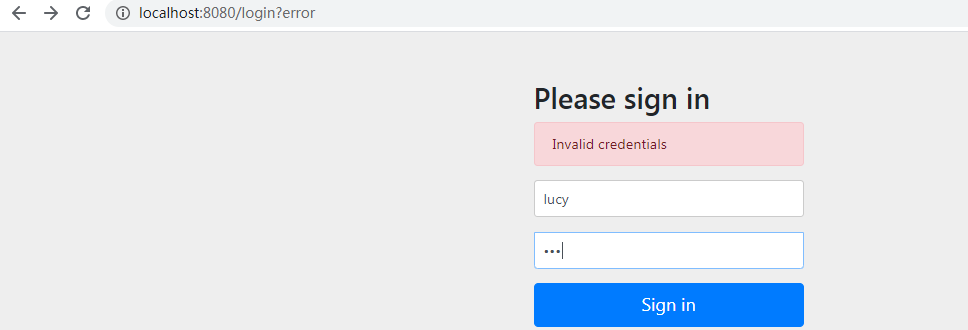


## 3.3 自定义登录页面

### 1.在`configure(HttpSecurity http)`方法中配置自定义的登录页面

```java
   /**
     * 配置自定义登录页面和路径拦截
     * @param http
     * @throws Exception
     */
    @Override
    protected void configure(HttpSecurity http) throws Exception {
        //配置自定义登录页面
        http.formLogin()
                .loginPage("/login.html")
        //配置处理登录功能的url
        .loginProcessingUrl("/login")
        //配置登录成功的url
           .defaultSuccessUrl("/index")
                .and()
        //配置哪些请求地址不被拦截
                .authorizeRequests()
                .antMatchers("/","/hello","/login", "/login.html")
                .permitAll()
                .anyRequest()
                .authenticated()
                .and()
                .csrf().disable();
    }
```

**在配置不拦截的请求地址时，千万不要把登录页面给忘记了，否则登录页面打不开，我就是遇到了这个问题！**

### 2.配置login.html页面

login.html的位置

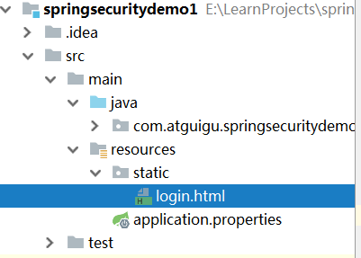

```html
<body>
<form action="/login" method="post">
    用户名：<input type="text" name="username"/><br/>
    密码：<input type="password" name="password"/><br/>
    <input type="submit" value="登录">
</form>
</body>
```

**<span style="color:red">注意点：</span>**

1. 表单提交方式需要选择POST请求
2. 用户名和密码标签的**`name`必须是`username`和`password`**

### 3.源码分析

在**<span style="color:red">执行登录的时候</span>**底层会走一个过滤器**`UsernamePasswordAuthenticationFilter`**

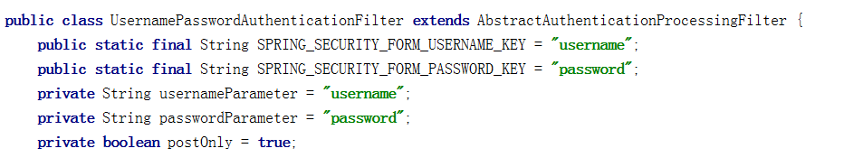

**<span style="color:red">如果想要修改用户名和密码标签的`name`，可以通过usernameParameter()和passwordParameter()方法</span>**

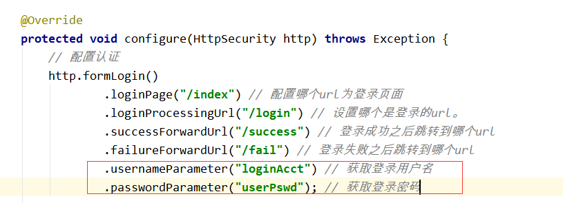


## 3.4 基于权限或角色进行访问控制

### 1.hasAuthority方法

如果当前的主体具有`hasAuthority()`方法中定义的权限，那么就可以访问，否则不可以访问

#### 在配置类中定义路径具有的权限

```java
   /**
     * 配置自定义登录页面和路径拦截
     * @param http
     * @throws Exception
     */
    @Override
    protected void configure(HttpSecurity http) throws Exception {
        //配置自定义登录页面
        http.formLogin()
                .loginPage("/login.html")
        //配置处理登录功能的url
        .loginProcessingUrl("/login")
        //配置登录成功的url
           .defaultSuccessUrl("/index")
                .and()
        //配置哪些请求地址不被拦截
                .authorizeRequests()
                .antMatchers("/","/hello","/login", "/login.html")
                .permitAll()
                .antMatchers("/index")
        // /index路径必须具有admin权限的主体才可以访问
                .hasAuthority("admin")
    }
```

#### 在`UserDetailsService`实现类中给返回的用户主体分配权限

```java
//给返回的用户分配admin的权限
        List<GrantedAuthority> auths = AuthorityUtils.commaSeparatedStringToAuthorityList("admin");
        return new User(user.getUsername(), SpringSecurityConfigTest.passwordEncoder().encode(user.getPassword()),auths);
```

#### 测试运行

如果没有权限访问403

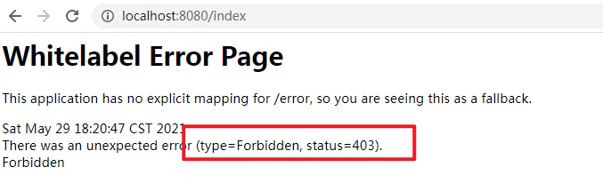

有对应的权限才可以访问资源


### 2.hasAnyAuthority()方法

如果当前的主体有任何一个要求的权限，就可以访问资源。

这里配置上面一样

```java
                .antMatchers("/index")
         // /index路径必须具有admin或者user权限的主体才可以访问
                .hasAnyAuthority("admin","user")
```

**<span style="color:red">在`UserDetailsService`实现类中给返回的用户主体分配权限</span>**

```java
        //给返回的用户分配admin的权限
        List<GrantedAuthority> auths = AuthorityUtils.commaSeparatedStringToAuthorityList("admin");
        return new User(user.getUsername(), SpringSecurityConfigTest.passwordEncoder().encode(user.getPassword()),auths);
```

### 3.hasRole()方法

如果用户具备给定的角色就允许访问，否则不允许访问(403)

**<span style="color:red">底层源码：</span>**

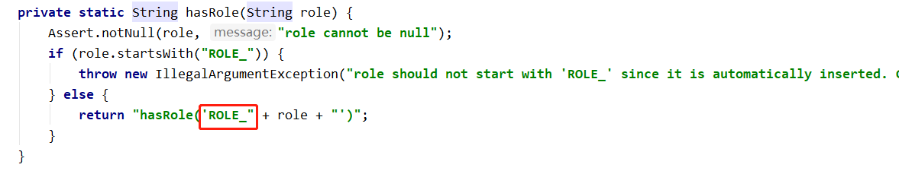

**<span style="color:red">注意点：我们在通过`hasRole()`时，不需要添加前缀`ROLE_`，否则会抛个异常，但是我们在`UserDetailsService`的实现类中需要指定前缀`ROLE_`</span>**

```java
                .antMatchers("/index")
        // /index路径必须具有IT的角色才可以访问
                .hasRole("IT")
```

**`UserDetailsService`实现类中 给用户分配角色**

```java
//给返回的用户分配IT角色
        List<GrantedAuthority> auths = AuthorityUtils.commaSeparatedStringToAuthorityList("ROLE_IT");
        return new User(user.getUsername(), SpringSecurityConfigTest.passwordEncoder().encode(user.getPassword()),auths);
```

### 4.hasAnyRole()方法

表示用户具备任何一个角色都可以访问到资源。

**给用户添加角色：**

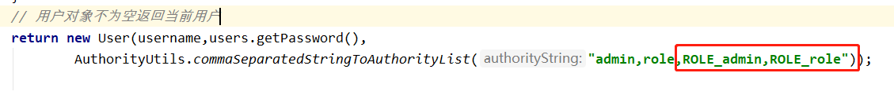

**修改配置类：**

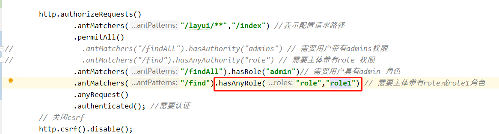

## 3.5自定义403页面

在配置类的`configure(HttpSecurity http)`方法中设置自定义403页面

```java
        //配置自定义403页面
        http.exceptionHandling().accessDeniedPage("/403.html");
```

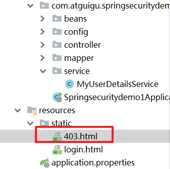

## 3.6 SpringSecurity注解使用

### 1.@Secured

**判断主体是否具有角色**，另外**<span style="color:red">需要注意的是这里匹配的字符串需要添加前缀"ROLE_"。</span>**

**1.<span style="color:red">使用注解要先开启`@Secured`注解功能</span>**

`@EnableGlobalMethodSecurity(securedEnabled = true)`

```java
@SpringBootApplication
@MapperScan(basePackages = "com.atguigu.springsecuritydemo1.mapper")
@EnableGlobalMethodSecurity(securedEnabled = true)
public class Springsecuritydemo1Application {

	public static void main(String[] args) {
		SpringApplication.run(Springsecuritydemo1Application.class, args);
	}

}
```

2.在控制器的**<span style="color:red">方法上添加该注解</span>**

```java
    @GetMapping("/annotation")
    @Secured("ROLE_IT")
    public String annotation(){

        return "hello annotation！";
    }
```

**<span style="color:red">3.在`UserDetailsService`实现类中给用户分配角色</span>**

```java
        //给返回的用户分配IT角色
        List<GrantedAuthority> auths = AuthorityUtils.commaSeparatedStringToAuthorityList("ROLE_IT,admin");
        return new User(user.getUsername(), SpringSecurityConfigTest.passwordEncoder().encode(user.getPassword()),auths);
```

**<span style="color:red">4.访问`http://localhost:8080/annotation`</span>**

将上述的角色改为 `@Secured({"ROLE_IT","ROLE_管理员"})`即可访问


### 2.@preAuthorize

**<span style="color:red">1.先开启`@preAuthorize`注解功能</span>**

```
@EnableGlobalMethodSecurity(securedEnabled = true,prePostEnabled = true)
```

**`@preAuthorize`**：该注解是在执行方法前的权限验证，**`@preAuthorize`**可以将登陆用户的roles/permissions参数传到方法中

```java
    @GetMapping("/annotation")
    //@Secured("ROLE_IT")
    @PreAuthorize("hasAnyAuthority('admin','ROLE_IT')")
    public String annotation(){

        return "hello annotation！";
    }
```

### 3.@postAuthorize

**<span style="color:red">1.先开启注解功能：</span>**

```
@EnableGlobalMethodSecurity(prePostEnabled = true)
```

`@postAuthorize`注解使用并不多，在方法执行后再进行权限认证，适合验证带有返回值的权限

**<span style="color:red">2.在控制器的方法上添加该注解</span>**

```java
    @GetMapping("/annotation")
    @PostAuthorize("hasAnyAuthority('ak')")
    public String annotation(){
        System.out.println("PostAuthorize");
        return "hello annotation！";
    }
```

**3.和`@Secured`注解使用的第三步一样。**

### 4.@postFilter

**`@postFilter`：<span style="color:red">在权限验证之后对返回的数据进行过滤；</span>**

留下用户名是admin1的数据

**<span style="color:red">表达式中的`filterObject`引用的是方法返回值List的某一个元素</span>**

```java
    @GetMapping("/annotation")
    @PostFilter("filterObject.username=='admin1'")
    public List<Users> annotation(){
        ArrayList<Users> list = new ArrayList<>();
        list.add(new Users(1,"admin1","123"));
        list.add(new Users(2,"admin2","888"));
        System.out.println(list);
        return list;
    }
```

**3.和`@Secured`注解使用的第三步一样。**

### 5.@preFilter

**`@preFilter`：进入控制器之前对数据进行过滤**

```java
@RequestMapping("getTestPreFilter") 
@PreAuthorize("hasRole('ROLE_管理员')")
@PreFilter(value = "filterObject.id%2==0") 
@ResponseBody public List<UserInfo> getTestPreFilter(@RequestBody List<UserInfo> list{ 
    list.forEach(t-> { System.out.println(t.getId()+"\t"+t.getUsername()); });
    return list; 
}
```

## 3.7 用户注销功能

**<span style="color:red">1、在配置类添加退出配置</span>**

```java
//配置退出功能
http.logout().logoutUrl("/logout").logoutSuccessUrl("/index.html").permitAll();
```

**<span style="color:red">2、退出按钮页面</span>**

```html
<body>
<h1>登录成功</h1>
<a href="/logout">退出</a>
</body>
```

## 3.8 SpringSecurity中的Rememberme自动登录原理分析、

**`简单版`**

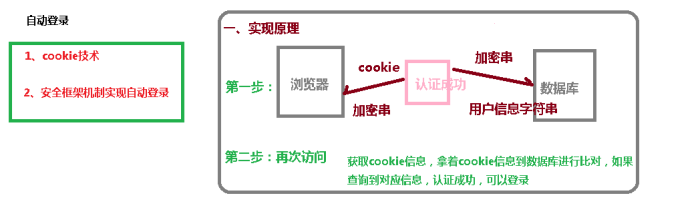

**`完整版`**

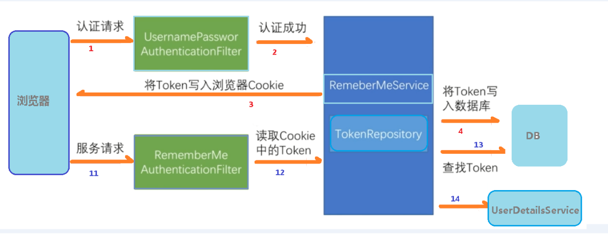


## 3.9 RememberMe 自动登录代码实现

```sql
CREATE TABLE `persistent_logins` (
  `username` varchar(64) NOT NULL,
  `series` varchar(64) NOT NULL,
  `token` varchar(64) NOT NULL,
  `last_used` timestamp NOT NULL DEFAULT CURRENT_TIMESTAMP ON UPDATE CURRENT_TIMESTAMP,
  PRIMARY KEY (`series`)
) ENGINE=InnoDB DEFAULT CHARSET=utf8

-- 可以手动创建，也可以通过 jdbcTokenRepository.setCreateTableOnStartup(true);让SpringSecurity帮我们创建。
```


**<span style="color:red">1、在配置类中注入数据源、配置Rememberme相关配置</span>**

```java
	 @Override
    protected void configure(HttpSecurity http) throws Exception {
//配置自定义登录页面
        		http
                //记住我
                .rememberMe()
                //设置操作数据库对象
                .tokenRepository(persistentTokenRepository())
                //设置token过期时间，单位为秒
                .tokenValiditySeconds(120)
                .userDetailsService(userDetailsService)
                    
    }


    // 注入数据源
    @Autowired
    private DataSource dataSource;

    /**
     * 注入JdbcTokenRepository
     * @return
     */
    @Bean
    public PersistentTokenRepository persistentTokenRepository(){
        JdbcTokenRepositoryImpl jdbcTokenRepository = new JdbcTokenRepositoryImpl();
        //设置数据源
        jdbcTokenRepository.setDataSource(dataSource);
        //设置项目一启动 就创建表
        jdbcTokenRepository.setCreateTableOnStartup(true);
        return jdbcTokenRepository;
    }
```

**<span style="color:red">2、页面添加记住我复选框</span>**

**复选框的标签名必须为remember-me**

```html
  自动登录:<input type="checkbox" name="remember-me">
```

**<span style="color:red">3、在application.properties配置文件配置数据库连接信息</span>**

```properties
#mysql数据库连接
spring.datasource.driver-class-name=com.mysql.jdbc.Driver
spring.datasource.url=jdbc:mysql://localhost:3306/security?serverTimezone=GMT%2B8
spring.datasource.username=root
spring.datasource.password=root
```

**<span style="color:red">4.测试运行</span>**

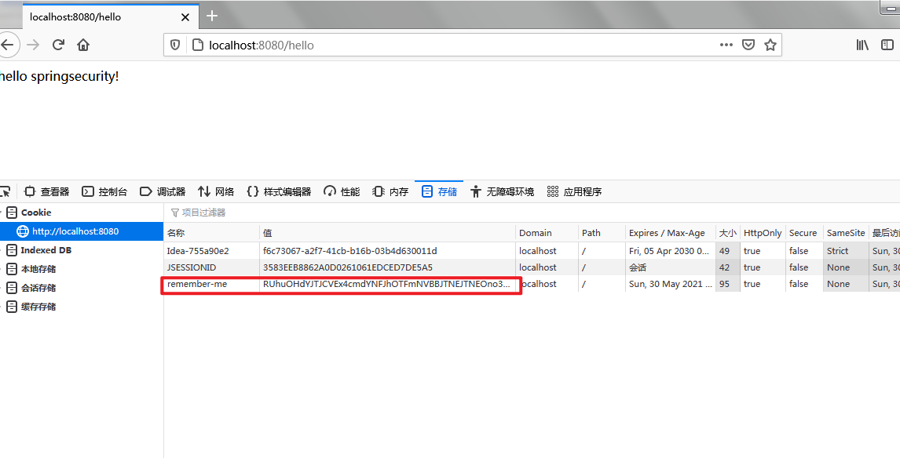

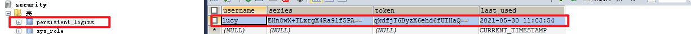


## 3.10 CSRF

### 什么是CSRF

```
跨站请求伪造（英语：Cross-site request forgery），也被称为 one-click attack 或者 session riding，通常缩写为 CSRF 或者 XSRF， 是一种挟制用户在当前已登录的Web应用程序上执行非本意的操作的攻击方法。跟跨网站脚本（XSS）相比，XSS利用的是用户对指定网站的信任，CSRF 利用的是网站对用户网页浏览器的信任。 跨站请求攻击，简单地说，是攻击者通过一些技术手段欺骗用户的浏览器去访问一个自己曾经认证过的网站并运行一些操作（如发邮件，发消息，甚至财产操作如转账和购买商品）。由于浏览器曾经认证过，所以被访问的网站会认为是真正的用户操作而去运行。这利用了web中用户身份验证的一个漏洞：简单的身份验证只能保证请求发自某个用户的浏览器，却不能保证请求本身是用户自愿发出的。 从Spring Security 4.0开始，默认情况下会启用CSRF保护，以防止CSRF攻击应用程序，Spring Security CSRF会针对PATCH，POST，PUT和DELETE方法进行防护。
```

### 案例

在登录页面添加一个隐藏域：

```HTML
<input type="hidden"th:if="${_csrf}!=null"th:value="${_csrf.token}"name="_csrf"/>
```

关闭安全配置的类中的csrf

```java
// http.csrf().disable();
```

### SpringSecurity实现CSRF的原理

1. 生成csrfToken 保存到HttpSession 或者Cookie 中。

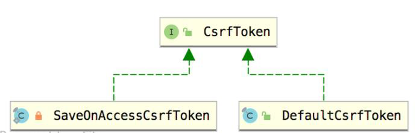

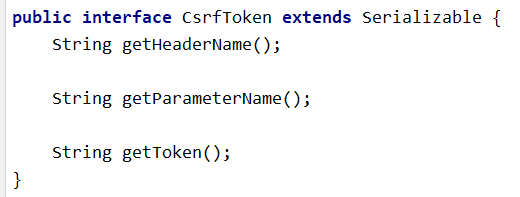

SaveOnAccessCsrfToken 类有个接口CsrfTokenRepository

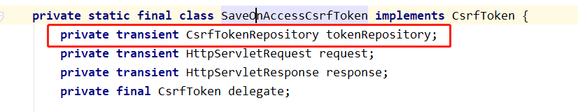

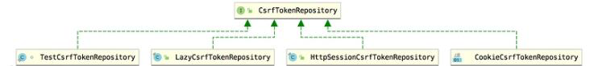

当前接口实现类：HttpSessionCsrfTokenRepository，CookieCsrfTokenRepository

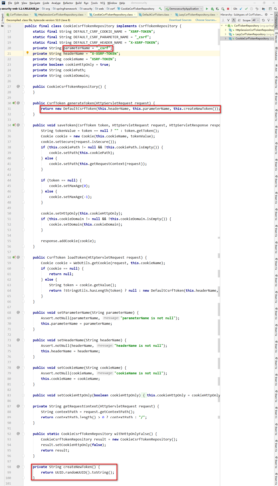

2. 请求到来时，从请求中提取csrfToken，和保存的csrfToken 做比较，进而判断当前请求是否合法。主要通过CsrfFilter 过滤器来完成。

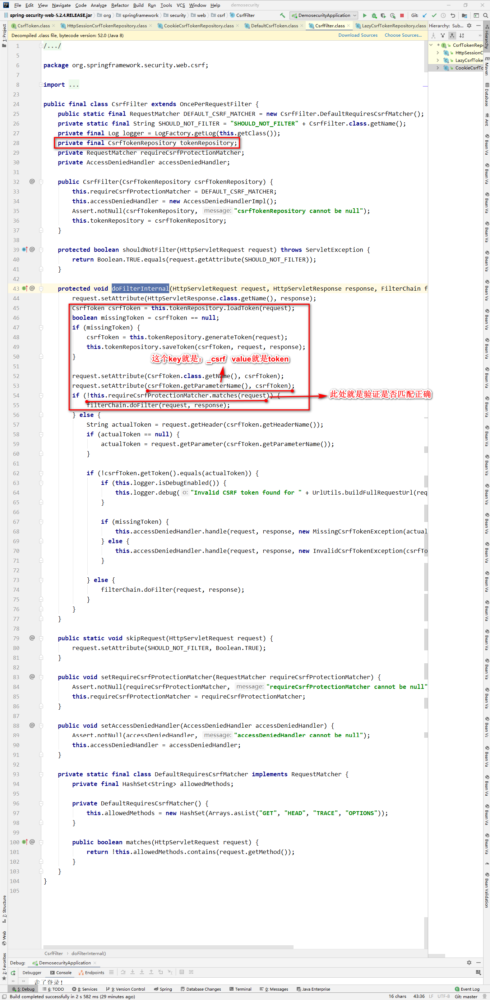


# 4、SpringSecurity 微服务权限方案

## 4.1 什么是微服务

**1.微服务的由来**

微服务最早由Martin Fowler与James Lewis于2014年共同提出，微服务架构风格是一种使用一套小服务来开发单个应用的方式途径，每个服务运行在自己的进程中，并使用轻量级机制通信，通常是HTTP API，这些服务基于业务能力构建，并能够通过自动化部署机制来独立部署，这些服务使用不同的编程语言实现，以及不同数据存储技术，并保持最低限度的集中式管理。

**2.微服务的优势**

（1）微服务每个模块就相当于一个单独的项目，代码量明显减少，遇到问题也相对来说比较好解决。 

（2）微服务每个模块都可以使用不同的存储方式（比如有的用redis，有的用mysql等），数据库也是单个模块对应自己的数据库。

 （3）微服务每个模块都可以使用不同的开发技术，开发模式更灵活。

**3.微服务本质**

（1）微服务，关键其实不仅仅是微服务本身，而是系统要提供一套基础的架构，这种架构使得微服务可以独立的部署、运行、升级，不仅如此，这个系统架构还让微服务与微服务之间在结构上“松耦合”，而在功能上则表现为一个统一的整体。这种所谓的“统一的整体”表现出来的是统一风格的界面，统一的权限管理，统一的安全策略，统一的上线过程，统一的日志和审计方法，统一的调度方式，统一的访问入口等等。 

（2）微服务的目的是有效的拆分应用，实现敏捷开发和部署。

## 4.2 微服务认证与授权实现思路

**1.认证授权过程分析**

（1）如果是基于Session，那么SpringSecurity会对Cookie的sessionid进行解析，找到服务器存储的session信息，然后判断当前用户否是符合请求的要求

（2）如果是基于token，则是解析出token，然后将当前请求加入到SpringSecurity管理的权限信息中去。

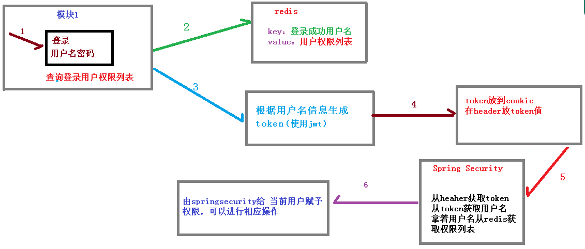

如果系统的模块众多，每个模块都需要进行授权与认证，所以我们选择基于token的形式进行授权与认证，用户根据用户名密码认证成功，然后获取当前用户角色的一系列权限值，并以用户名为key，权限列表为value的形式存入redis缓存中，根据用户名相关信息生成token返回，浏览器将token记录到cookie中，每次调用api接口都默认将token携带到header请求头中，Spring-security解析header头获取token信息，解析token获取当前用户名，根据用户名就可以从redis中获取权限列表，这样Spring-security就能够判断当前请求是否有权限访问

**2.数据模型介绍**

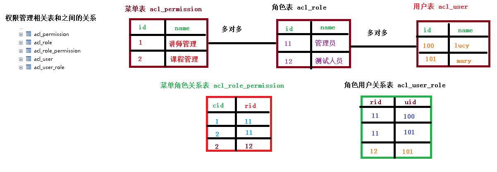

**SQL语句**

```sql
# Host: localhost  (Version 5.7.19)
# Date: 2019-11-18 15:49:15
# Generator: MySQL-Front 6.1  (Build 1.26)


#
# Structure for table "acl_permission"
#

CREATE TABLE `acl_permission` (
  `id` char(19) NOT NULL DEFAULT '' COMMENT '编号',
  `pid` char(19) NOT NULL DEFAULT '' COMMENT '所属上级',
  `name` varchar(20) NOT NULL DEFAULT '' COMMENT '名称',
  `type` tinyint(3) NOT NULL DEFAULT '0' COMMENT '类型(1:菜单,2:按钮)',
  `permission_value` varchar(50) DEFAULT NULL COMMENT '权限值',
  `path` varchar(100) DEFAULT NULL COMMENT '访问路径',
  `component` varchar(100) DEFAULT NULL COMMENT '组件路径',
  `icon` varchar(50) DEFAULT NULL COMMENT '图标',
  `status` tinyint(4) DEFAULT NULL COMMENT '状态(0:禁止,1:正常)',
  `is_deleted` tinyint(1) unsigned NOT NULL DEFAULT '0' COMMENT '逻辑删除 1（true）已删除， 0（false）未删除',
  `gmt_create` datetime DEFAULT NULL COMMENT '创建时间',
  `gmt_modified` datetime DEFAULT NULL COMMENT '更新时间',
  PRIMARY KEY (`id`),
  KEY `idx_pid` (`pid`)
) ENGINE=InnoDB DEFAULT CHARSET=utf8mb4 COMMENT='权限';

#
# Data for table "acl_permission"
#

INSERT INTO `acl_permission` VALUES ('1','0','全部数据',0,NULL,NULL,NULL,NULL,NULL,0,'2019-11-15 17:13:06','2019-11-15 17:13:06'),('1195268474480156673','1','权限管理',1,NULL,'/acl','Layout',NULL,NULL,0,'2019-11-15 17:13:06','2019-11-18 13:54:25'),('1195268616021139457','1195268474480156673','用户管理',1,NULL,'user/list','/acl/user/list',NULL,NULL,0,'2019-11-15 17:13:40','2019-11-18 13:53:12'),('1195268788138598401','1195268474480156673','角色管理',1,NULL,'role/list','/acl/role/list',NULL,NULL,0,'2019-11-15 17:14:21','2019-11-15 17:14:21'),('1195268893830864898','1195268474480156673','菜单管理',1,NULL,'menu/list','/acl/menu/list',NULL,NULL,0,'2019-11-15 17:14:46','2019-11-15 17:14:46'),('1195269143060602882','1195268616021139457','查看',2,'user.list','','',NULL,NULL,0,'2019-11-15 17:15:45','2019-11-17 21:57:16'),('1195269295926206466','1195268616021139457','添加',2,'user.add','user/add','/acl/user/form',NULL,NULL,0,'2019-11-15 17:16:22','2019-11-15 17:16:22'),('1195269473479483394','1195268616021139457','修改',2,'user.update','user/update/:id','/acl/user/form',NULL,NULL,0,'2019-11-15 17:17:04','2019-11-15 17:17:04'),('1195269547269873666','1195268616021139457','删除',2,'user.remove','','',NULL,NULL,0,'2019-11-15 17:17:22','2019-11-15 17:17:22'),('1195269821262782465','1195268788138598401','修改',2,'role.update','role/update/:id','/acl/role/form',NULL,NULL,0,'2019-11-15 17:18:27','2019-11-15 17:19:53'),('1195269903542444034','1195268788138598401','查看',2,'role.list','','',NULL,NULL,0,'2019-11-15 17:18:47','2019-11-15 17:18:47'),('1195270037005197313','1195268788138598401','添加',2,'role.add','role/add','/acl/role/form',NULL,NULL,0,'2019-11-15 17:19:19','2019-11-18 11:05:42'),('1195270442602782721','1195268788138598401','删除',2,'role.remove','','',NULL,NULL,0,'2019-11-15 17:20:55','2019-11-15 17:20:55'),('1195270621548568578','1195268788138598401','角色权限',2,'role.acl','role/distribution/:id','/acl/role/roleForm',NULL,NULL,0,'2019-11-15 17:21:38','2019-11-15 17:21:38'),('1195270744097742849','1195268893830864898','查看',2,'permission.list','','',NULL,NULL,0,'2019-11-15 17:22:07','2019-11-15 17:22:07'),('1195270810560684034','1195268893830864898','添加',2,'permission.add','','',NULL,NULL,0,'2019-11-15 17:22:23','2019-11-15 17:22:23'),('1195270862100291586','1195268893830864898','修改',2,'permission.update','','',NULL,NULL,0,'2019-11-15 17:22:35','2019-11-15 17:22:35'),('1195270887933009922','1195268893830864898','删除',2,'permission.remove','','',NULL,NULL,0,'2019-11-15 17:22:41','2019-11-15 17:22:41'),('1195349439240048642','1','讲师管理',1,NULL,'/edu/teacher','Layout',NULL,NULL,0,'2019-11-15 22:34:49','2019-11-15 22:34:49'),('1195349699995734017','1195349439240048642','讲师列表',1,NULL,'list','/edu/teacher/list',NULL,NULL,0,'2019-11-15 22:35:52','2019-11-15 22:35:52'),('1195349810561781761','1195349439240048642','添加讲师',1,NULL,'create','/edu/teacher/form',NULL,NULL,0,'2019-11-15 22:36:18','2019-11-15 22:36:18'),('1195349876252971010','1195349810561781761','添加',2,'teacher.add','','',NULL,NULL,0,'2019-11-15 22:36:34','2019-11-15 22:36:34'),('1195349979797753857','1195349699995734017','查看',2,'teacher.list','','',NULL,NULL,0,'2019-11-15 22:36:58','2019-11-15 22:36:58'),('1195350117270261762','1195349699995734017','修改',2,'teacher.update','edit/:id','/edu/teacher/form',NULL,NULL,0,'2019-11-15 22:37:31','2019-11-15 22:37:31'),('1195350188359520258','1195349699995734017','删除',2,'teacher.remove','','',NULL,NULL,0,'2019-11-15 22:37:48','2019-11-15 22:37:48'),('1195350299365969922','1','课程分类',1,NULL,'/edu/subject','Layout',NULL,NULL,0,'2019-11-15 22:38:15','2019-11-15 22:38:15'),('1195350397751758850','1195350299365969922','课程分类列表',1,NULL,'list','/edu/subject/list',NULL,NULL,0,'2019-11-15 22:38:38','2019-11-15 22:38:38'),('1195350500512206850','1195350299365969922','导入课程分类',1,NULL,'import','/edu/subject/import',NULL,NULL,0,'2019-11-15 22:39:03','2019-11-15 22:39:03'),('1195350612172967938','1195350397751758850','查看',2,'subject.list','','',NULL,NULL,0,'2019-11-15 22:39:29','2019-11-15 22:39:29'),('1195350687590748161','1195350500512206850','导入',2,'subject.import','','',NULL,NULL,0,'2019-11-15 22:39:47','2019-11-15 22:39:47'),('1195350831744782337','1','课程管理',1,NULL,'/edu/course','Layout',NULL,NULL,0,'2019-11-15 22:40:21','2019-11-15 22:40:21'),('1195350919074385921','1195350831744782337','课程列表',1,NULL,'list','/edu/course/list',NULL,NULL,0,'2019-11-15 22:40:42','2019-11-15 22:40:42'),('1195351020463296513','1195350831744782337','发布课程',1,NULL,'info','/edu/course/info',NULL,NULL,0,'2019-11-15 22:41:06','2019-11-15 22:41:06'),('1195351159672246274','1195350919074385921','完成发布',2,'course.publish','publish/:id','/edu/course/publish',NULL,NULL,0,'2019-11-15 22:41:40','2019-11-15 22:44:01'),('1195351326706208770','1195350919074385921','编辑课程',2,'course.update','info/:id','/edu/course/info',NULL,NULL,0,'2019-11-15 22:42:19','2019-11-15 22:42:19'),('1195351566221938690','1195350919074385921','编辑课程大纲',2,'chapter.update','chapter/:id','/edu/course/chapter',NULL,NULL,0,'2019-11-15 22:43:17','2019-11-15 22:43:17'),('1195351862889254913','1','统计分析',1,NULL,'/statistics/daily','Layout',NULL,NULL,0,'2019-11-15 22:44:27','2019-11-15 22:44:27'),('1195351968841568257','1195351862889254913','生成统计',1,NULL,'create','/statistics/daily/create',NULL,NULL,0,'2019-11-15 22:44:53','2019-11-15 22:44:53'),('1195352054917074946','1195351862889254913','统计图表',1,NULL,'chart','/statistics/daily/chart',NULL,NULL,0,'2019-11-15 22:45:13','2019-11-15 22:45:13'),('1195352127734386690','1195352054917074946','查看',2,'daily.list','','',NULL,NULL,0,'2019-11-15 22:45:30','2019-11-15 22:45:30'),('1195352215768633346','1195351968841568257','生成',2,'daily.add','','',NULL,NULL,0,'2019-11-15 22:45:51','2019-11-15 22:45:51'),('1195352547621965825','1','CMS管理',1,NULL,'/cms','Layout',NULL,NULL,0,'2019-11-15 22:47:11','2019-11-18 10:51:46'),('1195352856645701633','1195353513549205505','查看',2,'banner.list','',NULL,NULL,NULL,0,'2019-11-15 22:48:24','2019-11-15 22:48:24'),('1195352909401657346','1195353513549205505','添加',2,'banner.add','banner/add','/cms/banner/form',NULL,NULL,0,'2019-11-15 22:48:37','2019-11-18 10:52:10'),('1195353051395624961','1195353513549205505','修改',2,'banner.update','banner/update/:id','/cms/banner/form',NULL,NULL,0,'2019-11-15 22:49:11','2019-11-18 10:52:05'),('1195353513549205505','1195352547621965825','Bander列表',1,NULL,'banner/list','/cms/banner/list',NULL,NULL,0,'2019-11-15 22:51:01','2019-11-18 10:51:29'),('1195353672110673921','1195353513549205505','删除',2,'banner.remove','','',NULL,NULL,0,'2019-11-15 22:51:39','2019-11-15 22:51:39'),('1195354076890370050','1','订单管理',1,NULL,'/order','Layout',NULL,NULL,0,'2019-11-15 22:53:15','2019-11-15 22:53:15'),('1195354153482555393','1195354076890370050','订单列表',1,NULL,'list','/order/list',NULL,NULL,0,'2019-11-15 22:53:33','2019-11-15 22:53:58'),('1195354315093282817','1195354153482555393','查看',2,'order.list','','',NULL,NULL,0,'2019-11-15 22:54:12','2019-11-15 22:54:12'),('1196301740985311234','1195268616021139457','分配角色',2,'user.assgin','user/role/:id','/acl/user/roleForm',NULL,NULL,0,'2019-11-18 13:38:56','2019-11-18 13:38:56');

#
# Structure for table "acl_role"
#

CREATE TABLE `acl_role` (
  `id` char(19) NOT NULL DEFAULT '' COMMENT '角色id',
  `role_name` varchar(20) NOT NULL DEFAULT '' COMMENT '角色名称',
  `role_code` varchar(20) DEFAULT NULL COMMENT '角色编码',
  `remark` varchar(255) DEFAULT NULL COMMENT '备注',
  `is_deleted` tinyint(1) unsigned NOT NULL DEFAULT '0' COMMENT '逻辑删除 1（true）已删除， 0（false）未删除',
  `gmt_create` datetime NOT NULL COMMENT '创建时间',
  `gmt_modified` datetime NOT NULL COMMENT '更新时间',
  PRIMARY KEY (`id`)
) ENGINE=InnoDB DEFAULT CHARSET=utf8;

#
# Data for table "acl_role"
#

INSERT INTO `acl_role` VALUES ('1','普通管理员',NULL,NULL,0,'2019-11-11 13:09:32','2019-11-18 10:27:18'),('1193757683205607426','课程管理员',NULL,NULL,0,'2019-11-11 13:09:45','2019-11-18 10:25:44'),('1196300996034977794','test',NULL,NULL,0,'2019-11-18 13:35:58','2019-11-18 13:35:58');

#
# Structure for table "acl_role_permission"
#

CREATE TABLE `acl_role_permission` (
  `id` char(19) NOT NULL DEFAULT '',
  `role_id` char(19) NOT NULL DEFAULT '',
  `permission_id` char(19) NOT NULL DEFAULT '',
  `is_deleted` tinyint(1) unsigned NOT NULL DEFAULT '0' COMMENT '逻辑删除 1（true）已删除， 0（false）未删除',
  `gmt_create` datetime NOT NULL COMMENT '创建时间',
  `gmt_modified` datetime NOT NULL COMMENT '更新时间',
  PRIMARY KEY (`id`),
  KEY `idx_role_id` (`role_id`),
  KEY `idx_permission_id` (`permission_id`)
) ENGINE=InnoDB DEFAULT CHARSET=utf8 COMMENT='角色权限';

#
# Data for table "acl_role_permission"
#

INSERT INTO `acl_role_permission` VALUES ('1196301979754455041','1','1',1,'2019-11-18 13:39:53','2019-11-18 13:39:53'),('1196301979792203778','1','1195268474480156673',1,'2019-11-18 13:39:53','2019-11-18 13:39:53'),('1196301979821563906','1','1195268616021139457',1,'2019-11-18 13:39:53','2019-11-18 13:39:53'),('1196301979842535426','1','1195269143060602882',1,'2019-11-18 13:39:53','2019-11-18 13:39:53'),('1196301979855118338','1','1195269295926206466',1,'2019-11-18 13:39:53','2019-11-18 13:39:53'),('1196301979880284161','1','1195269473479483394',1,'2019-11-18 13:39:53','2019-11-18 13:39:53'),('1196301979913838593','1','1195269547269873666',1,'2019-11-18 13:39:53','2019-11-18 13:39:53'),('1196301979926421506','1','1196301740985311234',1,'2019-11-18 13:39:53','2019-11-18 13:39:53'),('1196301979951587330','1','1195268788138598401',1,'2019-11-18 13:39:53','2019-11-18 13:39:53'),('1196301980014501889','1','1195269821262782465',1,'2019-11-18 13:39:53','2019-11-18 13:39:53'),('1196301980035473410','1','1195269903542444034',1,'2019-11-18 13:39:53','2019-11-18 13:39:53'),('1196301980052250626','1','1195270037005197313',1,'2019-11-18 13:39:53','2019-11-18 13:39:53'),('1196301980077416450','1','1195270442602782721',1,'2019-11-18 13:39:53','2019-11-18 13:39:53'),('1196301980094193665','1','1195270621548568578',1,'2019-11-18 13:39:53','2019-11-18 13:39:53'),('1196301980119359489','1','1195268893830864898',1,'2019-11-18 13:39:53','2019-11-18 13:39:53'),('1196301980136136706','1','1195270744097742849',1,'2019-11-18 13:39:53','2019-11-18 13:39:53'),('1196301980249382913','1','1195270810560684034',1,'2019-11-18 13:39:53','2019-11-18 13:39:53'),('1196301980270354434','1','1195270862100291586',1,'2019-11-18 13:39:53','2019-11-18 13:39:53'),('1196301980287131649','1','1195270887933009922',1,'2019-11-18 13:39:53','2019-11-18 13:39:53'),('1196301980303908866','1','1195349439240048642',1,'2019-11-18 13:39:53','2019-11-18 13:39:53'),('1196301980320686082','1','1195349699995734017',1,'2019-11-18 13:39:53','2019-11-18 13:39:53'),('1196301980345851905','1','1195349979797753857',1,'2019-11-18 13:39:53','2019-11-18 13:39:53'),('1196301980362629121','1','1195350117270261762',1,'2019-11-18 13:39:53','2019-11-18 13:39:53'),('1196301980383600641','1','1195350188359520258',1,'2019-11-18 13:39:53','2019-11-18 13:39:53'),('1196301980408766465','1','1195349810561781761',1,'2019-11-18 13:39:53','2019-11-18 13:39:53'),('1196301980421349378','1','1195349876252971010',1,'2019-11-18 13:39:53','2019-11-18 13:39:53'),('1196301980438126593','1','1195350299365969922',1,'2019-11-18 13:39:53','2019-11-18 13:39:53'),('1196301980450709506','1','1195350397751758850',1,'2019-11-18 13:39:53','2019-11-18 13:39:53'),('1196301980501041153','1','1195350612172967938',1,'2019-11-18 13:39:53','2019-11-18 13:39:53'),('1196301980517818370','1','1195350500512206850',1,'2019-11-18 13:39:53','2019-11-18 13:39:53'),('1196301980538789889','1','1195350687590748161',1,'2019-11-18 13:39:53','2019-11-18 13:39:53'),('1196301980622675970','1','1195350831744782337',1,'2019-11-18 13:39:53','2019-11-18 13:39:53'),('1196301980639453186','1','1195350919074385921',1,'2019-11-18 13:39:53','2019-11-18 13:39:53'),('1196301980660424705','1','1195351159672246274',1,'2019-11-18 13:39:53','2019-11-18 13:39:53'),('1196301980677201922','1','1195351326706208770',1,'2019-11-18 13:39:53','2019-11-18 13:39:53'),('1196301980698173441','1','1195351566221938690',1,'2019-11-18 13:39:53','2019-11-18 13:39:53'),('1196301980714950658','1','1195351020463296513',1,'2019-11-18 13:39:53','2019-11-18 13:39:53'),('1196301980723339266','1','1195351862889254913',1,'2019-11-18 13:39:53','2019-11-18 13:39:53'),('1196301980744310786','1','1195351968841568257',1,'2019-11-18 13:39:53','2019-11-18 13:39:53'),('1196301980761088001','1','1195352215768633346',1,'2019-11-18 13:39:53','2019-11-18 13:39:53'),('1196301980777865217','1','1195352054917074946',1,'2019-11-18 13:39:53','2019-11-18 13:39:53'),('1196301980794642434','1','1195352127734386690',1,'2019-11-18 13:39:53','2019-11-18 13:39:53'),('1196301980811419650','1','1195352547621965825',1,'2019-11-18 13:39:53','2019-11-18 13:39:53'),('1196301980828196865','1','1195353513549205505',1,'2019-11-18 13:39:53','2019-11-18 13:39:53'),('1196301980844974082','1','1195352856645701633',1,'2019-11-18 13:39:53','2019-11-18 13:39:53'),('1196301980861751298','1','1195352909401657346',1,'2019-11-18 13:39:53','2019-11-18 13:39:53'),('1196301980886917122','1','1195353051395624961',1,'2019-11-18 13:39:53','2019-11-18 13:39:53'),('1196301980928860162','1','1195353672110673921',1,'2019-11-18 13:39:53','2019-11-18 13:39:53'),('1196301980954025986','1','1195354076890370050',1,'2019-11-18 13:39:53','2019-11-18 13:39:53'),('1196301980970803201','1','1195354153482555393',1,'2019-11-18 13:39:53','2019-11-18 13:39:53'),('1196301980987580418','1','1195354315093282817',1,'2019-11-18 13:39:53','2019-11-18 13:39:53'),('1196305293070077953','1','1',1,'2019-11-18 13:53:03','2019-11-18 13:53:03'),('1196305293099438081','1','1195268474480156673',1,'2019-11-18 13:53:03','2019-11-18 13:53:03'),('1196305293120409602','1','1195268616021139457',1,'2019-11-18 13:53:03','2019-11-18 13:53:03'),('1196305293153964034','1','1195269143060602882',1,'2019-11-18 13:53:03','2019-11-18 13:53:03'),('1196305293183324162','1','1195269295926206466',1,'2019-11-18 13:53:03','2019-11-18 13:53:03'),('1196305293212684290','1','1195269473479483394',1,'2019-11-18 13:53:03','2019-11-18 13:53:03'),('1196305293237850114','1','1195269547269873666',1,'2019-11-18 13:53:03','2019-11-18 13:53:03'),('1196305293271404545','1','1196301740985311234',1,'2019-11-18 13:53:03','2019-11-18 13:53:03'),('1196305293485314049','1','1195268788138598401',1,'2019-11-18 13:53:03','2019-11-18 13:53:03'),('1196305293506285569','1','1195269821262782465',1,'2019-11-18 13:53:03','2019-11-18 13:53:03'),('1196305293527257089','1','1195269903542444034',1,'2019-11-18 13:53:03','2019-11-18 13:53:03'),('1196305293552422914','1','1195270037005197313',1,'2019-11-18 13:53:03','2019-11-18 13:53:03'),('1196305293565005825','1','1195270442602782721',1,'2019-11-18 13:53:03','2019-11-18 13:53:03'),('1196305293594365954','1','1195270621548568578',1,'2019-11-18 13:53:03','2019-11-18 13:53:03'),('1196305293611143169','1','1195268893830864898',1,'2019-11-18 13:53:03','2019-11-18 13:53:03'),('1196305293627920385','1','1195270744097742849',1,'2019-11-18 13:53:03','2019-11-18 13:53:03'),('1196305293657280513','1','1195349439240048642',1,'2019-11-18 13:53:03','2019-11-18 13:53:03'),('1196305293674057729','1','1195349699995734017',1,'2019-11-18 13:53:03','2019-11-18 13:53:03'),('1196305293690834946','1','1195349979797753857',1,'2019-11-18 13:53:03','2019-11-18 13:53:03'),('1196305293716000770','1','1195350117270261762',1,'2019-11-18 13:53:03','2019-11-18 13:53:03'),('1196305293736972290','1','1195350188359520258',1,'2019-11-18 13:53:03','2019-11-18 13:53:03'),('1196305293749555202','1','1195349810561781761',1,'2019-11-18 13:53:03','2019-11-18 13:53:03'),('1196305293766332417','1','1195349876252971010',1,'2019-11-18 13:53:03','2019-11-18 13:53:03'),('1196305293795692546','1','1195350299365969922',1,'2019-11-18 13:53:03','2019-11-18 13:53:03'),('1196305293812469762','1','1195350397751758850',1,'2019-11-18 13:53:03','2019-11-18 13:53:03'),('1196305293837635586','1','1195350612172967938',1,'2019-11-18 13:53:03','2019-11-18 13:53:03'),('1196305293858607106','1','1195350500512206850',1,'2019-11-18 13:53:03','2019-11-18 13:53:03'),('1196305293875384322','1','1195350687590748161',1,'2019-11-18 13:53:03','2019-11-18 13:53:03'),('1196305293892161538','1','1195350831744782337',1,'2019-11-18 13:53:03','2019-11-18 13:53:03'),('1196305293950881794','1','1195350919074385921',1,'2019-11-18 13:53:03','2019-11-18 13:53:03'),('1196305293976047617','1','1195351159672246274',1,'2019-11-18 13:53:03','2019-11-18 13:53:03'),('1196305294127042561','1','1195351326706208770',1,'2019-11-18 13:53:03','2019-11-18 13:53:03'),('1196305294156402690','1','1195351566221938690',1,'2019-11-18 13:53:03','2019-11-18 13:53:03'),('1196305294177374209','1','1195351862889254913',1,'2019-11-18 13:53:03','2019-11-18 13:53:03'),('1196305294194151425','1','1195351968841568257',1,'2019-11-18 13:53:03','2019-11-18 13:53:03'),('1196305294223511554','1','1195352215768633346',1,'2019-11-18 13:53:03','2019-11-18 13:53:03'),('1196305294240288770','1','1195352054917074946',1,'2019-11-18 13:53:03','2019-11-18 13:53:03'),('1196305294248677377','1','1195352127734386690',1,'2019-11-18 13:53:03','2019-11-18 13:53:03'),('1196305294248677378','1','1195352547621965825',1,'2019-11-18 13:53:03','2019-11-18 13:53:03'),('1196305294319980546','1','1195353513549205505',1,'2019-11-18 13:53:03','2019-11-18 13:53:03'),('1196305294319980547','1','1195352856645701633',1,'2019-11-18 13:53:03','2019-11-18 13:53:03'),('1196305294319980548','1','1195352909401657346',1,'2019-11-18 13:53:03','2019-11-18 13:53:03'),('1196305294378700802','1','1195353051395624961',1,'2019-11-18 13:53:03','2019-11-18 13:53:03'),('1196305294378700803','1','1195353672110673921',1,'2019-11-18 13:53:03','2019-11-18 13:53:03'),('1196305294458392577','1','1195354076890370050',1,'2019-11-18 13:53:03','2019-11-18 13:53:03'),('1196305294483558402','1','1195354153482555393',1,'2019-11-18 13:53:03','2019-11-18 13:53:03'),('1196305294500335618','1','1195354315093282817',1,'2019-11-18 13:53:03','2019-11-18 13:53:03'),('1196305566656139266','1','1',1,'2019-11-18 13:54:08','2019-11-18 13:54:08'),('1196305566689693698','1','1195268474480156673',1,'2019-11-18 13:54:08','2019-11-18 13:54:08'),('1196305566706470913','1','1195268616021139457',1,'2019-11-18 13:54:08','2019-11-18 13:54:08'),('1196305566740025346','1','1195269143060602882',1,'2019-11-18 13:54:08','2019-11-18 13:54:08'),('1196305566756802561','1','1195269295926206466',1,'2019-11-18 13:54:08','2019-11-18 13:54:08'),('1196305566781968385','1','1195269473479483394',1,'2019-11-18 13:54:08','2019-11-18 13:54:08'),('1196305566811328514','1','1195269547269873666',1,'2019-11-18 13:54:08','2019-11-18 13:54:08'),('1196305566828105730','1','1196301740985311234',1,'2019-11-18 13:54:08','2019-11-18 13:54:08'),('1196305566853271554','1','1195268788138598401',1,'2019-11-18 13:54:08','2019-11-18 13:54:08'),('1196305566878437378','1','1195269821262782465',1,'2019-11-18 13:54:08','2019-11-18 13:54:08'),('1196305566895214593','1','1195269903542444034',1,'2019-11-18 13:54:08','2019-11-18 13:54:08'),('1196305566916186113','1','1195270037005197313',1,'2019-11-18 13:54:08','2019-11-18 13:54:08'),('1196305566949740546','1','1195270442602782721',1,'2019-11-18 13:54:08','2019-11-18 13:54:08'),('1196305566966517761','1','1195270621548568578',1,'2019-11-18 13:54:08','2019-11-18 13:54:08'),('1196305566991683585','1','1195268893830864898',1,'2019-11-18 13:54:08','2019-11-18 13:54:08'),('1196305567012655106','1','1195270744097742849',1,'2019-11-18 13:54:08','2019-11-18 13:54:08'),('1196305567029432322','1','1195270810560684034',1,'2019-11-18 13:54:08','2019-11-18 13:54:08'),('1196305567042015233','1','1195270862100291586',1,'2019-11-18 13:54:08','2019-11-18 13:54:08'),('1196305567100735490','1','1195270887933009922',1,'2019-11-18 13:54:08','2019-11-18 13:54:08'),('1196305567117512705','1','1195349439240048642',1,'2019-11-18 13:54:08','2019-11-18 13:54:08'),('1196305567142678530','1','1195349699995734017',1,'2019-11-18 13:54:08','2019-11-18 13:54:08'),('1196305567155261442','1','1195349979797753857',1,'2019-11-18 13:54:08','2019-11-18 13:54:08'),('1196305567172038658','1','1195350117270261762',1,'2019-11-18 13:54:08','2019-11-18 13:54:08'),('1196305567188815873','1','1195350188359520258',1,'2019-11-18 13:54:08','2019-11-18 13:54:08'),('1196305567218176001','1','1195349810561781761',1,'2019-11-18 13:54:08','2019-11-18 13:54:08'),('1196305567234953217','1','1195349876252971010',1,'2019-11-18 13:54:08','2019-11-18 13:54:08'),('1196305567251730434','1','1195350299365969922',1,'2019-11-18 13:54:08','2019-11-18 13:54:08'),('1196305567272701954','1','1195350397751758850',1,'2019-11-18 13:54:08','2019-11-18 13:54:08'),('1196305567289479170','1','1195350612172967938',1,'2019-11-18 13:54:08','2019-11-18 13:54:08'),('1196305567310450690','1','1195350500512206850',1,'2019-11-18 13:54:08','2019-11-18 13:54:08'),('1196305567327227905','1','1195350687590748161',1,'2019-11-18 13:54:08','2019-11-18 13:54:08'),('1196305567448862722','1','1195350831744782337',1,'2019-11-18 13:54:08','2019-11-18 13:54:08'),('1196305567478222850','1','1195350919074385921',1,'2019-11-18 13:54:08','2019-11-18 13:54:08'),('1196305567495000065','1','1195351159672246274',1,'2019-11-18 13:54:08','2019-11-18 13:54:08'),('1196305567520165889','1','1195351326706208770',1,'2019-11-18 13:54:08','2019-11-18 13:54:08'),('1196305567541137409','1','1195351566221938690',1,'2019-11-18 13:54:08','2019-11-18 13:54:08'),('1196305567570497538','1','1195351862889254913',1,'2019-11-18 13:54:08','2019-11-18 13:54:08'),('1196305567587274754','1','1195351968841568257',1,'2019-11-18 13:54:08','2019-11-18 13:54:08'),('1196305567604051970','1','1195352215768633346',1,'2019-11-18 13:54:08','2019-11-18 13:54:08'),('1196305567633412098','1','1195352054917074946',1,'2019-11-18 13:54:08','2019-11-18 13:54:08'),('1196305567683743745','1','1195352127734386690',1,'2019-11-18 13:54:08','2019-11-18 13:54:08'),('1196305567721492481','1','1195352547621965825',1,'2019-11-18 13:54:08','2019-11-18 13:54:08'),('1196305567742464002','1','1195353513549205505',1,'2019-11-18 13:54:08','2019-11-18 13:54:08'),('1196305567771824129','1','1195352856645701633',1,'2019-11-18 13:54:08','2019-11-18 13:54:08'),('1196305567792795650','1','1195352909401657346',1,'2019-11-18 13:54:08','2019-11-18 13:54:08'),('1196305567809572866','1','1195353051395624961',1,'2019-11-18 13:54:08','2019-11-18 13:54:08'),('1196305567843127298','1','1195353672110673921',1,'2019-11-18 13:54:08','2019-11-18 13:54:08'),('1196305567868293122','1','1195354076890370050',1,'2019-11-18 13:54:08','2019-11-18 13:54:08'),('1196305567885070338','1','1195354153482555393',1,'2019-11-18 13:54:08','2019-11-18 13:54:08'),('1196305567910236162','1','1195354315093282817',1,'2019-11-18 13:54:08','2019-11-18 13:54:08'),('1196312702601695234','1','1',0,'2019-11-18 14:22:29','2019-11-18 14:22:29'),('1196312702652026881','1','1195268474480156673',0,'2019-11-18 14:22:29','2019-11-18 14:22:29'),('1196312702668804098','1','1195268616021139457',0,'2019-11-18 14:22:29','2019-11-18 14:22:29'),('1196312702698164226','1','1195269143060602882',0,'2019-11-18 14:22:29','2019-11-18 14:22:29'),('1196312702723330049','1','1195269295926206466',0,'2019-11-18 14:22:29','2019-11-18 14:22:29'),('1196312702744301569','1','1195269473479483394',0,'2019-11-18 14:22:29','2019-11-18 14:22:29'),('1196312702765273089','1','1195269547269873666',0,'2019-11-18 14:22:29','2019-11-18 14:22:29'),('1196312702790438913','1','1196301740985311234',0,'2019-11-18 14:22:29','2019-11-18 14:22:29'),('1196312702945628161','1','1195268788138598401',0,'2019-11-18 14:22:29','2019-11-18 14:22:29'),('1196312702970793985','1','1195269821262782465',0,'2019-11-18 14:22:29','2019-11-18 14:22:29'),('1196312703000154114','1','1195269903542444034',0,'2019-11-18 14:22:29','2019-11-18 14:22:29'),('1196312703025319938','1','1195270037005197313',0,'2019-11-18 14:22:29','2019-11-18 14:22:29'),('1196312703046291458','1','1195270442602782721',0,'2019-11-18 14:22:29','2019-11-18 14:22:29'),('1196312703063068673','1','1195270621548568578',0,'2019-11-18 14:22:29','2019-11-18 14:22:29'),('1196312703084040193','1','1195268893830864898',0,'2019-11-18 14:22:29','2019-11-18 14:22:29'),('1196312703113400321','1','1195270744097742849',0,'2019-11-18 14:22:29','2019-11-18 14:22:29'),('1196312703134371842','1','1195270810560684034',0,'2019-11-18 14:22:30','2019-11-18 14:22:30'),('1196312703159537665','1','1195270862100291586',0,'2019-11-18 14:22:30','2019-11-18 14:22:30'),('1196312703184703490','1','1195270887933009922',0,'2019-11-18 14:22:30','2019-11-18 14:22:30'),('1196312703209869313','1','1195349439240048642',0,'2019-11-18 14:22:30','2019-11-18 14:22:30'),('1196312703230840834','1','1195349699995734017',0,'2019-11-18 14:22:30','2019-11-18 14:22:30'),('1196312703251812354','1','1195349979797753857',0,'2019-11-18 14:22:30','2019-11-18 14:22:30'),('1196312703272783873','1','1195350117270261762',0,'2019-11-18 14:22:30','2019-11-18 14:22:30'),('1196312703293755394','1','1195350188359520258',0,'2019-11-18 14:22:30','2019-11-18 14:22:30'),('1196312703327309826','1','1195349810561781761',0,'2019-11-18 14:22:30','2019-11-18 14:22:30'),('1196312703348281345','1','1195349876252971010',0,'2019-11-18 14:22:30','2019-11-18 14:22:30'),('1196312703365058561','1','1195350299365969922',0,'2019-11-18 14:22:30','2019-11-18 14:22:30'),('1196312703386030082','1','1195350397751758850',0,'2019-11-18 14:22:30','2019-11-18 14:22:30'),('1196312703440556034','1','1195350612172967938',0,'2019-11-18 14:22:30','2019-11-18 14:22:30'),('1196312703486693378','1','1195350500512206850',0,'2019-11-18 14:22:30','2019-11-18 14:22:30'),('1196312703511859202','1','1195350687590748161',0,'2019-11-18 14:22:30','2019-11-18 14:22:30'),('1196312703654465537','1','1195350831744782337',0,'2019-11-18 14:22:30','2019-11-18 14:22:30'),('1196312703683825665','1','1195350919074385921',0,'2019-11-18 14:22:30','2019-11-18 14:22:30'),('1196312703700602882','1','1195351159672246274',0,'2019-11-18 14:22:30','2019-11-18 14:22:30'),('1196312703717380098','1','1195351326706208770',0,'2019-11-18 14:22:30','2019-11-18 14:22:30'),('1196312703738351618','1','1195351566221938690',0,'2019-11-18 14:22:30','2019-11-18 14:22:30'),('1196312703759323137','1','1195351020463296513',0,'2019-11-18 14:22:30','2019-11-18 14:22:30'),('1196312703776100353','1','1195351862889254913',0,'2019-11-18 14:22:30','2019-11-18 14:22:30'),('1196312703792877570','1','1195351968841568257',0,'2019-11-18 14:22:30','2019-11-18 14:22:30'),('1196312703830626305','1','1195352215768633346',0,'2019-11-18 14:22:30','2019-11-18 14:22:30'),('1196312703843209217','1','1195352054917074946',0,'2019-11-18 14:22:30','2019-11-18 14:22:30'),('1196312703868375041','1','1195352127734386690',0,'2019-11-18 14:22:30','2019-11-18 14:22:30'),('1196312703889346561','1','1195352547621965825',0,'2019-11-18 14:22:30','2019-11-18 14:22:30'),('1196312703901929473','1','1195353513549205505',0,'2019-11-18 14:22:30','2019-11-18 14:22:30'),('1196312703918706689','1','1195352856645701633',0,'2019-11-18 14:22:30','2019-11-18 14:22:30'),('1196312703952261121','1','1195352909401657346',0,'2019-11-18 14:22:30','2019-11-18 14:22:30'),('1196312703973232642','1','1195353051395624961',0,'2019-11-18 14:22:30','2019-11-18 14:22:30'),('1196312703990009857','1','1195353672110673921',0,'2019-11-18 14:22:30','2019-11-18 14:22:30'),('1196312704048730114','1','1195354076890370050',0,'2019-11-18 14:22:30','2019-11-18 14:22:30'),('1196312704069701633','1','1195354153482555393',0,'2019-11-18 14:22:30','2019-11-18 14:22:30'),('1196312704094867457','1','1195354315093282817',0,'2019-11-18 14:22:30','2019-11-18 14:22:30');

#
# Structure for table "acl_user"
#

CREATE TABLE `acl_user` (
  `id` char(19) NOT NULL COMMENT '会员id',
  `username` varchar(20) NOT NULL DEFAULT '' COMMENT '微信openid',
  `password` varchar(32) NOT NULL DEFAULT '' COMMENT '密码',
  `nick_name` varchar(50) DEFAULT NULL COMMENT '昵称',
  `salt` varchar(255) DEFAULT NULL COMMENT '用户头像',
  `token` varchar(100) DEFAULT NULL COMMENT '用户签名',
  `is_deleted` tinyint(1) unsigned NOT NULL DEFAULT '0' COMMENT '逻辑删除 1（true）已删除， 0（false）未删除',
  `gmt_create` datetime NOT NULL COMMENT '创建时间',
  `gmt_modified` datetime NOT NULL COMMENT '更新时间',
  PRIMARY KEY (`id`),
  UNIQUE KEY `uk_username` (`username`)
) ENGINE=InnoDB DEFAULT CHARSET=utf8mb4 COMMENT='用户表';

#
# Data for table "acl_user"
#

INSERT INTO `acl_user` VALUES ('1','admin','96e79218965eb72c92a549dd5a330112','admin','',NULL,0,'2019-11-01 10:39:47','2019-11-01 10:39:47'),('2','test','96e79218965eb72c92a549dd5a330112','test',NULL,NULL,0,'2019-11-01 16:36:07','2019-11-01 16:40:08');

#
# Structure for table "acl_user_role"
#

CREATE TABLE `acl_user_role` (
  `id` char(19) NOT NULL DEFAULT '' COMMENT '主键id',
  `role_id` char(19) NOT NULL DEFAULT '0' COMMENT '角色id',
  `user_id` char(19) NOT NULL DEFAULT '0' COMMENT '用户id',
  `is_deleted` tinyint(1) unsigned NOT NULL DEFAULT '0' COMMENT '逻辑删除 1（true）已删除， 0（false）未删除',
  `gmt_create` datetime NOT NULL COMMENT '创建时间',
  `gmt_modified` datetime NOT NULL COMMENT '更新时间',
  PRIMARY KEY (`id`),
  KEY `idx_role_id` (`role_id`),
  KEY `idx_user_id` (`user_id`)
) ENGINE=InnoDB DEFAULT CHARSET=utf8;

#
# Data for table "acl_user_role"
#

INSERT INTO `acl_user_role` VALUES ('1','1','2',0,'2019-11-11 13:09:53','2019-11-11 13:09:53');

```

## 4.3 jwt介绍

**1.访问令牌的类型**

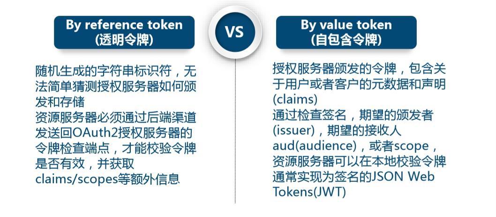

**2.jwt的组成**

典型的，一个JWT看起来如下图：

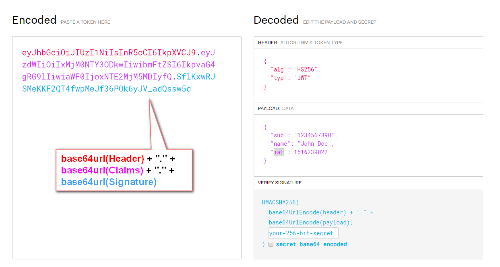

该对象为一个很长的字符串，字符之间通过"."分隔符分为三个子串。
每一个子串表示了一个功能块，总共有以下三个部分：JWT头、有效载荷和签名

**JWT头**

JWT头部分是一个描述JWT元数据的JSON对象，通常如下所示。
{
"alg": "HS256",
"typ": "JWT"
}
在上面的代码中，alg属性表示签名使用的算法，默认为HMAC SHA256（写为HS256）；typ属性表示令牌的类型，JWT令牌统一写为JWT。最后，使用Base64 URL算法将上述JSON对象转换为字符串保存。

**有效载荷**
有效载荷部分，是JWT的主体内容部分，也是一个JSON对象，包含需要传递的数据。 JWT指定七个默认字段供选择。
iss：发行人
exp：到期时间
sub：主题
aud：用户
nbf：在此之前不可用
iat：发布时间
jti：JWT ID用于标识该JWT
除以上默认字段外，我们还可以自定义私有字段，如下例：

{
"sub": "1234567890",
"name": "Helen",
"admin": true
}
请注意，默认情况下JWT是未加密的，任何人都可以解读其内容，因此不要构建隐私信息字段，存放保密信息，以防止信息泄露。
JSON对象也使用Base64 URL算法转换为字符串保存。

**签名哈希**

签名哈希部分是对上面两部分数据签名，通过指定的算法生成哈希，以确保数据不会被篡改。
首先，需要指定一个密码（secret）。该密码仅仅为保存在服务器中，并且不能向用户公开。然后，使用标头中指定的签名算法（默认情况下为HMAC SHA256）根据以下公式生成签名。
HMACSHA256(base64UrlEncode(header) + "." + base64UrlEncode(claims), secret)
在计算出签名哈希后，JWT头，有效载荷和签名哈希的三个部分组合成一个字符串，每个部分用"."分隔，就构成整个JWT对象。

**Base64URL算法**

如前所述，JWT头和有效载荷序列化的算法都用到了Base64URL。该算法和常见Base64算法类似，稍有差别。
作为令牌的JWT可以放在URL中（例如api.example/?token=xxx）。 Base64中用的三个字符是"+"，"/"和"="，由于在URL中有特殊含义，因此Base64URL中对他们做了替换："="去掉，"+"用"-"替换，"/"用"_"替换，这就是Base64URL算法。

## 4.4 搭建项目工程

**项目所使用的技术说明**

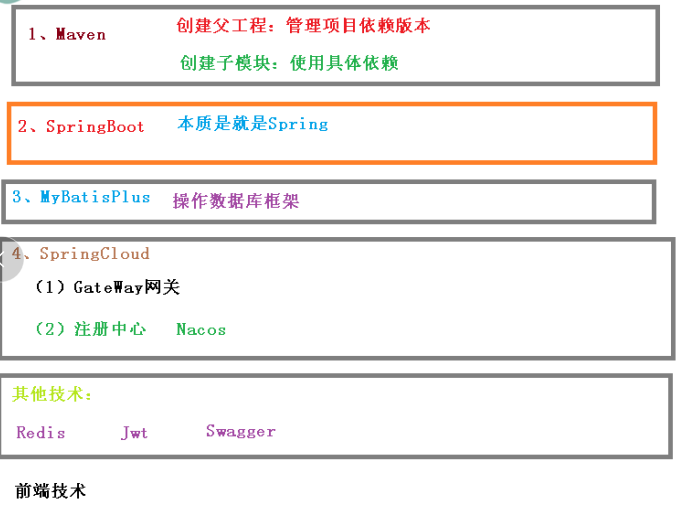

**1.项目搭建总体设计**

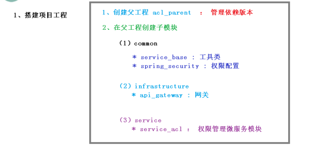

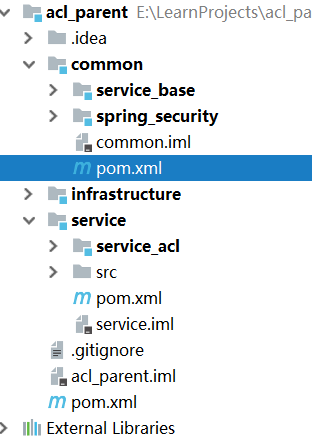

**2.引入相关依赖**

略

**3.具体代码实现**

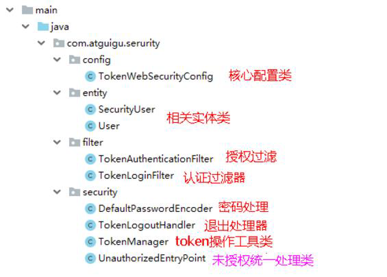

### **编写核心配置类**

SpringSecurity的核心配置类继承**`WebSecurityConfigureAdapter`**并且注解**`@Configuration`。**这个配置类指名了密码处理的方式、登录登出的控制、请求路径等和安全相关的配置

```java
@Configuration
public class TokenSecurityConfig extends WebSecurityConfigurerAdapter {
    private RedisTemplate redisTemplate;
    //自定义查询数据库用户名密码和权限信息
    private UserDetailsService userDetailsService;
    //token管理工具类（生成token）
    private TokenManager tokenManager;
    // 密码管理工具类
    private DefaultPasswordEncoder defaultPasswordEncoder;
    private AuthenticationManager authenticationManager;

    @Override
    protected void configure(HttpSecurity http) throws Exception {

        http.logout().logoutUrl("/*/acl/**").addLogoutHandler(new TokenLogoutHandler(redisTemplate, tokenManager)).permitAll();

        http.exceptionHandling()
                .authenticationEntryPoint(new unAuthorizedEntryPoint())
                .and()
                .csrf().disable()
                .addFilter(new LoginAuthtication(tokenManager,redisTemplate,authenticationManager))
                .addFilter(new TokenAuthorize(authenticationManager,redisTemplate,tokenManager));
    }

    @Override
    protected void configure(AuthenticationManagerBuilder auth) throws Exception {
        auth.userDetailsService(userDetailsService).passwordEncoder(defaultPasswordEncoder);
    }

    @Override
    public void configure(WebSecurity web) throws Exception {
        web.ignoring().antMatchers("/api/**","/swagger-ui.html/**");
    }
}
```

### 创建认证授权相关的工具类

**（1）：`DefaultPasswordEncoder`：密码处理方法**

```java
/**
 * 自定义密码加密
 */
public class DefaultPasswordEncoder implements PasswordEncoder {
    
    /**
     * 自定义MD5加密
     * @param rawPassword
     * @return
     */
    @Override
    public String encode(CharSequence rawPassword) {
        return MD5.encrypt(rawPassword.toString());
    }

    /**
     * 自定义密码比对
     * @param rawPassword
     * @param encodedPassword
     * @return
     */
    @Override
    public boolean matches(CharSequence rawPassword, String encodedPassword) {
        return encodedPassword.equals(MD5.encrypt(rawPassword.toString()));
    }
}
```

**（2）`TokenManager`：token的操作工具类**

```java
/**
 * Token工具类
 */
@Component
public class TokenManager {
    // 过期时间
    private long tokenExpiration = 24 * 60 * 60 * 1000;
    //秘钥
    private String tokenSignKey = "123456";

    public TokenManager(long tokenExpiration, String tokenSignKey) {
        this.tokenExpiration = tokenExpiration;
        this.tokenSignKey = tokenSignKey;
    }

    //1.使用jwt根据用户名生成token
    public String createToken(String username){
        return Jwts.builder().setSubject(username)
                .setExpiration(new Date(System.currentTimeMillis() + tokenExpiration))
                .signWith(SignatureAlgorithm.HS512,tokenSignKey).compressWith(CompressionCodecs.GZIP).compact();
    }
    //2.根据token获取用户信息
    public String getUserInfoFromToken(String token){
        String subject = Jwts.parser().setSigningKey(tokenSignKey)
                .parseClaimsJwt(token).getBody().getSubject();
        return subject;
    }

    //3.删除token
    public void removeToken(String token){}
}
```

**（3）：`TokenLogoutHandler`：退出实现**

```JAVA
/**
 * 自定义退出处理器
 */
@Component
public class TokenLogoutHandler implements LogoutHandler {

    private RedisTemplate redisTemplate;
    private TokenManager tokenManager;

    public TokenLogoutHandler(RedisTemplate redisTemplate, TokenManager tokenManager) {
        this.redisTemplate = redisTemplate;
        this.tokenManager = tokenManager;
    }

    //退出功能
    @Override
    public void logout(HttpServletRequest httpServletRequest, HttpServletResponse httpServletResponse, Authentication authentication) {
        //1.将token从header中去除
        String token = httpServletRequest.getHeader("token");
        if (token != null ){
            tokenManager.removeToken(token);
            //2.从reids中去除token
            String userName = tokenManager.getUserInfoFromToken(token);
            redisTemplate.delete(userName);
        }
        ResponseUtil.out(httpServletResponse, R.ok());
    }
}
```

**（4）`unAuthorizedEntryPoint`：未授权统一处理**

```java
/**
 * 自定义类：未授权处理类
 */
public class unAuthorizedEntryPoint implements AuthenticationEntryPoint {
    @Override
    public void commence(HttpServletRequest httpServletRequest, HttpServletResponse httpServletResponse, AuthenticationException e) throws IOException, ServletException {
        ResponseUtil.out(httpServletResponse,R.error());
    }
}
```

### 创建认证授权实体类


**（1）SecurityUser**

```java
@Data
@Slf4j
public class SecurityUser implements UserDetails {
    //当前登录用户
    private transient User currentUserInfo;
    //当前权限
    private List<String> permissionValueList;

    public SecurityUser() {

    }

    public SecurityUser(User user) {
        if (user != null) {
            this.currentUserInfo = user;
        }
    }

    @Override
    public Collection<? extends GrantedAuthority> getAuthorities() {
        Collection<GrantedAuthority> authorities = new ArrayList<>();
        for (String permissionValue : permissionValueList)

        {
            if (StringUtils.isEmpty(permissionValue)) continue;
            SimpleGrantedAuthority authority = new SimpleGrantedAuthority(permissionValue);
            authorities.add(authority);
        }
        return authorities;
    }

    @Override
    public String getPassword() {
        return currentUserInfo.getPassword();
    }

    @Override
    public String getUsername() {
        return currentUserInfo.getUsername();
    }

    @Override
    public boolean isAccountNonExpired() {
        return true;
    }

    @Override
    public boolean isAccountNonLocked() {
        return true;
    }

    @Override
    public boolean isCredentialsNonExpired() {
        return true;
    }

    @Override
    public boolean isEnabled() {
        return true;
    }
}
```

**（2）User**

```java
@Data
@ApiModel(description = "用户实体类")
public class User implements Serializable {
    private String username;
    private String password;
    private String nickName;
    private String salt;
    private String token;
}
```

### 创建认证和授权过滤器

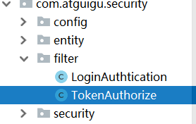

**（1）`LoginAuthtication`：认证过滤器**

```java
/**
 * 自定义认证过滤器
 */
public class LoginAuthtication extends UsernamePasswordAuthenticationFilter {

    private TokenManager tokenManager;
    private RedisTemplate redisTemplate;
    private AuthenticationManager authenticationManager;

    public LoginAuthtication(TokenManager tokenManager, RedisTemplate redisTemplate, AuthenticationManager authenticationManager) {
        this.tokenManager = tokenManager;
        this.redisTemplate = redisTemplate;
        this.authenticationManager = authenticationManager;
        this.setPostOnly(false);
        this.setRequiresAuthenticationRequestMatcher(new AntPathRequestMatcher("/admin/acl/login","POST"));
    }

    @Override
    public Authentication attemptAuthentication(HttpServletRequest request, HttpServletResponse response) throws AuthenticationException {

        try {
            //获取请求参数
            User user = new ObjectMapper().readValue(request.getInputStream(), User.class);
            return authenticationManager.authenticate(new UsernamePasswordAuthenticationToken(user.getUsername(),user.getPassword(),new ArrayList<>()));
        } catch (IOException e) {
            e.printStackTrace();
            throw new RuntimeException(e);
        }
    }
}
```

**（2）`TokenAuthorize`：授权过滤器**

```java
/**
 * 自定义授权过滤器
 */
public class TokenAuthorize extends BasicAuthenticationFilter {
    private RedisTemplate redisTemplate;
    private TokenManager tokenManager;

    public TokenAuthorize(AuthenticationManager authenticationManager, RedisTemplate redisTemplate, TokenManager tokenManager) {
        super(authenticationManager);
        this.redisTemplate = redisTemplate;
        this.tokenManager = tokenManager;
    }


    /**
     * 授权
     * @param request
     * @param response
     * @param chain
     * @throws IOException
     * @throws ServletException
     */
    @Override
    protected void doFilterInternal(HttpServletRequest request, HttpServletResponse response, FilterChain chain) throws IOException, ServletException {


        Authentication authResult = getAuthenticate(request);

        SecurityContextHolder.getContext().setAuthentication(authResult);

        chain.doFilter(request, response);
    }

    private Authentication getAuthenticate(HttpServletRequest request){
        //1.从header中获取token
        String token = request.getHeader("token");
        if (token != null){
            //2.根据token获取用户信息
            String userName = tokenManager.getUserInfoFromToken(token);
            //3.根据user从redis中获取对应的权限
            List<String> list = (List<String>) redisTemplate.opsForValue().get(userName);
            List<GrantedAuthority> auths = new ArrayList<>();
            for (String auth : list) {
                SimpleGrantedAuthority simpleGrantedAuthority = new SimpleGrantedAuthority(auth);
                auths.add(simpleGrantedAuthority);
            }
            return new UsernamePasswordAuthenticationToken(userName,token,auths);
        }
        return null;
    }
}
```

# 5、SpringSecurity原理

## 5.1 SpringSecurity过滤器介绍

SpringSecurity采用的是责任链的设计模式，它有一条很长的过滤器链。现在对这条过滤器链的15个过滤器进行说明：

（1） WebAsyncManagerIntegrationFilter：将 Security 上下文与 Spring Web 中用于处理异步请求映射的 WebAsyncManager 进行集成。

（2）SecurityContextPersistenceFilter：在每次请求处理之前将该请求相关的安全上下文信息加载到SecurityContextHolder中，然后在该次请求处理完成之后，将 SecurityContextHolder 中关于这次请求的信息存储到一个“仓储”中，然后将 SecurityContextHolder 中的信息清除，例如在Session中维护一个用户的安全信息就是这个过滤器处理的。

（3） HeaderWriterFilter：用于将头信息加入响应中。

（4） CsrfFilter：用于处理跨站请求伪造。

（5）LogoutFilter：用于处理退出登录。

（6）UsernamePasswordAuthenticationFilter：用于处理基于表单的登录请求，从表单中获取用户名和密码。默认情况下处理来自 /login 的请求。从表单中获取用户名和密码时，默认使用的表单 name 值为 username 和 password，这两个值可以通过设置这个过滤器的usernameParameter 和 passwordParameter 两个参数的值进行修改。

（7）DefaultLoginPageGeneratingFilter：如果没有配置登录页面，那系统初始化时就会配置这个过滤器，并且用于在需要进行登录时生成一个登录表单页面。

（8）BasicAuthenticationFilter：检测和处理 http basic 认证。

（9）RequestCacheAwareFilter：用来处理请求的缓存。

（10）SecurityContextHolderAwareRequestFilter：主要是包装请求对象request。

（11）AnonymousAuthenticationFilter：检测 SecurityContextHolder 中是否存在 Authentication 对象，如果不存在为其提供一个匿名 Authentication。

（12）SessionManagementFilter：管理 session 的过滤器

（13）ExceptionTranslationFilter：处理 AccessDeniedException 和 AuthenticationException 异常。

（14）FilterSecurityInterceptor：可以看做过滤器链的出口。

（15）RememberMeAuthenticationFilter：当用户没有登录而直接访问资源时, 从 cookie 里找出用户的信息, 如果 Spring Security 能够识别出用户提供的remember me cookie, 用户将不必填写用户名和密码, 而是直接登录进入系统，该过滤器默认不开启。

## 5.2 SpringSecurity的基本流程

**Spring Security**采取过滤链实现认证与授权，只有当前过滤器通过，才能进入下一个过滤器：

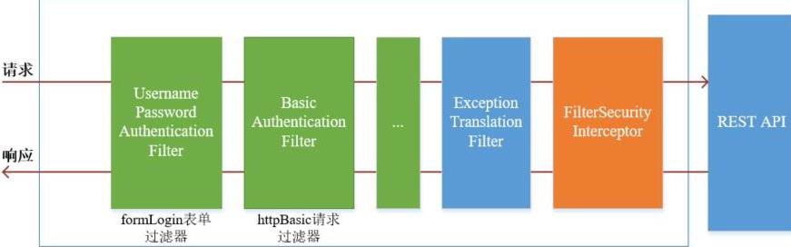

**绿色部分是认证过滤器，需要我们自己配置，可以配置多个认证过滤器。**认证过滤器可以使用Spring Security提供的认证过滤器，也可以自定义过滤器（例如：短信验证）。认证过滤器要在configure(HttpSecurity http)方法中配置，没有配置不生效。下面会重点介绍以下三个过滤器：
UsernamePasswordAuthenticationFilter过滤器：该过滤器会拦截前端提交的 POST 方式的登录表单请求，并进行身份认证。
ExceptionTranslationFilter过滤器：该过滤器不需要我们配置，对于前端提交的请求会直接放行，捕获后续抛出的异常并进行处理（例如：权限访问限制）。
FilterSecurityInterceptor过滤器：该过滤器是过滤器链的最后一个过滤器，根据资源权限配置来判断当前请求是否有权限访问对应的资源。如果访问受限会抛出相关异常，并由ExceptionTranslationFilter过滤器进行捕获和处理。

## 5.3 SpringSecurity 认证流程

认证流程是在UsernamePasswordAuthenticationFilter过滤器中处理的，具体流程如下所示：

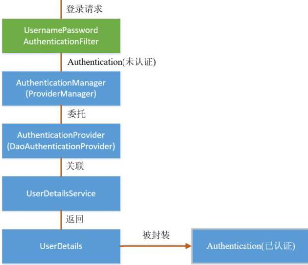

### 5.3.1UsernamePasswordAuthenticationFilter源码

当前端提交的是一个 POST 方式的登录表单请求，就会被该过滤器拦截，并进行身份认证。该过滤器的 doFilter() 方法实现在其抽象父类

**AbstractAuthenticationProcessingFilter中，查看相关源码：**

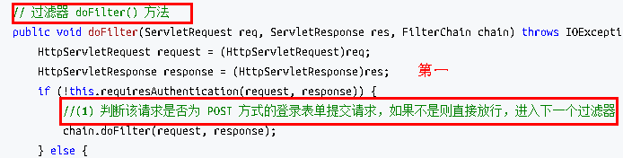

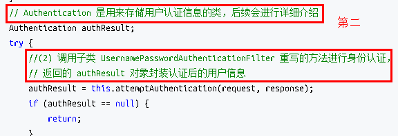

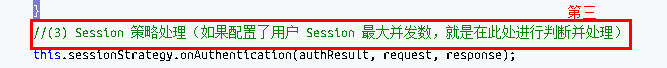

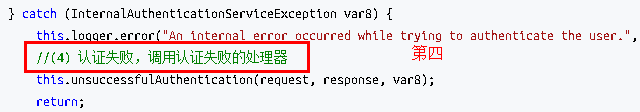

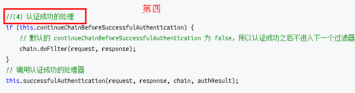

**上述的 第二 过程调用了UsernamePasswordAuthenticationFilter的 attemptAuthentication() 方法，源码如下：**

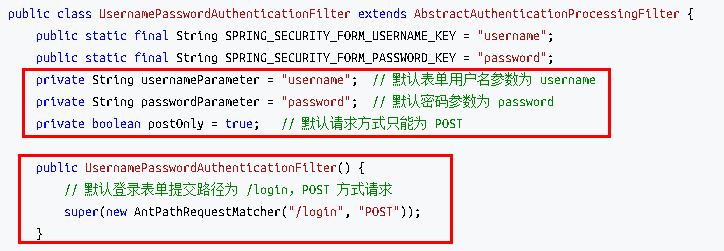

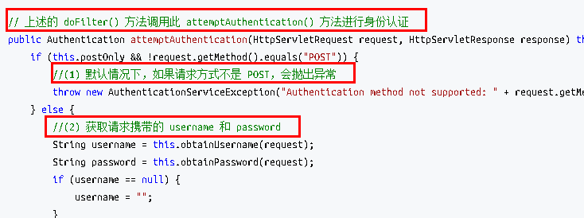

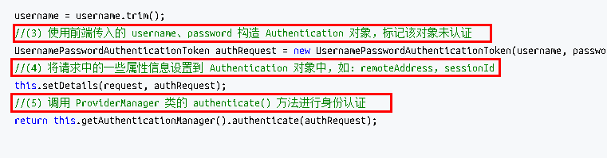

**上述的（3）过程创建的UsernamePasswordAuthenticationToken是 Authentication 接口的实现类，该类有两个构造器，一个用于封装前端请求传入的未认证的用户信息，一个用于封装认证成功后的用户信息：**

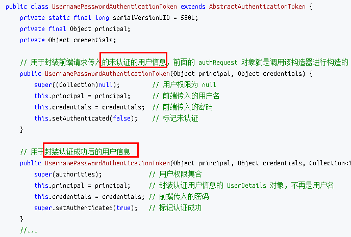

**Authentication 接口的实现类用于存储用户认证信息，查看该接口具体定义：**

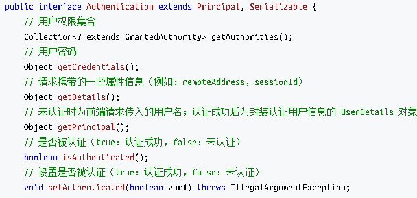

### 5.3.2 ProviderManager 源码

上述过程中，UsernamePasswordAuthenticationFilter过滤器的 attemptAuthentication() 方法的**（5）过程**将未认证的 Authentication 对象传入 ProviderManager 类的 authenticate() 方法进行身份认证。ProviderManager 是 AuthenticationManager 接口的实现类，该接口是认证相关的核心接口，也是认证的入口。在实际开发中，我们可能有多种不同的认证方式，例如：用户名+密码、邮箱+密码、手机号+验证码等，而这些认证方式的入口始终只有一个，那就是 AuthenticationManager。在该接口的常用实现类 ProviderManager 内部会维护一个`List<AuthenticationProvider>`列表，存放多种认证方式，实际上这是委托者模式（Delegate）的应用。每种认证方式对应着一个 AuthenticationProvider，AuthenticationManager 根据认证方式的不同（根据传入的 Authentication 类型判断）委托对应的 AuthenticationProvider 进行用户认证。

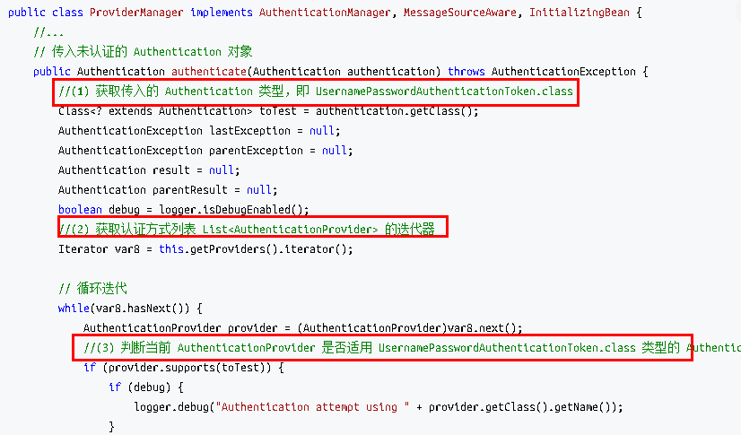

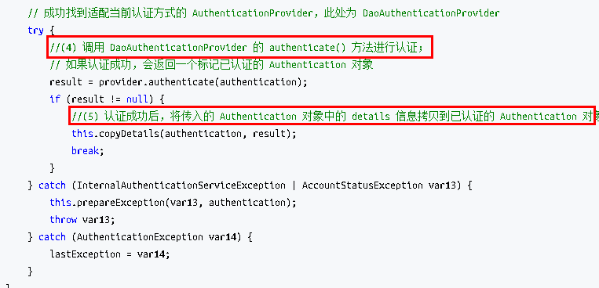

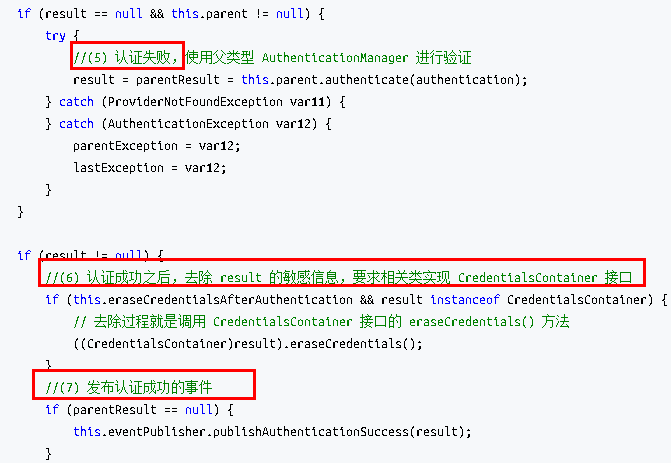

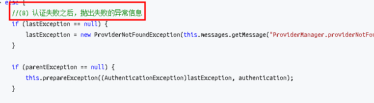

**上述认证成功之后的（6）过程，调用 CredentialsContainer 接口定义的 eraseCredentials() 方法去除敏感信息。查看 UsernamePasswordAuthenticationToken 实现的 eraseCredentials() 方法，该方法实现在其父类中：**

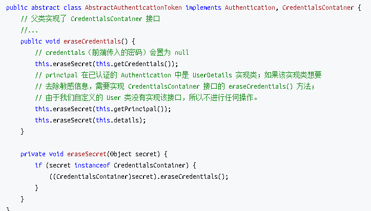

### 5.3.3 认证成功/失败处理

**上述过程就是认证流程的最核心部分**，接下来重新回到UsernamePasswordAuthenticationFilter过滤器的 doFilter() 方法，查看认证成功/失败的处理：

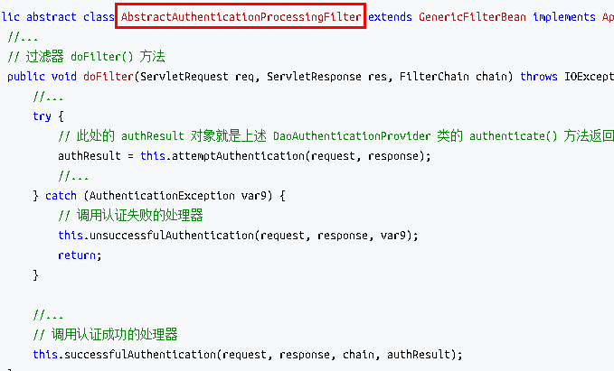

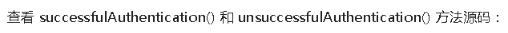

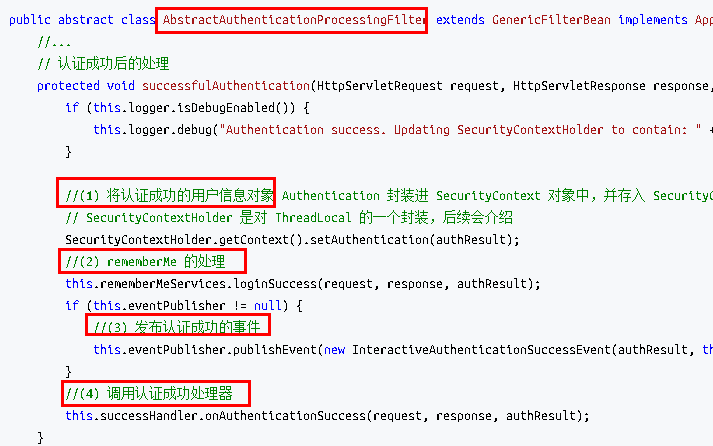

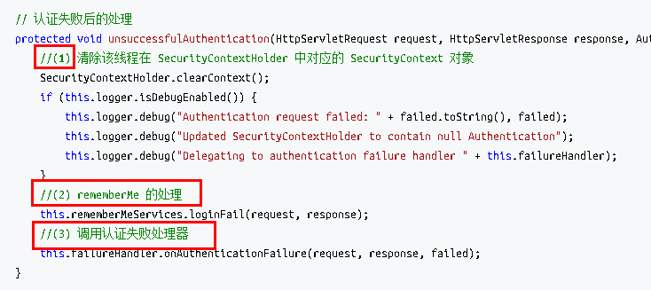

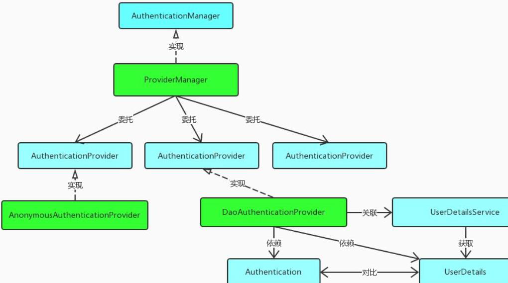

## 5.4 SpringSecurity权限访问流程

上一个部分通过源码的方式介绍了认证流程，下面介绍权限访问流程，主要是对**ExceptionTranslationFilter**过滤器和**FilterSecurityInterceptor**过滤器进行介绍。

### 5.4.1ExceptionTranslationFilter过滤器

该过滤器是用于处理异常的，不需要我们配置，对于前端提交的请求会直接放行，捕获后续抛出的异常并进行处理（例如：权限访问限制）。具体源码如下：

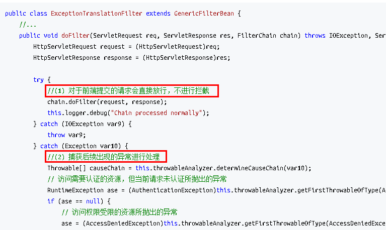

### 5.4.2 FilterSecurityInterceptor过滤器

ilterSecurityInterceptor是过滤器链的最后一个过滤器，该过滤器是过滤器链的最后一个过滤器，根据资源权限配置来判断当前请求是否有权限访问对应的资源。如果访问受限会抛出相关异常，最终所抛出的异常会由前一个过滤器ExceptionTranslationFilter进行捕获和处理。具体源码如下：

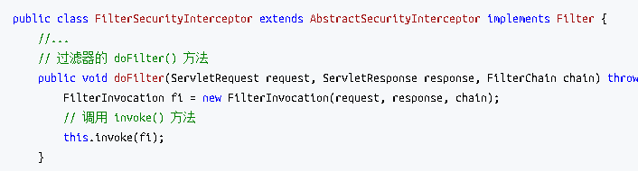

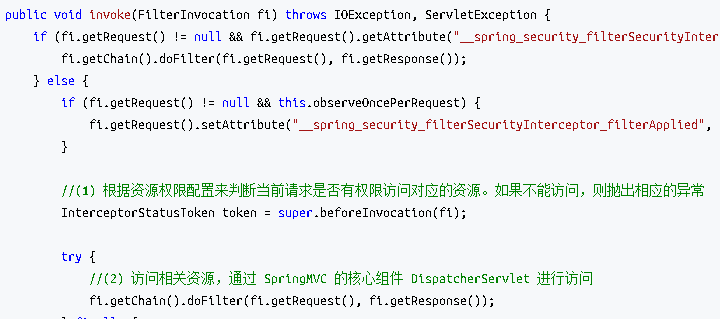

需要注意，Spring Security的过滤器链是配置在 SpringMVC 的核心组件 DispatcherServlet 运行之前。也就是说，请求通过Spring Security的所有过滤器，不意味着能够正常访问资源，该请求还需要通过 SpringMVC 的拦截器链。

## 5.5 SpringSecurity请求间共享认证信息

一般认证成功后的用户信息是通过 Session 在多个请求之间共享，那么Spring Security中是如何实现将已认证的用户信息对象 Authentication 与 Session 绑定的进行具体分析。

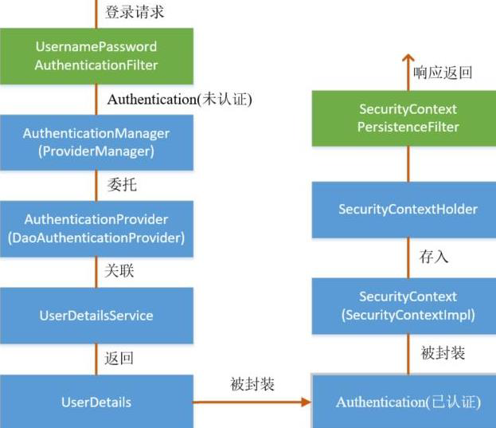

在前面讲解认证成功的处理方法 successfulAuthentication() 时，有以下代码：

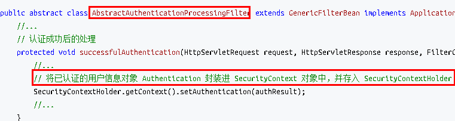

查看 SecurityContext 接口及其实现类 SecurityContextImpl，该类其实就是对 Authentication 的封装：

查看 SecurityContextHolder 类，该类其实是对 ThreadLocal 的封装，存储 SecurityContext 对象：

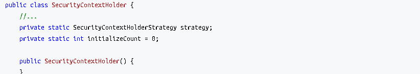

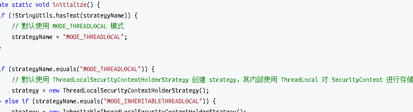

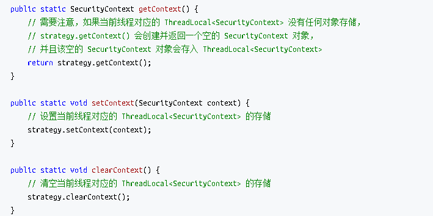

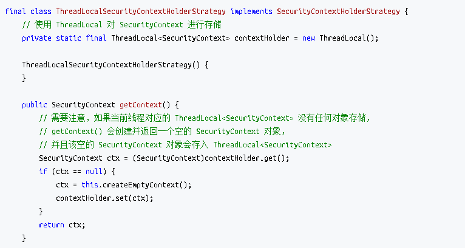

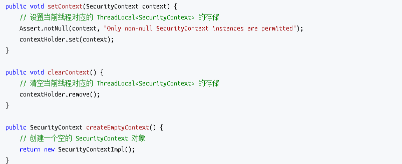

### 5.5.1 SecurityContextPersistenceFilter过滤器

前面提到过，在UsernamePasswordAuthenticationFilter过滤器认证成功之后，会在认证成功的处理方法中将已认证的用户信息对象 Authentication 封装进 SecurityContext，并存入 SecurityContextHolder。
之后，响应会通过SecurityContextPersistenceFilter过滤器，该过滤器的位置在所有过滤器的最前面，请求到来先进它，响应返回最后一个通过它，所以在该过滤器中处理已认证的用户信息对象 Authentication 与 Session 绑定。
认证成功的响应通过SecurityContextPersistenceFilter过滤器时，会从 SecurityContextHolder 中取出封装了已认证用户信息对象 Authentication 的 SecurityContext，放进 Session 中。当请求再次到来时，请求首先经过该过滤器，该过滤器会判断当前请求的 Session 是否存有 SecurityContext 对象，如果有则将该对象取出再次放入 SecurityContextHolder 中，之后该请求所在的线程获得认证用户信息，后续的资源访问不需要进行身份认证；当响应再次返回时，该过滤器同样从 SecurityContextHolder 取出 SecurityContext 对象，放入 Session 中。具体源码如下：

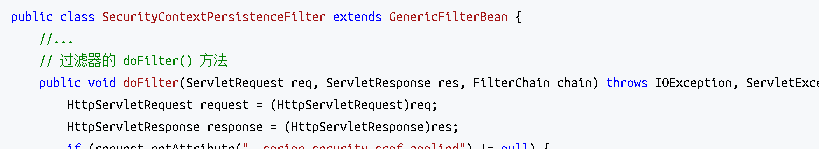

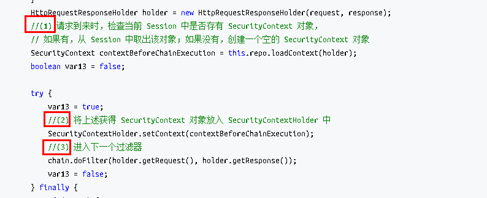

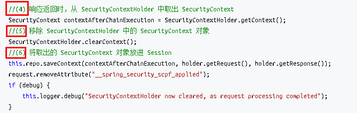