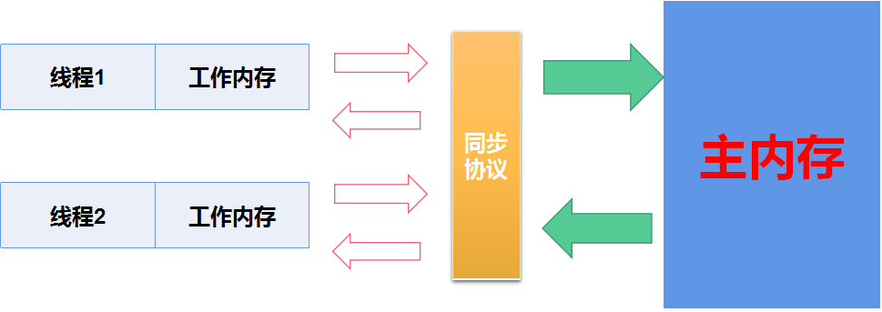
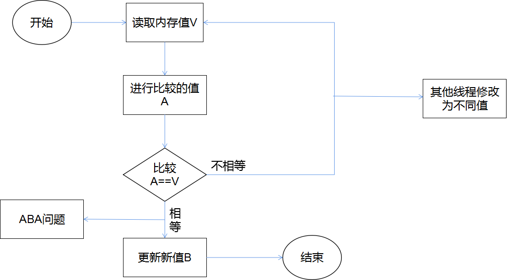
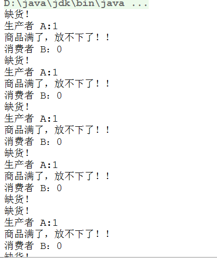
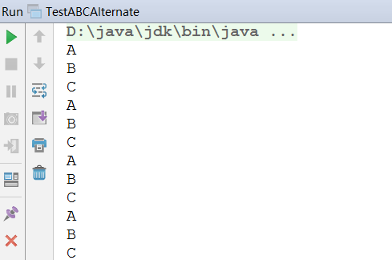
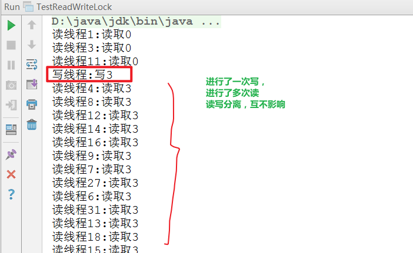
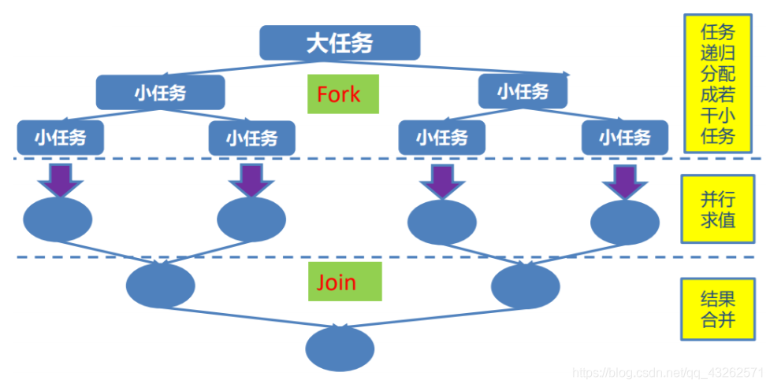

# 1、JUC 简介

在Java5.0提供了**java.util.concurrent**（简称JUC）包，在此包中增加了在并发编程中的很常用的实用工具类，用于定义类似于线程的自定义子系统，包括线程池、异步于IO和轻量级任务框架。提供可调的、灵活的线程池。还提供了设计用于多线程上下文中的Collection实现等。

# 2、volatile 关键字-内存可见性

## 2.1 内存可见性

Java内存模型规定，**<span style="color:red">对于多线程下的共享变量是存储在主内存中的，每个线程都有自己独立的工作线程，每个线程会将主内存的共享变量复制一份副本放入到自己的工作内存中，每个线程只能操作自己的工作内存，不可以访问其他线程的工作内存。</span>**线程要操作这些共享变量，只能通过工作内存中的副本来实现，在操作完成之后再同步到主内存中，其JVM模型图大致如下：



**JVM模型规定：**

1）线程对共享变量的操作必须在自己的工作内存中进行，不能直接从主内存中读写。

2）不同的线程之间无法直接访问其他线程的工作内存中的变量，多线程之间的共享变量操作需要通过主内存来进行传递。

**3）导致的后果：线程对共享变量的操作如果没有及时更新（同步）到主内存中，那其他线程读取该共享变量的值就不是最新的。这就引出了内存可见性问题。**

**<span style="color:red">内存可见性定义：</span>**当多个线程对共享变量进行读写操作时，要确保共享变量在修改之后对其他线程来说是可见的。	

```java
public class TestVolatile {
    public static void main(String[] args) {
        ThreadDemo td = new ThreadDemo();
        Thread t1 = new Thread(td);
        t1.start();

        //第一种方式：通过synchronized解决共享数据可见问题
//        synchronized (td) {
//            while (true) {
//                if (td.isFlag()) {
//                    System.out.println("----------------");
//                }
//            }
//        }
        
        while (true) {
            if (td.isFlag()) {
                System.out.println("----------------");
                break;
            }
        }
    }
}

class ThreadDemo implements Runnable {

    //第二种方式：通过volatile解决多线程共享数据可见性问题
    private volatile boolean flag = false;

    @Override
    public void run() {
        try {
            Thread.sleep(200);
        } catch (InterruptedException e) {
            e.printStackTrace();
        }
        flag = true;
        System.out.println("线程1:flag = " + flag);
    }

    public boolean isFlag() {
        return flag;
    }
    public void setFlag(boolean flag) {
        this.flag = flag;
    }
}
```

## 2.2 volatile 关键字

Java提供了一种轻量级的同步机制，即volatile变量。用来确保将共享变量的更新操作通知到其他线程。当把共享变量用volatile修饰时，线程对该变量进行修改时将该变量的值立即刷新回主内存，同时会使其他线程中缓存的该变量无效，从而其他线程在读取该值时会从主内存中读取该值（参考缓存一致性）。

volatile**<span style="color:red">屏蔽了JVM中必要的代码优化（禁止指令重排）</span>**，所以在**效率上比较低。**

```java
//如果设置为	
private volatile boolean flag = false;
//输出结果：
flag=true
------------------
```

## 2.3 volatile和synchronized的区别

1. 对于多线程，**不是一种互斥关系**
2. **不能保证**变量状态的**“原子性操作”**

# 3、原子变量与CAS算法

## 3.1 i++的原子问题

```java
public class TestAtomicDemo {
    public static void main(String[] args) {

        AtomicDemo ad = new AtomicDemo();
        for (int i = 0; i < 10; i++) {
            new Thread(ad).start();
        }
    }
}

class AtomicDemo implements Runnable {

    private int serialNumber = 0;

    @Override
    public void run() {
        try {
            Thread.sleep(2000);
        } catch (InterruptedException e) {
            e.printStackTrace();
        }
        System.out.println(Thread.currentThread().getName() + ":" + getSerialNumber());
    }

    public int getSerialNumber() {
        return serialNumber++;
    }
}

//运行结果
Thread-1:0
Thread-5:1
Thread-9:2
Thread-6:3
Thread-2:3
Thread-0:4
Thread-4:5
Thread-8:6
Thread-3:7
Thread-7:8
```

```java
//如果改为：
class AtomicDemo implements Runnable{
	private volatile int serialNumber = 0;
//	private AtomicInteger serialNumber = new AtomicInteger(0);
	
	@Override
	public void run() {
		try {
			Thread.sleep(200);
		} catch (InterruptedException e) {
		}
		System.out.print(getSerialNumber()+" ");
	}
	public int getSerialNumber(){
		return serialNumber++;
//		return serialNumber.getAndIncrement();
	}
}
//运行结果：
//0 4 3 2 1 0 5 6 7 8 ——> 会产生重复

```

## 3.2 原子变量

`java.util.concurrent.atomic`包定义了一些常用类型的原子变量。这些原子变量为我们提供了一种操作单一变量无锁（lock-free）的线程安全（thread-safe）方式。

实际上该包下面的类为我们提供了类似`volatile`变量的特性，同时还提供了诸如`boolean compareAndSet(expectedValue,updateValue)`的功能。

不使用锁实现线程安全听起来似乎很不可思议，这其实是通过CPU的`compare and swap`指令实现的，由于硬件指令支持当然不需要加锁了。

```
核心方法：boolean compareAndSet(expectedValue, updateValue)
```

+ 原子变量类的命名类似于AtomicXxx，例如，AtomicInteger类用于表示一个int变量。
+ 标量原子变量类

AtomicInteger，AtomicLong和AtomicBoolean类分别支持对原始数据类型int，long和boolean的操作。

当引用变量需要以原子方式更新时，AtomicReference类用于处理引用数据类型。

+ 原子数组类

有三个类称为AtomicIntegerArray，AtomicLongArray和AtomicReferenceArray，它们表示一个int，long和引用类型的数组，其元素可以进行原子性更新。

## 3.3 CAS算法

+ Compare And Swap
+ CAS算法是一种硬件对并发的支持，针对多个处理器操作而设计的处理器中的一种特殊指令，用于管理对共享数据的并发访问。
+ CAS是一种**无锁的非阻塞算法**的实现
+ **<span style="color:red">CAS包含3个操作数</span>**
  + V：从主内存读取的值
  + A：进行比较的预期原值
  + B：要修改的新值
  + **<span style="color:red">当且仅当 V == A</span>**时，CAS才会用新值B来更新V的值，否则不会执行任何操作。



## 3.4 ABA问题

CAS操作可能会带来ABA问题，**因为CAS操作需要在操作值的时候，检查该值是否发生变化，如果没有发生变化才会更新。如果没有发生变化，CAS默认会认为该值没有发生变化。**如果一个值原来是A，后来变成了B，然后又变成了A，那么使用CAS进行检查时会认为它的值没有发生变化，但是实际上已经发生改变了。

**<span style="color:red">ABA问题的解决：</span>**JUC提供了一个带有标记版本号的原子引用类`AtomicStampedReference`，它可以通过控制变量的版本来保证CAS的正确性。

## 3.5 CAS在底层的实现

**Unsafe类**

```
Java与C/C++的一个非常明显区别的就是，Java中不可以直接操作内存。当然这并不完全正确；因为Unsafe类就可以做到。
```

Unsafe类在AtomicInteger中的应用：

```java
class AtomicDemo implements Runnable{
	private AtomicInteger serialNumber = new AtomicInteger(0);
	
	@Override
	public void run() {
		try {
			Thread.sleep(200);
		} catch (InterruptedException e) {
		}
		System.out.print(getSerialNumber()+" ");
	}
	public int getSerialNumber(){
		return serialNumber.incrementAndGet();
	}
}
```

```java
public final int incrementAndGet() {
        for (;;) {
            int current = get();
            int next = current + 1;
            if (compareAndSet(current, next))
                return next;
        }
    }

public final boolean compareAndSet(int expect, int update) {
        return unsafe.compareAndSwapInt(this, valueOffset, expect, update);
    }
```

Unsafe类：

```java
public final native boolean compareAndSwapInt(Object var1, long var2, int var4, int var5);
```

运用：

```java
package com.mashibing.jol;

import sun.misc.Unsafe;

import java.lang.reflect.Field;

public class T02_TestUnsafe {

    int i = 0;
    private static T02_TestUnsafe t = new T02_TestUnsafe();

    public static void main(String[] args) throws Exception {
        //Unsafe unsafe = Unsafe.getUnsafe();

        Field unsafeField = Unsafe.class.getDeclaredFields()[0];
        unsafeField.setAccessible(true);
        Unsafe unsafe = (Unsafe) unsafeField.get(null);

        Field f = T02_TestUnsafe.class.getDeclaredField("i");
        long offset = unsafe.objectFieldOffset(f);
        System.out.println(offset);

        boolean success = unsafe.compareAndSwapInt(t, offset, 0, 1);
        System.out.println(success);
        System.out.println(t.i);
        //unsafe.compareAndSwapInt()
    }
}
```

jdk8u: unsafe.cpp:

cmpxchg = compare and exchange

```c++
UNSAFE_ENTRY(jboolean, Unsafe_CompareAndSwapInt(JNIEnv *env, jobject unsafe, jobject obj, jlong offset, jint e, jint x))
  UnsafeWrapper("Unsafe_CompareAndSwapInt");
  oop p = JNIHandles::resolve(obj);
  jint* addr = (jint *) index_oop_from_field_offset_long(p, offset);
  return (jint)(Atomic::cmpxchg(x, addr, e)) == e;
UNSAFE_END
```

jdk8u: atomic_linux_x86.inline.hpp

is_MP = Multi Processor

```c++
inline jint     Atomic::cmpxchg    (jint     exchange_value, volatile jint*     dest, jint     compare_value) {
  int mp = os::is_MP();
  __asm__ volatile (LOCK_IF_MP(%4) "cmpxchgl %1,(%3)"
                    : "=a" (exchange_value)
                    : "r" (exchange_value), "a" (compare_value), "r" (dest), "r" (mp)
                    : "cc", "memory");
  return exchange_value;
}
```

jdk8u: os.hpp is_MP()

```c++
  static inline bool is_MP() {
    // During bootstrap if _processor_count is not yet initialized
    // we claim to be MP as that is safest. If any platform has a
    // stub generator that might be triggered in this phase and for
    // which being declared MP when in fact not, is a problem - then
    // the bootstrap routine for the stub generator needs to check
    // the processor count directly and leave the bootstrap routine
    // in place until called after initialization has ocurred.
    return (_processor_count != 1) || AssumeMP;
  }
```

jdk8u: atomic_linux_x86.inline.hpp

```c++
#define LOCK_IF_MP(mp) "cmp $0, " #mp "; je 1f; lock; 1: "
```

最终实现：

**cmpxchg** = cas修改变量值

```c++
lock cmpxchg 指令   //记住这条指令
```

**cmpxchg不能保证原子性，lock保证了原子性**（当执行cmpxchg指令时，其他CPU不允许对里面的值进行修改）。

```
CAS在JAVA中底层的实现是通过 lock cmpxchg来实现的
volatile和synchronized的实现也都跟这条指令有关
```

# 4、ConcurrentHashMap

`ConcurrentHashMap`同步容器类是JDK5.0之后新增加的一个线程安全的哈希表。对于多线程操作，介于`HashMap`和`HashTable`之间。**<span style="color:red">内部使用分段锁`Segment`代替HashTable的独占锁。</span>**提高了性能。

## 4.1锁粒度

**减小锁的粒度是指缩小锁定对象的范围，从而减小锁冲突的可能性，进而提高系统的并发能力。**减小锁的粒度是一种削弱多线程锁竞争的有效手段，这种技术典型的应用是ConcurrentHashMap（高性能的HashMap）类的实现。对于HashMap而言，最重要的是put()和get()方法，**如果我们对整个HashMap加锁，可以得到线程的安全，但是锁的粒度太大。**Segment的大小也称为ConcurrentHashMap的并发度。

## 4.2锁分段

**<span style="color:red">在jdk1.8以前，ConcurrentHashMap的内部细分了若干个的Segment。</span>**默认情况下，ConcurrentHashMap会被细分成16个Segment段。

如果需要在ConcurrentHashMap中添加一个新的表项，并不是将整个HashMap加锁，而是首先根据hashcode得到该表项位于哪个Segment段，然后**对该Segment段进行加锁。**在多线程环境中，如果多个线程同时进行操作，那么只需要位于不同的Segment，则线程可以实现真正意义上的并行。

## 4.3 其他

此包还提供了设计用于多线程上下文的Collection实现：

`ConcurrentHashMap、ConcurrentSkipListMap、ConcurrentSkipListSet、CopyOnWriteArrayList和CopyOnWriteArraySet`

+ 当期望许多线程访问一个给定 collection 时，ConcurrentHashMap 通常优于同步的 HashMap， ConcurrentSkipListMap 通常优于同步的 TreeMap。
+ **<span style="color:red">当在遍历或者读操作多于写操作时，</span>**``CopyOnWriteArrayList`优于`synchronizedArrayList`

## 4.4 CopyOnWriteArrayList——写入并复制

注意：多线程环境下，**在进行较多的添加操作时，效率低。**因为每次添加时候都会进行复制，开销非常大。但如果是并发的迭代操作时，可以考虑该类。

```java
public class TestCopyOnWriteArrayList {

    public static void main(String[] args) {
        CopyOnWriteArrayListDemo cowad = new CopyOnWriteArrayListDemo();
        for (int i = 0; i < 10; i++) {
            new Thread(cowad).start();
        }
    }
}

class CopyOnWriteArrayListDemo implements Runnable{

    //    private static CopyOnWriteArrayList<String> list = new CopyOnWriteArrayList<>();
    private static List<String> list = Collections.synchronizedList(new ArrayList<>());

    static {
        list.add("AA");
        list.add("BB");
        list.add("CC");
    }

    @Override
    public void run() {

        Iterator<String> iterator = list.iterator();
        while (iterator.hasNext()){
            System.out.println(iterator.next());
            list.add("AA");
        }
    }
}
```

运行时会造成`ConcurrentModificationException`异常，**该异常的出现是因为：多线程并发环境下，在进行遍历数据的同时修改数据，就会抛出此异常。**

```java
//	private static List<String> list = Collections.synchronizedList(new ArrayList<String>());
	private static CopyOnWriteArrayList<String> list = new CopyOnWriteArrayList<>();
```

这样写程序正常运行，并且不会抛出此异常。**<span style="color:red">这是因为在并发环境下，每次写入一个数据的时候都进行复制，这样就不会互相影响了。但是这个操作的开销会非常大。</span>**

# 5、CountDownLatch（闭锁）

`CountDownLatch`(闭锁)——一个同步辅助类，在完成一组正在其他线程中执行的操作之前，它允许一个或多个线程一直等待。CountDown(倒数) latch(锁)

`CountDownLatch`（闭锁）用给定的计数器初始化CountDownLatch。由于调用了`countDown()`方法，所以在当前计数到达零之前，`await()`方法一直处于阻塞状态。当计数到达零之后，会释放所有等待的线程，这种现象只会产生一次——计数无法被重置。**一个线程或者多个，等待另外N个线程完成某个事情之后才能执行。**

闭锁可以确保某些活动直到其他活动完成之后才继续执行；例如：

+ 确保某个计算在其所需要的资源都初始化之后才继续执行。
+ 确保某个服务在其依赖的所有其他服务都已经启动之后才启动；
+ 等待直到某个操作所有参与者都准备就绪再继续执行。

## 5.1 方法介绍

+ `countDown()`：倒数
+ `await()`：在计数没有到达0之前，调用await方法的对象需要等待直到计数到达0之后释放。

**`CountDownLatch`的一个小例子：**运行看效果更好哟~

```java
public class TestCountDownLatch {

    public static void main(String[] args) {

        long start = System.currentTimeMillis();

        //有几个线程，计数器就等于几
        CountDownLatch countDownLatch = new CountDownLatch(5);
        CountDownLatchDemo cdld  = new CountDownLatchDemo(countDownLatch);
        for (int i = 0; i < 5; i++) {
            new Thread(cdld).start();
        }

        try {
            countDownLatch.await();
        } catch (InterruptedException e) {
            e.printStackTrace();
        }
        long end = System.currentTimeMillis();
        System.out.println("总耗费时间：" + (end - start));
    }
}

class CountDownLatchDemo implements Runnable{

    private CountDownLatch countDownLatch;

    public CountDownLatchDemo(CountDownLatch countDownLatch){
        this.countDownLatch = countDownLatch;
    }

    @Override
    public void run() {
        try {
            for (int i = 0; i < 10000; i++) {
                if (i % 2 == 0){
                    System.out.println(i);
                }
            }
        }finally {
            //每当一个线程执行完成之后，计数减一
            //无论如何，都要执行计数减少1，所以放在finally中
            countDownLatch.countDown();
        }
    }
}
```

# 6、实现Callable接口

Java5.0在java.util.concurrent提供了**一个新的创建线程的方式：Callable接口。**

Callable接口中`call()`方法的返回值需要依赖`FutureTask`实现类来接收，`FutureTask`也可以用作闭锁。

## 6.1 创建线程的四种方式

+ 继承`Thread`类，重写run()方法
+ 实现`Runnable`接口，重写run()方法
+ 实现`Callable`接口，重写call()方法
+ 利用线程池创建线程

## 6.2 面试题—Callable和Runnable的区别

Callable接口可以添加泛型，call方法可以抛出异常，并且有返回值。返回值用`FutureTask`实现类接收。Runnable接口中重写run()方法，无返回值。并且没有抛出异常。

**Callable小例子：**

```java
public class TestCallable {
    public static void main(String[] args) {
        CallableDemo cd = new CallableDemo();
        FutureTask<Integer> futureTask = new FutureTask<Integer>(cd);
        new Thread(futureTask).start();

        Integer result = null;
        try {
            result = futureTask.get();
        } catch (InterruptedException e) {
            e.printStackTrace();
        } catch (ExecutionException e) {
            e.printStackTrace();
        }
        System.out.println(result);
    }
}

class CallableDemo implements Callable<Integer> {

    @Override
    public Integer call() throws Exception {
        int sum = 0;
        for (int i = 0; i < 100; i++) {
            sum += i;
        }
        return sum;
    }
}
```

# 7、Lock同步锁

解决多线程的安全问题的三种方式：

+ jdk1.5前：synchronized（隐式锁）
  + 同步代码快
  + 同步方法
+ jdk1.5后：Lock（显示锁）
+ 注意：Lock是一个显示锁，需要通过lock()方法上锁，必须通过unlock()方法进行释放锁。

**Lock小例子：**

```java
public class TestLock {
    public static void main(String[] args) {
        LockDemo kd = new LockDemo();
        new Thread(kd).start();
        new Thread(kd).start();
        new Thread(kd).start();
    }
}

class LockDemo implements Runnable {

    private int tickets = 100;
    private Lock lock = new ReentrantLock();

    @Override
    public void run() {
        lock.lock();
        try {
            while (true) {
                if (tickets > 0) {
//                    try {
//                        Thread.sleep(200);
//                    } catch (InterruptedException e) {
//                        e.printStackTrace();
//                    }
                    System.out.println(Thread.currentThread().getName() + ":完成了售票，余票为：" + tickets--);
                }
            }
        }finally {
            lock.unlock();
        }
    }
}
```

## 7.1面试题—Lock与Synchronized的区别

+ Lock是一个接口，synchronized是关键字
+ synchronized在线程发生异常时会自动释放锁，因此不会导致异常死锁的发生。而lock不会自动释放锁，需要在finally中手动释放锁。
+ lock是可以中断锁，synchronized是非中断锁，必须等待线程执行完成释放锁。

## 7.2 ReentrantLock与Synchronized的区别

+ ReentrantLock是Lock接口的实现类，synchronized是关键字
+ ReentrantLock可以对获取锁的等待时间进行设置，这样就避免了死锁。
+ ReentrantLock必须手动释放锁，并且只能修改代码块。而synchronized不用手动释放锁，除此之外可以修饰方法
+ ReentrantLock可以实现公平锁，而synchronized不能。（两个默认都是非公平锁）

# 8、Condition通信

Condition接口描述了可能与锁有关联的条件变量。这些变量在用法与使用Object.wait访问的隐式监视器类似，但提供了更强大的功能。需要特别指出的是，单个Lock与多个Condition对象关联。为了避免兼容性问题，Condition方法的名称与对应的Object版本中的不同。

**在Condition对象中，与wait、notify、notifyall方法对应的方法是await、signal、signalAll。**

Condition实例实质上被绑定到一个锁上。**要为特定的Lock实例获得Condition实例，请使用`newCondition()`方法**

## 8.1使用Condition

使用Condition控制线程通信：

1. 如果不使用synchronized关键字保证同步，而是使用Lock对象来保证同步，则系统中不能使用wait、notify()、notifyAll()方法，**应该使用对应的`await()、signal()、signalAll()`方法**
2. 当使用Lock对象来保证同步时，Java提供了一个Condition类保持协调，使用Condition可以让那些已经得到lock对象却无法继续执行的线程释放lock对象，Condition对象也可以唤醒其他处于等待状态的进程。

## 8.2 使用lock实现生产者-消费者问题

```java
public class ProducerAndConsumerForLock {
    public static void main(String[] args) {
        Clerk clerk = new Clerk();
        Consumer consumer = new Consumer(clerk);
        Producer producer = new Producer(clerk);
        new Thread(producer,"生产者 A").start();
        new Thread(consumer,"消费者 B").start();
        new Thread(producer,"生产者 C").start();
        new Thread(consumer,"消费者 D").start();
    }
}

class Clerk {
    private int product = 0;
    private Lock lock = new ReentrantLock();
    Condition condition = lock.newCondition();

    //进货
    public void get() {
        lock.lock();
        try {
            //为了避免虚假唤醒，需要使用while来代替if
            while (product >= 1) {
                System.out.println("商品满了，放不下了！！");
                try {
                    //等待
                    condition.await();
                } catch (InterruptedException e) {
                    e.printStackTrace();
                }
            }
            System.out.println(Thread.currentThread().getName() + ":" + (++product));
            //唤醒
            condition.signalAll();
        }finally {
            //一定要释放锁
            lock.unlock();
        }

    }

    //卖货
    public void sale() {
        lock.lock();
        try {
            while (product <= 0) {
                System.out.println("缺货！");
                try {
                    condition.await();
                } catch (InterruptedException e) {
                    e.printStackTrace();
                }
            }
            System.out.println(Thread.currentThread().getName() + "：" + (--product));
            condition.signalAll();
        }finally {
            lock.unlock();
        }

    }
}

class Producer implements Runnable {
    Clerk clerk;

    public Producer(Clerk clerk) {
        this.clerk = clerk;
    }

    @Override
    public void run() {
        for (int i = 0; i < 20; i++) {
            clerk.get();
        }
    }
}

class Consumer implements Runnable {
    Clerk clerk;

    public Consumer(Clerk clerk) {
        this.clerk = clerk;
    }

    @Override
    public void run() {
        for (int i = 0; i < 20; i++) {
            clerk.sale();
        }
    }
}
```



# 9、线程按序交替

要求：编写一个程序，开启3个线程，这三个线程的ID分别为A、B、C，每个线程将自己的ID在屏幕上打印10遍，要求输出的结果必须按顺序显示。如：ABCABCABC...依次递归

```java
/**
 * 线程依次轮询，ABCABCABC
 */
public class TestABCAlternate {
    public static void main(String[] args) {
        AlternateDemo ad = new AlternateDemo();
        new Thread(new Runnable() {
            @Override
            public void run() {
                for (int i = 0; i < 10; i++) {
                    ad.loopA();
                }
            }
        }, "A").start();

        new Thread(new Runnable() {
            @Override
            public void run() {
                for (int i = 1; i <= 10; i++) {

                    ad.loopB();
                }
            }
        }, "B").start();

        new Thread(new Runnable() {
            @Override
            public void run() {
                for (int i = 0; i < 10; i++) {
                    ad.loopC();

                }
            }
        }, "C").start();
    }
}

class AlternateDemo {

    private int number = 1;
    private Lock lock = new ReentrantLock();
    Condition conditionA = lock.newCondition();
    Condition conditionB = lock.newCondition();
    Condition conditionC = lock.newCondition();

    public void loopA() {
        lock.lock();
        try {
            //1.判断
            if (number != 1) {
                try {
                    conditionA.await();
                } catch (InterruptedException e) {
                    e.printStackTrace();
                }
            }
            //2.打印
            for (int i = 1; i <= 1; i++) {
                System.out.println(Thread.currentThread().getName());
            }

            //3.设置number为2,唤醒B
            number = 2;
            conditionB.signal();
        } finally {
            lock.unlock();
        }
    }

    public void loopB() {
        lock.lock();
        try {
            //1.判断
            if (number != 2) {
                try {
                    conditionB.await();
                } catch (InterruptedException e) {
                    e.printStackTrace();
                }
            }
            //2.打印
            for (int i = 1; i <= 1; i++) {
                System.out.println(Thread.currentThread().getName());
            }

            //3.唤醒C线程
            number = 3;
            conditionC.signal();
        } finally {
            lock.unlock();
        }

    }

    public void loopC() {
        lock.lock();
        try {
            //1.判断
            if (number != 3) {
                try {
                    conditionC.await();
                } catch (InterruptedException e) {
                    e.printStackTrace();
                }
            }
            //2.打印
            for (int i = 1; i <= 1; i++) {
                System.out.println(Thread.currentThread().getName());
            }
            //3.唤醒
            number = 1;
            conditionA.signal();
        } finally {
            lock.unlock();
        }
    }
}

```



# 10、ReadWriteLock读写锁

**<span style="color:red">ReadWriteLock维护了一对相关联的锁，一个用于只读操作，另一个用于写入操作。</span>**只要没有write，读取锁可以由多个reader线程同时保持。写入锁是独占的。

ReadWriteLock读取操作通常不会改变共享资源，但执行写入操作时，必须独占方式来获取锁。对于读取操作占多数的数据结构，ReadWriteLock能提供比独占锁更高的并发性。而对于只读操作，可以完全不需要考虑加锁操作。

+ **读写，写写操作需要互斥**
+ **读读不需要互斥**

```java
public class TestReadWriteLock {
    public static void main(String[] args) {
        ReadWriteLockDemo rwld = new ReadWriteLockDemo();
        new Thread(new Runnable() {
            @Override
            public void run() {
             rwld.set(3);
            }
        },"写线程").start();

        for (int i = 1; i <= 100; i++) {
            new Thread(new Runnable() {
                @Override
                public void run() {
                    rwld.get();
                }
            },"读线程"+ i).start();
        }
    }
}

class ReadWriteLockDemo {

    private int number = 0;
    private ReadWriteLock readWriteLock = new ReentrantReadWriteLock();

    //读操作
    public void get(){
        readWriteLock.readLock().lock();
        try {
            System.out.println(Thread.currentThread().getName() + ":读取" + number);
        }finally {
            readWriteLock.readLock().unlock();
        }
    }

    public void set(int number){
        readWriteLock.writeLock().lock();
        try {
            this.number = number;
            System.out.println(Thread.currentThread().getName() + ":写" + number);
        }finally {
            readWriteLock.writeLock().unlock();
        }
    }
}
```



# 11、线程8锁

1. 两个普通同步方法，两个线程，一个 Number 对象，标准打印， 打印结果? //one two
2. 新增 Thread.sleep() 给 getOne() ,打印结果? // --过了3秒-- one two
3. 新增普通方法 getThree() , 打印结果? //three --过了3秒-- one two
4. 两个普通同步方法，两个 Number 对象，打印结果? //two --过了3秒-- one
5. 修改 getOne() 为静态同步方法，打印结果? //two --过了3秒-- one
6. 修改两个方法均为静态同步方法，一个 Number 对象，打印结果? //–过了3秒-- one two
7. 一个静态同步方法，一个非静态同步方法，两个 Number 对象，打印结果? //two --过了3秒-- one
8. 两个静态同步方法，两个 Number 对象，打印结果? //–过了3秒-- one two

```java
public class TestThread8Monitor {
	
	public static void main(String[] args) {
		Number number = new Number();
		Number number2 = new Number();
		
		new Thread(new Runnable() {
			@Override
			public void run() {
				number.getOne();
			} 
		}).start();
		
		new Thread(new Runnable() {
			@Override
			public void run() {
//				number.getTwo();
				number2.getTwo();
			}
		}).start();
		
//		new Thread(new Runnable() {
//			@Override
//			public void run() {
//				number.getThree();
//			}
//		}).start();
		
	}

}

class Number{
	
	public static synchronized void getOne(){
		try {
			Thread.sleep(3000);
            System.out.println("--过了3秒--");
		} catch (InterruptedException e) {
		}
		
		System.out.println("one");
	}
	
	public static synchronized void getTwo(){
		System.out.println("two");
	}
	
	public void getThree(){
		System.out.println("three");
	}
	
}
```

+ 要想知道上面的答案，关键在于：
  + 非静态方法的锁默认为this(实例对象)，静态方法的锁为对应的Class类
  + **某一时刻，<span style="color:red">同一个对象</span>，只能有一个线程持有锁，无论几个方法**
  + **锁静态方法，某一个时刻，<span style="color:red">不同实例对象也只能有一个对象持有锁</span>** 

# 12、线程池

## 12.1 线程池的介绍

**第四种获取线程的方法：线程池。**线程池中提供了一个线程队列，队列中保存着所有等待状态的线程。避免了频繁创建线程和销毁线程带来的巨大开销，提高了响应速度。**<span style="color:red">通常使用Exectors工具类完成创建线程池。</span>**

## 12.2 线程池的体系

```
java.util.concurrent.Executor：负责线程的使用与调度的根接口
	|--ExecutorService 子接口：线程池的主要接口
		|--ThreadPoolExecutor：线程池的主要实现类
		|--ScheduledExecutorService：子接口，负责线程的调度
			|--ScheduledThreadPoolExecutor：继承ThreadPoolExecutor，实现															ScheduledExecutorService
```

## 12.3 工具类：Executors

为了便于跨大量上下文使用，此类提供了很多可调整的参数和扩展钩子(hook)。但是，推荐使用Executors工具类。

+ ExecutorService newFixedThreadPool(int nThreads)：创建固定线程的线程池
+ ExecutorService newCachedThreadPool()：缓存线程池，线程池的数量不固定，可以根据需求自动的更改数量，可以进行自动线程回收。
+ ExecutorService newSingleThreadExecutor()：线程池中只有一个线程。
+ ScheduledExecutorService newScheduledThreadPool()：创建固定大小的线程池，可以延迟或者定时的执行任务。

```java
public class TestThreadPool {
	
	public static void main(String[] args) throws Exception {
		//1. 创建线程池
		ExecutorService pool = Executors.newFixedThreadPool(5);
		
		List<Future<Integer>> list = new ArrayList<>();
		
		for (int i = 0; i < 10; i++) {
			Future<Integer> future = pool.submit(new Callable<Integer>(){

				@Override
				public Integer call() throws Exception {
					int sum = 0;
					
					for (int i = 0; i <= 100; i++) {
						sum += i;
					}
					return sum;
				}
				
			});

			list.add(future);
		}
		
		pool.shutdown();
		
		for (Future<Integer> future : list) {
			System.out.println(future.get());
		}
		
		
		/*ThreadPoolDemo tpd = new ThreadPoolDemo();
		
		//2. 为线程池中的线程分配任务
		for (int i = 0; i < 10; i++) {
			pool.submit(tpd);
		}
		
		//3. 关闭线程池
		pool.shutdown();*/
	}
	
//	new Thread(tpd).start();
//	new Thread(tpd).start();
}

//class ThreadPoolDemo implements Runnable{
//
//	private int i = 0;
//	
//	@Override
//	public void run() {
//		while(i <= 100){
//			System.out.println(Thread.currentThread().getName() + " : " + i++);
//		}
//	}
//	
//}
```

## 12.4 线程调度

ScheduledExecutorService newScheduledThreadPool()：创建固定大小的线程池，可以延迟或者定时的执行任务。

```java
public class TestScheduledThreadPool {
    public static void main(String[] args) throws ExecutionException, InterruptedException {

        ScheduledExecutorService threadPool = Executors.newScheduledThreadPool(5);
        for (int i = 0; i < 5; i++) {
            ScheduledFuture<Integer> future = threadPool.schedule(new Callable<Integer>() {
                @Override
                public Integer call() throws Exception {
                    int num = new Random().nextInt(100);//生成随机数
                    System.out.println(Thread.currentThread().getName() + " : " + num);
                    return num;
                }
            }, 3, TimeUnit.SECONDS);

            System.out.println(future.get());
        }
        threadPool.shutdown();
    }
}
```

# 13、ForkJoinPool 分支/合并框架 窃取工作

## 13.1 Fork/join框架

Fork/join框架：就是在必要的情况下，将一个大任务，进行拆分(fork)成若干个小任务(拆到不可再拆为止)，再将一个个小任务运算的结果进行join汇总



## 13.2 Fork/join框架与线程池的区别

采用 “工作窃取”模式（work-stealing）：

当执行新的任务时它可以将其拆分分成更小的任务执行，并将小任务加到线程队列中，然后**再从一个随机线程的队列中偷一个并把它放在自己的队列中。**

相对于一般的线程池实现，fork/join框架的优势体现在对其中包含的任务的处理方式上。在一般的线程池中，如果一个线程正在执行的任务由于某些原因无法继续运行，那么该线程会处于等待状态。而在fork/join框架实现中， 如果某个子问题由于等待另外一个子问题的完成而无法继续运行。那么处理该子问题的线程会主动寻找其他尚未运行的子问题来执行。这种方式减少了 线程的等待时间，提高了性能。

```java
public class TestForkJoinPool {
	
	public static void main(String[] args) {
		Instant start = Instant.now();
		
		ForkJoinPool pool = new ForkJoinPool();
		
		ForkJoinTask<Long> task = new ForkJoinSumCalculate(0L, 5000000000L);
		
		Long sum = pool.invoke(task);
		
		System.out.println(sum);
		
		Instant end = Instant.now();
		
		System.out.println("耗费时间为：" + Duration.between(start, end).toMillis());//2709  拆分也需要时间
	}
	
	@Test
	public void test1(){
		Instant start = Instant.now();
		
		long sum = 0L;
		
		for (long i = 0L; i <= 5000000000L; i++) {
			sum += i;
		}
		
		System.out.println(sum);
		
		Instant end = Instant.now();
		
		System.out.println("for耗费时间为：" + Duration.between(start, end).toMillis());//2057
	}
	
	//java8 新特性
	@Test
	public void test2(){
		Instant start = Instant.now();
		
		Long sum = LongStream.rangeClosed(0L, 5000000000L)
							 .parallel()
							 .reduce(0L, Long::sum);
		
		System.out.println(sum);
		Instant end = Instant.now();
		System.out.println("java8 新特性耗费时间为：" + Duration.between(start, end).toMillis());//1607
	}
}

class ForkJoinSumCalculate extends RecursiveTask<Long>{

	/**
	 * 
	 */
	private static final long serialVersionUID = -259195479995561737L;
	private long start;
	private long end;
	private static final long THURSHOLD = 10000L;  //临界值
	
	public ForkJoinSumCalculate(long start, long end) {
		this.start = start;
		this.end = end;
	}

	@Override
	protected Long compute() {
		long length = end - start;
		
		if(length <= THURSHOLD){
			long sum = 0L;
			
			for (long i = start; i <= end; i++) {
				sum += i;
			}
			
			return sum;
		}else{
			long middle = (start + end) / 2;
			
			ForkJoinSumCalculate left = new ForkJoinSumCalculate(start, middle); 
			left.fork(); //进行拆分，同时压入线程队列
			
			ForkJoinSumCalculate right = new ForkJoinSumCalculate(middle+1, end);
			right.fork(); //进行拆分，同时压入线程队列
			
			return left.join() + right.join();
		}
	}
	
}

```


