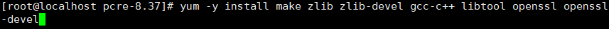
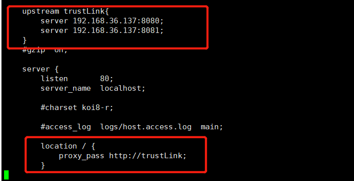

# 第一章 Nginx简介

## 1.1 Nginx概述

Nginx是一个**高性能的HTTP和反向代理服务器**，**特点是占有内存少，并发能力强**，事实上nginx的并发能力在同类型的网页服务器中表现较好，中国大陆使用nginx网站用户有：百度、京东、新浪、网易、腾讯、淘宝等。

## 1.2 Nginx作为web服务器

Nginx可以作为静态页面的web服务器，同时支持CGI协议的动态语言，比如perl、php等。**但是不支持Java。Java程序只能与tomcat配合完成。**Nginx专为性能优化而开发，性能是其最重要的考量。

## 1.3 正向代理

**所谓正向代理**：如果把局域网外的Internet想象成一个巨大的资源库，则局域网中的客户端要访问Internet，则需要通过代理服务器来访问，这种代理服务就称为正向代理。

通俗的说：客户端(浏览器)如果想要访问www.google.com，那么需要在客户端(浏览器)处配置代理服务器，才能访问谷歌，这种代理服务就叫正向代理

## 1.4 反向代理

所谓反向代理：其实客户端(浏览器)对代理是无感知的，因为**客户端不需要任何配置就可以访问**，我们**只需要将请求发送到反向代理服务器**，由反向代理服务器去选择目标服务器获取数据后，再返回给客户端，此时**反向代理服务器和目标服务器对外就是一个服务器**，**暴露的是代理服务器地址**，**隐藏了真实服务器IP地址**。

## 1.5 负载均衡

增加服务器的数量，然后将多个请求分发到各个服务器上，将原先请求集中到单个服务器上的情况改为将请求分发到各个服务器上，这就是我们所说的**负载均衡。**

## 1.6 动静分离

# 第二章 Nginx安装

进入nginx官网进行下载。http://nginx.org/

**第一步：联网下载pcre压缩文件依赖**

**第二步：解压pcre压缩文件**

**第三步：先通过./configure检查文件，然后编译安装pcre**

**第四步：安装openssl、zlib、gcc依赖**

`yum -y install make zlib zlib-devel gcc-c++ libtool openssl openssl-devel`

**第五步：安装nginx**

`tar -zxvf nginx-**1.12.2.tar.gz`

进入nginx目录，执行`./configure`检查文件

编译运行`make && make install `

**第六步：启动nginx**

进入目录 /usr/local/nginx/sbin/nginx 启动服务

`./nginx`

**第七步将nginx添加到防火墙开放的端口号中**

在windows系统中访问Linux中的nginx，默认是访问不了的，因为有防火墙。

解决方案1：关闭防火墙(**不推荐**)，防火墙关了会有被攻击的风险

**解决方案2：开放访问的端口号，80端口**

1. 查看开放的端口号

`firewall-cmd --list-all`

2. 设置开放的端口号

`firewall-cmd --permanent --add-port=80/tcp`

3. 重启防火墙

`systemctl reload firewalld`

# 第三章 Nginx常用命令

使用Nginx命令的前提：需要进入到/usr/local/nginx/sbin/目录下

**启动Nginx**

`./nginx`

关闭Nginx

`./nginx -s stop`

重新加载Nginx配置文件

`./nginx -s reload`

查看Nginx版本

`./nginx -v`

# 第四章 Nginx的配置文件

Nginx的配置文件，默认是在Nginx安装目录/conf/ 目录下。

配置文件中有很多#开头的，表示注释内容。

**nginx.conf配置文件分成三部分：**

**第一部分：全局块**

从配置文件开始到events块之间的内容，主要设置一些影响nginx服务器整体运行的配置指令，**主要包括**配置运行Nginx服务器的用户组、允许生成的worker processes 数，进程PID 存放路径，日志存放路径和类型以及配置文件的引入等。

这是Nginx服务器并发处理服务的关键配置，**worker_processes值越大，可以支持的并发处理量也越多**，但是会受到硬件、软件等设备的制约。

**第二部分：events块**

events块涉及的指令主要影响Nginx服务器与用户的网络连接，常用的设置包括是否开启对多 work process下的网络连接进行序列化，是否允许同时接收多个网络连接，选取哪种事件驱动模型来处理连接请求，每个work process 可以同时支持的最大连接数等

这部分的配置对Nginx的性能影响较大，在实际中应该灵活配置

**第三部分：http块**

这算是Nginx服务器配置中最频繁的部分，代理、缓存和日志定义等绝大多数功能和第三方模块的配置都在这里。

需要注意的是：http块可以包括**http全局快、server块。**

**① http全局快**

http全局块配置的指令包括文件引入、MIME-TYPE定义、日志自定义、连接超时时间、单链接请求数上限等。

**②server块**

**1、全局Server块**

主要是监听的端口号、主机地址配置

**2、location块**

这块的主要作用是基于Nginx服务器接收到的请求字符串（例如serve_name/uri-string），对虚拟机名称(也可以是IP别名)之外的字符串进行匹配，对特定的请求进行处理，地址定向、数据缓存和应答控制等功能，还有许多第三方模块的配置也在这里进行。

# 第五章 Nginx配置实例- 反向代理

## 5.1 反向代理实例一 

实现的效果：使用nginx反向代理，访问192.168.36.137直接跳转到www.baidu.com

**在进行配置的时候，一定要注意配置中所涉及到的端口号必须配置到防火墙开放端口中**

## 5.2 反向代理实例二 

实现的效果：使用nginx反向代理，根据访问的路径跳转到不同的端口号中

nginx监听的端口号为9001

访问 http://192.168.36.137:9001/edu/  直接跳转到127.0.0.1:8080

访问 http://192.168.36.137:9001/jd/  直接跳转到127.0.0.1:8081

**具体配置**

(1) 启动8080 和8081tomcat，需要jdk

(2) 将8080 、8081、9001端口号配置到防火墙开放端口号中。
(3) 找到nginx配置文件，配置反向代理

最终测试即可。

http://192.168.36.137:9001/edu/a.html  8080

http://192.168.36.137:9001/vod/a.html  8081

# 第六章 配置实例-Nginx 负载均衡

**实现效果：** 浏览器地址栏 输入地址 http://192.168.36.137/edu/a.html，平均访问8080/8081端口，达到 负载均衡的效果。

**准备工作：**

1. 准备两台tomcat服务器，一台8080，一台8081
2. 在两台tomcat里面webapps目录中，创建名称是edu文件夹，在edu文件夹中创建页面a.html，用于测试

**在nginx配置文件中进行负载均衡配置**

## 6.1 nginx分配服务器策略

**第一种：轮询（默认）**

每个请求按时间顺序逐一分配到不同的服务器上，如果某个服务器down掉，能自动剔除。

**第二种：weight（权重）**

weight代表权重，默认为1，权重越高被分配到的可能型越大。

**第三种：ip_hash**

每个请求按访问ip的hash结果分配，这样每个访问者固定访问一个服务器。（可用于session共享）

**第四种：fair（第三方）**

按服务器的响应时间来分配请求，响应时间短的优先分配。

# 第七章 配置实例-动静分离

1、什么是动静分离

通过 location 指定不同的后缀名实现不同的请求转发。通过 expires 参数设置，可以使浏 览器缓存过期时间，减少与服务器之前的请求和流量。具体 Expires 定义：是给一个资源 设定一个过期时间，也就是说无需去服务端验证，直接通过浏览器自身确认是否过期即可， 所以不会产生额外的流量。此种方法非常适合不经常变动的资源。（如果经常更新的文件， 不建议使用 Expires 来缓存），我这里设置 3d，表示在这 3 天之内访问这个 URL，发送一 个请求，比对服务器该文件最后更新时间没有变化，则不会从服务器抓取，返回状态码 304， 如果有修改，则直接从服务器重新下载，返回状态码 200。

**2、准备工作**

（1）在Linux系统种准备静态资源、用于进行访问

在Linux的根目录下`/` ，创建data目录，在data目录下创建image目录，用于存放静态资源

**3、具体配置**

（1）在nginx配置文件中进行配置。

# 第八章 高可用（后续更）

# 第九章 Nginx原理

## 9.1  master和worker

## 9.2 worker是如何进行工作的

客户端发送请求，首先经过master，然后由master发送信号告诉下面的worker有粮食(请求)了，worker收到信号之后开始争抢粮食(请求)

## 9.3 一个master和多个worker机制的好处

1. 可以使用nginx -s reload 热部署，这样就不需要关闭nginx了，往往关闭nginx会造成一些麻烦
2. 每个worker是独立的进程，如果有其中的一个worker出现问题，其他worker独立的，继续进行争抢，实现请求过程，不会造成服务中断 

## 9.4 设置多少个worker何时

**worker的数量和服务器的cpu数量相等是最为适宜的。**

## 9.5 连接数worker_connection

### 9.5.1 发送请求，占用了worker的几个连接数

2个或者4个

### 9.5.2 nginx有一个master，有4个worker，每个worker支持最大的连接数1024，支持的最大并发数是多少？

+ 普通的静态访问最大并发数是：worker_connections * worker_processes **/2** ；
+ 如果是HTPP作为反向代理的话，最大的并发数应该是worker_connections * worker_processes **/ 4**；

worker_connections ：每个worker支持的最大连接数

worker_processes ：有多少个worker

