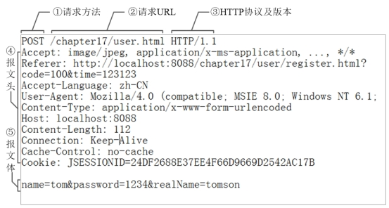
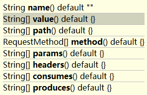
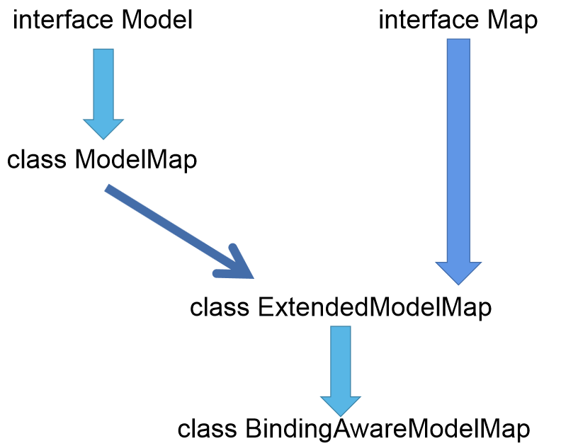

# 一、什么是SpringMVC

## 1.SpringMVC简介

SpringMVC是Spring框架的一部分，是基于Java实现MVC的轻量级Web框架

+ **SpringMVC的特点：**
  + 轻量，简单易学
  + 高效，基于请求响应的MVC框架
  + 功能强大：RESTFul、数据验证、格式化、本地化、主题等
  + 简洁灵活

## 2.SpringMVC和Struts2

```
SpringMVC和Struts2的对比：
	1.SpringMVC的前端控制器是Servlet，而Struts2是Filter
	2.Spring MVC会稍微比Struts2 快些，Spring MVC是基于方法设计，处理器是单例,而Sturts2 是基于类,每次发一次请求都会实例一个新的Action对象, Action是多例的。
	3.Spring MVC更加简洁,开发效率Spring MVC比Struts2高,如支持JSR303校验,且处理AJAX请求更方便。
	4.Struts2 的OGNL表达式使页面的开发效率相比Spring MVC更高些,但是Spring MVC也不差。

总之SpringMVC目前的使用率已经远远超过Struts2,Struts2的漏洞比较多。
```

# 二、SpringMVC快速——helloworld

## 2.1引入依赖

```xml
        <!--web-->
        <dependency>
            <groupId>org.springframework</groupId>
            <artifactId>spring-web</artifactId>
            <version>5.1.8.RELEASE</version>
        </dependency>

        <!--jsp-->
        <dependency>
            <groupId>javax.servlet.jsp</groupId>
            <artifactId>jsp-api</artifactId>
            <version>2.2</version>
        </dependency>

        <!--servlet-api-->
        <dependency>
            <groupId>javax.servlet</groupId>
            <artifactId>servlet-api</artifactId>
            <version>2.5</version>
        </dependency>

        <dependency>
            <groupId>junit</groupId>
            <artifactId>junit</artifactId>
            <version>4.11</version>
            <scope>test</scope>
        </dependency>
    </dependencies>
```

## 2.2 在web.xml配置文件中配置前端控制器DispatcherServlet

```XML
<!DOCTYPE web-app PUBLIC
 "-//Sun Microsystems, Inc.//DTD Web Application 2.3//EN"
 "http://java.sun.com/dtd/web-app_2_3.dtd" >

<web-app>
  <display-name>Archetype Created Web Application</display-name>

  <!--配置前端控制器-->
  <servlet>
    <servlet-name>dispatcherServlet</servlet-name>
    <servlet-class>org.springframework.web.servlet.DispatcherServlet</servlet-class>

    <init-param>
      <!--contextConfigLocation:指定SpringMVC配置文件的位置-->
      <param-name>contextConfigLocation</param-name>
      <param-value>classpath:springmvc.xml</param-value>
    </init-param>
  </servlet>

  <servlet-mapping>
    <servlet-name>dispatcherServlet</servlet-name>
    <!--/和/*的区别：
         /：会拦截所有的请求，但是jsp页面不会被拦截
         /*:会拦截所有的请求,包括jsp页面
    -->
    <url-pattern>/</url-pattern>
  </servlet-mapping>
</web-app>

```

`<url-pattern>`

```
注意：
/：会拦截所有的请求，但是jsp页面不会被拦截
/*:会拦截所有的请求,包括jsp页面
```

## 2.3 配置SpringMVC配置文件

```xml
<?xml version="1.0" encoding="UTF-8"?>
<beans xmlns="http://www.springframework.org/schema/beans"
       xmlns:context="http://www.springframework.org/schema/context"
       xmlns:xsi="http://www.w3.org/2001/XMLSchema-instance"
       xsi:schemaLocation="http://www.springframework.org/schema/beans http://www.springframework.org/schema/beans/spring-beans.xsd
       http://www.springframework.org/schema/context http://www.springframework.org/schema/context/spring-context.xsd">


    <!--开启注解扫描-->
    <context:component-scan base-package="com.atguigu.springmvc"/>

    <!--配置视图解析器-->
    <bean id="internalResourceViewResolver" class="org.springframework.web.servlet.view.InternalResourceViewResolver">
        <!--前缀-->
        <property name="prefix" value="/WEB-INF/pages/"></property>
        <!--后缀-->
        <property name="suffix" value=".jsp"></property>
    </bean>
</beans>
```

## 2.4 编写Controller，增加@Controller注解，进行测试

```java
@Controller
public class HelloController {

    @RequestMapping("/test")
    public String test(){

        System.out.println("经过了controller接口....");

        return "success";
    }
}
```

由于配置了视图解析器，所以`test()`方法返回的success完整路径是**<span style="color:red">/WEB-INF/pages/success.jsp</span>** 

## 2.5 HelloWorld运行流程

**<span style="color:red">1、HelloWorld请求流程图解</span>**


**<span style="color:red">2、一般请求的映射路径名称和处理请求的方法名称最好一致(实质上方法名称任意)</span>**

```java
@RequestMapping(value="/test",method = RequestMethod.GET)
public String test(){

    System.out.println("经过了controller接口....");

    return "success";
}
```

**<span style="color:red">3、处理请求方式有如下几种</span>**

```java
public enum RequestMethod {

	GET, HEAD, POST, PUT, PATCH, DELETE, OPTIONS, TRACE

}
```

**<span style="color:red">4、@RequestMapping注解可以作用在什么地方</span>**

可以作用在类上，方法上。

```java
@Target({ElementType.TYPE, ElementType.METHOD})
@Retention(RetentionPolicy.RUNTIME)
@Documented
@Mapping
public @interface RequestMapping
```

**<span style="color:red">5、HelloWorld流程的基本步骤</span>**

1. 客户端发送请求到<span style="color:red">DispatcherServlet</span>
2. DispatcherServlet查询一个或者多个<span style="color:red">HandlerMapping</span>，找到处理请求的<span style="color:red">Controller</span>
3. 由Controller调用业务逻辑后，返回<span style="color:red">ModelAndView</span>
4. DispatcherServlet查询一个或者多个视图解析器<span style="color:red">ViewResolver</span>，找到ModelAndView指定的视图
5. 视图负责将结果显示到客户端上。

# 三、@RequestMapping映射

## 3.1、@RequestMapping映射请求注解

+ SpringMVC使用@RequestMapping注解为控制器指定可以处理哪些URL请求。
+ 在控制器Controller的**<span style="color:red">类以及方法上</span>**都可标注@RequestMapping
  + **<span style="color:red">标记在类上</span>**：提供初步的请求映射信息。相对于WEB应用的根目录。
  + **<span style="color:red">标记在方法上</span>**：相对于标记在类上的URL提供进一步的细分映射信息。
+ 若类上未标记@requestMapping，则方法处标记的URL相对于WEB应用的根目录。

作用：DispatcherServlet截获请求后，就通过控制器上@RequestMapping提供的映射信息确定请求所对应的的处理方法

## 3.2 @RequestMapping源码参考

```java
package org.springframework.web.bind.annotation;
@Target({ElementType.METHOD, ElementType.TYPE})
@Retention(RetentionPolicy.RUNTIME)
@Documented
@Mapping
public @interface RequestMapping {
String[] value() default {};
RequestMethod[] method() default {};
String[] params() default {};
String[] headers() default {};
String[] consumes() default {};
String[] produces() default {};
```

## 3.3 @RequestMapping映射请求方式

**<span style="color:red">1、标准的HTTP请求头</span>**



**<span style="color:red">2、映射请求参数、请求方法或请求头</span>**

@RequestMapping除了可以映射URL之外，还可以映射请求方式以及请求参数和请求头信息

**@RequestMapping的属性有：**



+ value：请求URL
+ method：请求方式
+ params：请求参数
  + 支持简单的表达式：
    + param1：表示请求参数中必须有param1的请求参数,没有就404
    + !param1：表示请求参数中不包含param1的请求参数,不满足条件404
    + param1!=value1：表示请求参数中包含param1的请求参数，但值不能为value1
    + {"param=value1","param2"}：请求必须包含名为param1和param2的两个请求参数，且param1的值必须为value1
+ headers：请求头
+ consumes：接收客户端数据的数据类型
+ produces：响应返回的内容 数据类型，对应Content-Type


**测试代码：**

**<span style="color:red">1、请求方式是POST</span>**

```java
@Controller
public class HelloController {

    @RequestMapping(value="/test",method = RequestMethod.POST)
    public String test(){

        System.out.println("经过了controller接口....");

        return "success";
    }
}
```

运行结果


**<span style="color:red">2、请求参数&请求头测试</span>**

```java
   @RequestMapping(value="/test",method = RequestMethod.GET,params = {"username","pwd!=123"})
    public String test(){

        System.out.println("经过了controller接口....");

        return "success";
    }
```


## 3.4 @RequestMapping支持ant路径风格

+ **<span style="color:red">ANT风格资源地址支持3种匹配符：</span>**

  + **<span style="color:red">？：匹配文件名中的一个字符</span>**
  + **<span style="color:red">*：匹配0个或者多个字符</span>**
  + `** `**：匹配多层路径**

  ```xml
  /user/*/createUser
  匹配 /user/aaa/createUser、/user/bbb/createUser 等 URL
  /user/**/createUser
  匹配 /user/createUser、/user/aaa/bbb/createUser 等 URL
  /user/createUser??
  匹配 /user/createUseraa、/user/createUserbb 等 URL
  ```

## 3.5 @PathVariable注解

**<span style="color:red">带占位符的URL是Spring3.0新增的功能</span>**，该功能在SpringMVC向REST目标挺进发展过程中具有里程碑的意义。

**<span style="color:red">通过@PathVariable可以将URL中占位符参数绑定到控制器Controller处理方法的入参中。</span>**

URL中的**`{xxx}`**占位符可以通过**@PathVariable("xxx")**绑定到操作方法的入参中。

```java
  @RequestMapping("testPathVariable/{user}")
    public String testPathVariable(@PathVariable("user") String user) {

        System.out.println("user:" + user);
        System.out.println("testPathVariable ....");

        return "success";
    }
```


# 四 Rest风格

## 4.1 概述

REST就是一个资源定位以及资源操作的风格。不是标准也不是协议，只是一种风格。基于这个风格设计的软件可以更简洁，更有层次，更易于实现缓存等机制。其强调HTTP应当以资源为中心，并且规范了URI的风格；规范了HTTP请求方式的使用。

+ 资源（Resource）：网络上的一个实体，每种资源对应一个特定的URI，即URI为每个资源的独一无二的识别符；

+ 表现层（Representation）：把资源具体呈现出来的形式，叫做它的表现层。比如txt、HTML、XML、JSON格式等；

+ 状态转化（State Transfer）：每发出一个请求，就代表一次客户端和服务器的一次交互过程。GET用来获取资源，POST用来新建资源，PUT用来更新资源，DELETE用来删除资源。

**<span style="color:red">在参数上使用@PathVariable注解，可以获取到请求路径上的值，可以写多个。</span>**

```java
@RequestMapping(value = "/hello04/username/{id}")
    public String test2(@PathVariable("id") int id){
        System.out.println(id);
        return "success";
    }
```

## 4.2 搭建Rest环境，在页面上发送PUT和DELETE请求

**对一个资源的增删改查<span style="color:red">用请求方式来区分</span>**

| 请求地址 | 请求方式 |    说明     |
| :------: | :------: | :---------: |
| /book/1  |   GET    | 查询1号图书 |
| /book/1  |   PUT    | 修改1号图书 |
| /book/1  |  DELETE  | 删除1号图书 |
|  /book   |   POST   |  新增图书   |

**页面只能发出GET和POST请求。<span style="color:red">如何在页面上发送DELETE和PUT等请求？</span>**

**<span style="color:red">1、在web.xml中配置HiddenHttpMethodFilter过滤器</span>**

```xml
<!--配置HiddenHttpMethodFilter过滤器-->
  <filter>
    <filter-name>hiddenHttpMethodFilter</filter-name>
    <filter-class>org.springframework.web.filter.HiddenHttpMethodFilter</filter-class>
  </filter>

  <filter-mapping>
    <filter-name>hiddenHttpMethodFilter</filter-name>
    <url-pattern>/*</url-pattern>
  </filter-mapping>
```

**<span style="color:red">2、在控制器Controller中添加REST风格的CRUD方法</span>**

```java
@Controller
public class RestController {

    @RequestMapping(value = "/book/{bid}", method = RequestMethod.GET)
    public String getBook(@PathVariable("bid") String id) {
        System.out.println("查询id=" + id + "的图书");
        return "success";
    }

    @RequestMapping(value = "/book/{bid}", method = RequestMethod.PUT)
    public String putBook(@PathVariable("bid") String id) {
        System.out.println("修改id=" + id + "的图书");
        return "success";
    }


    @RequestMapping(value = "/book/{bid}", method = RequestMethod.DELETE)
    public String deleteBook(@PathVariable("bid") String id) {
        System.out.println("删除id=" + id + "的图书");
        return "success";
    }

    @RequestMapping(value = "/book", method = RequestMethod.POST)
    public String addBook() {
        System.out.println("添加图书");
        return "success";
    }
}
```

**<span style="color:red">3、在jsp中编写delete和put请求</span>**

```jsp
<body>
<a href="book/1">查询1号图书</a><br/>
新增图书
<form action="book/" method="post">
    <input type="submit" value="提交">
</form><br/>

修改1号图书
<form action="book/1" method="post">
    <input hidden name="_method" value="put">
    <input type="submit" value="提交">
</form><br/>

删除1号图书
<form action="book/1" method="post">
    <input hidden name="_method" value="delete">
    <input type="submit" value="提交">
</form><br/>
</body>
```

**<span style="color:red">4、HiddenHttpMethodFilter过滤器源码分析</span>**

为什么请求参数必须叫做"_method"


```
注意：高版本的Tomcat会出现问题：JSPs only permit GET POST or HEAD；
解决方案：
在jsp页面加上如下代码
<%@ page contentType="text/html;charset=UTF-8" language="java"  isErrorPage="true" %>
```

# 五、请求参数处理

## 5.1 @RequestParam注解

**<span style="color:red">1、如果提交的参数名称和处理方法的参数名称相同，则无需处理，直接使用。</span>**

```java
@RequestMapping("/hello3")
public String test03(String username){
    System.out.println("获取的参数的值：" + username);
    return "success";
}
```

**不带参数的情况**：在浏览器输入地址如下地址时；控制台输出的信息


**带参数的情况：**在浏览器输入地址如下地址时；控制台输出的信息


**<span style="color:red">2、提交的参数名称和方法中参数的名称不一致时，使用@RequestParam注解</span>**

+ **@RequestParam：获取请求参数**
  + **value：请求参数名称**
  + **required：设置请求参数是否必须携带**
  + **defaultValue：设置默认值 ，当没有携带请求参数时使用该值。**

```java
@RequestMapping("/hello3")
public String test03(
        @RequestParam(value = "username", required = false, defaultValue = "张三") String username,
        @RequestParam("age") String age
) {
    System.out.println("获取的参数的值：" + username);
    System.out.println("获取请求参数 age的值：" + age);
    return "success";
}
```


## 5.2@RequestHeader注解

+ 使用@RequestHeader注解可以获取请求头的属性值
+ 请求头包含了若干属性，服务器可根据此获取客户端的信息，**<span style="color:red">通过@RequestHeader即可将请求头中的属性值绑定到处理方法的参数中。</span>**
+ **@RequestHeader：获取请求头中的信息**
  + **value：请求参数名称**
  + **required：设置请求参数是否必须携带**
  + **defaultValue：设置默认值 ，当没有携带请求参数时使用该值。**

```java
    @RequestMapping("/hello4")
    public String test03(@RequestHeader("User-Agent") String userAgent) {
        System.out.println("获取请求头中浏览器的信息：" + userAgent);
        return "success";
    }
```

**测试：**


## 5.3@CookieValue注解

+ 使用@CookieValue注解可以获取请求中Cookie的值
+ **<span style="color:red">@CookieValue可让处理方法入参绑定某个Cookie的值</span>**
+ **@CookieValue：获取Cookie的值**
  + **value：请求参数名称**
  + **required：设置请求参数是否必须携带**
  + **defaultValue：设置默认值 ，当没有携带请求参数时使用该值。**

```java
    @RequestMapping("/hello5")
    public String test05(@CookieValue("JSESSSIONID") String cookieValue) {
        System.out.println("获取Cookie中JSESSSIONID的值：" + cookieValue);
        return "success";
    }
```

**测试：**


## 5.4 使用POJO作为参数

+ 使用POJO对象绑定请求参数值
+ **<span style="color:red">SpringMVC会按照请求参数名和POJO属性名进行自动匹配，自动为该对象填充属性值。支持级联属性。如：l dept.deptId、dept.address.tel 等</span>**

**实现步骤：**

**<span style="color:red">1、添加Controller处理方法</span>**

```java
    @RequestMapping("/hello6")
    public String test05(Book book) {
        System.out.println(book);
        return "success";
    }
```

**<span style="color:red">2、创建实体类</span>**

```java
public class Book {

    private String bookName;
    private String price;
    private Address address;
	...get/set toString()..
}

public class Address {
    private String province;
    private String city;
    private String street;
    ...get/set toString()..
}
```

**<span style="color:red">3、创建jsp页面</span>**

```jsp
<body>
<form action="book" method="post">
    书名：<input type="text" name="bookName"><br/>
    价格：<input type="text" name="price"><br/>
    省份：<input type="text" name="province"><br/>
    城市：<input type="text" name="city"><br/>
    街道：<input type="text" name="street"><br/>
    <input type="submit" value="提交">
</form>
</body>
```

**<span style="color:red">4、运行测试：</span>**


**<span style="color:red">5、如果有中文乱码问题，需要配置字符编码过滤器，并且必须要在其他过滤器之前配置，否则不起作用。</span>**

```xml
    <!--配置字符编码过滤器-->
    <filter>
        <filter-name>characterEncodingFilter</filter-name>
        <filter-class>org.springframework.web.filter.CharacterEncodingFilter</filter-class>
        <init-param>
            <param-name>encoding</param-name>
            <param-value>UTF-8</param-value>
        </init-param>
        <init-param>
            <param-name>forceRequestEncoding</param-name>
            <param-value>true</param-value>
        </init-param>
        <init-param>
            <param-name>forceResponseEncoding</param-name>
            <param-value>true</param-value>
        </init-param>
    </filter>
    <filter-mapping>
        <filter-name>characterEncodingFilter</filter-name>
        <url-pattern>/*</url-pattern>
    </filter-mapping>
```

## 5.5 使用原生API作为参数

+ SpringMVC的Controller方法可以接收哪些ServletAPI类型的参数：
  + **<span style="color:red">HttpServletRequest：</span>**
  + **<span style="color:red">HttpServletResponse：</span>**
  + **<span style="color:red">HttpSession：</span>**
  + **<span style="color:red">java.security.Principal：</span>**关于Https协议
  + **<span style="color:red">Locale：用于国际化</span>**
  + **InputStream**
  + **OutputStream**
  + **Reader**
  + **Writer**

# 六、响应数据输出

## 6.1 Map 、Model、ModelMap

**<span style="color:red">SpringMVC除了在方法上传入原生的request和session外还能如何把数据带给页面中呢？</span>**

**<span style="color:red">1、可以在方法处传入Map、Model、ModelMap</span>**

往这三个参数中保存的所有数据都会放在**<span style="color:red">请求域</span>**中。可以在页面获取

**代码示例1：Map方式**

```java
    @RequestMapping("/handler01")
    public String handler01(Map map){
        map.put("msg","map中的数据");
        return "success";
    }
```

**代码示例2：Model方式**

```java
 @RequestMapping("/handler02")
    public String handler02(Model model){
       model.addAttribute("msg","model中的数据");
        return "success";
    }
```

**代码示例3：ModelMap方式**

```java
    @RequestMapping("/handler03")
    public String handler03(ModelMap modelMap){

      modelMap.addAttribute("msg","我是ModelMap中的数据");

        return "success";
    }
```

这三种数据都会放入request域中：


**<span style="color:red">2、Map、Model、ModelMap的继承关系</span>**




## 6.2 处理模型数据之ModelAndView

+ 控制器处理方法的返回值如果是**<span style="color:red">ModelAndView，则其既包含视图信息，也包含模型数据信息。</span>**
+ 设置视图：
  + `void setView(View view)`
  + `void setViewName(String viewName)`
+ 添加模型数据：
  + `ModelAndView  addObjects(String attributeName,Object attributeValue)`
  + `ModelAndView addAllObject(Map<String,?) modelMap`

**代码示例**

```java
    @RequestMapping("/handler04")
    public ModelAndView handler04(){
        ModelAndView mv = new ModelAndView();
        mv.setViewName("success");
        mv.addObject("msg","我是ModelAndView中的数据");
        return mv;
    }
```

## 6.3 @SessionAttributes(不推荐使用，推荐使用原生HttpSession)

+ 给Session域中存入数据使用注解@SessionAttributes，只能标注在类上。


+ **@SessionAttributes有三个属性：**

  + **value：存入<span style="color:red">指定名称的属性</span>到Session域中的；**
  + **types：通过模型属性的<span style="color:red">对象类型</span>指定哪些模型属性可以存放到会话中。**

+ 例如：

  ① @SessionAttributes(types=User.class) 会将隐含模型中所有类型为 User.class 的属性添加到会话中。

  ② @SessionAttributes(value={“user1”, “user2”}) 

  ③ @SessionAttributes(types={User.class, Dept.class})

  ④ @SessionAttributes(value={“user1”, “user2”}, types={Dept.class}) 

## 6.4 @ResponseBody

**<span style="color:red">在控制器类中，在方法上使用@ResponseBody注解可以不走视图解析器。</span>**

+ **<span style="color:red">如果返回值是字符串：那么直接将字符串写到客户端；</span>**
+ **<span style="color:red">如果返回值是对象：会将对象转换为JSON字符串，然后写到客户端。</span>**
+ **<span style="color:red">或者在类上加上注解@RestController，可以让类中的所有方法都不走视图解析器，直接返回JSON字符串。</span>**

# 七、源码分析：视图执行流程

## 7.1 SpringMVC的九大组件

+ **<span style="color:red">MultipartResolver：文件上传视图解析器</span>**
+ **<span style="color:red">LocaleResolver：区域信息解析器，和国际化有关</span>**
+ **<span style="color:red">ThemeResolver：主题解析器</span>**
+ **<span style="color:red">HandlerMappings：handler的映射器</span>**
+ **<span style="color:red">HandlerAdapter：handler的适配器</span>**
+ **<span style="color:red">HandlerExceptionResolvers：异常解析功能</span>**
+ **<span style="color:red">ViewNameTranslator：请求到视图名的转换器</span>**
+ **<span style="color:red">FlashMapManager：SpringMVC中允许重定向携带数据的功能</span>**
+ **<span style="color:red">ViewResolers：视图解析器</span>**

```java
  /** 文件上传解析器*/
    private MultipartResolver multipartResolver;
    /** 区域信息解析器；和国际化有关 */
    private LocaleResolver localeResolver;
    /** 主题解析器；强大的主题效果更换 */
    private ThemeResolver themeResolver;
    /** Handler映射信息；HandlerMapping */
    private List<HandlerMapping> handlerMappings;
    /** Handler的适配器 */
    private List<HandlerAdapter> handlerAdapters;
    /** SpringMVC强大的异常解析功能；异常解析器 */
    private List<HandlerExceptionResolver> handlerExceptionResolvers;
    /**  */
    private RequestToViewNameTranslator viewNameTranslator;
    /** FlashMap+Manager：SpringMVC中运行重定向携带数据的功能 */
    private FlashMapManager flashMapManager;
    /** 视图解析器； */
    private List<ViewResolver> viewResolvers;
```

**SpringMVC中初始化九大组件**

`onRefresh() -> initStrategies()  DispatcherServlet中`

```java
protected void initStrategies(ApplicationContext context) {
        initMultipartResolver(context);
        initLocaleResolver(context);
        initThemeResolver(context);
        initHandlerMappings(context);
        initHandlerAdapters(context);
        initHandlerExceptionResolvers(context);
        initRequestToViewNameTranslator(context);
        initViewResolvers(context);
        initFlashMapManager(context);
    }
```

**例如：初始化HandlerMapping组件**

```java
private void initHandlerMappings(ApplicationContext context) {
        this.handlerMappings = null;

        if (this.detectAllHandlerMappings) {
            // Find all HandlerMappings in the ApplicationContext, including ancestor contexts.
            Map<String, HandlerMapping> matchingBeans =
                    BeanFactoryUtils.beansOfTypeIncludingAncestors(context, HandlerMapping.class, true, false);
            if (!matchingBeans.isEmpty()) {
                this.handlerMappings = new ArrayList<HandlerMapping>(matchingBeans.values());
                // We keep HandlerMappings in sorted order.
                OrderComparator.sort(this.handlerMappings);
            }
        }
        else {
            try {
                HandlerMapping hm = context.getBean(HANDLER_MAPPING_BEAN_NAME, HandlerMapping.class);
                this.handlerMappings = Collections.singletonList(hm);
            }
            catch (NoSuchBeanDefinitionException ex) {
                // Ignore, we'll add a default HandlerMapping later.
            }
        }

        // Ensure we have at least one HandlerMapping, by registering
        // a default HandlerMapping if no other mappings are found.
        if (this.handlerMappings == null) {
            this.handlerMappings = getDefaultStrategies(context, HandlerMapping.class);
            if (logger.isDebugEnabled()) {
                logger.debug("No HandlerMappings found in servlet '" + getServletName() + "': using default");
            }
        }
    }
```

## 7.2 前端控制器 DispatcherServlet

```java
protected void doDispatch(HttpServletRequest request, HttpServletResponse response) throws Exception {
		HttpServletRequest processedRequest = request;
		HandlerExecutionChain mappedHandler = null;
		boolean multipartRequestParsed = false;

		WebAsyncManager asyncManager = WebAsyncUtils.getAsyncManager(request);

		try {
			ModelAndView mv = null;
			Exception dispatchException = null;

			try {
                
                //1. 检查是否是上传请求
				processedRequest = checkMultipart(request);
				multipartRequestParsed = (processedRequest != request);

				//2. 根据当前请求地址找到哪个类来处理
				mappedHandler = getHandler(processedRequest);
				if (mappedHandler == null) {
					noHandlerFound(processedRequest, response);
					return;
				}

				//3. 根据这个类拿到这个类的适配器
				HandlerAdapter ha = getHandlerAdapter(mappedHandler.getHandler());

				//4. 获取到目标方法
				String method = request.getMethod();
				boolean isGet = "GET".equals(method);
				if (isGet || "HEAD".equals(method)) {
					long lastModified = ha.getLastModified(request, mappedHandler.getHandler());
					if (new ServletWebRequest(request, response).checkNotModified(lastModified) && isGet) {
						return;
					}
				}

				if (!mappedHandler.applyPreHandle(processedRequest, response)) {
					return;
				}

				//5. 执行目标方法
                // 将目标执行方法的返回值作为视图名，设置保存到ModelAndView中
                // 无论目标方法怎么写，最终适配器执行完成之后都会将执行后的信息封装成ModelAndView
				mv = ha.handle(processedRequest, response, mappedHandler.getHandler());

				if (asyncManager.isConcurrentHandlingStarted()) {
					return;
				}

				applyDefaultViewName(processedRequest, mv);
				mappedHandler.applyPostHandle(processedRequest, response, mv);
			}
			catch (Exception ex) {
				dispatchException = ex;
			}
			catch (Throwable err) {
				dispatchException = new NestedServletException("Handler dispatch failed", err);
			}
            
            //6. 根据方法执行完成后封装的ModelAndView进行页面跳转，并且渲染页面 
			processDispatchResult(processedRequest, response, mappedHandler, mv, dispatchException);
		}
		catch (Exception ex) {
			triggerAfterCompletion(processedRequest, response, mappedHandler, ex);
		}
		catch (Throwable err) {
			triggerAfterCompletion(processedRequest, response, mappedHandler,
					new NestedServletException("Handler processing failed", err));
		}
		finally {
			if (asyncManager.isConcurrentHandlingStarted()) {
				// Instead of postHandle and afterCompletion
				if (mappedHandler != null) {
					mappedHandler.applyAfterConcurrentHandlingStarted(processedRequest, response);
				}
			}
			else {
				// Clean up any resources used by a multipart request.
				if (multipartRequestParsed) {
					cleanupMultipart(processedRequest);
				}
			}
		}
	}

```

## 7.3SpringMVC的总体流程(掌握)

1. **<span style="color:red">用户发出请求，前端控制器DipatcherServlet接收请求并拦截。</span>**
2. **<span style="color:red">调用DoDipatch()方法进行处理</span>**
   1. **<span style="color:red">getHander()：根据当前请求地址找到能处理这个请求的目标控制器(处理器)Controller</span>**
      1. **<span style="color:red">根据当前请求在HandlerMapping中找到这个请求的映射信息，获取到目标处理器类</span>**
      2. **`mappedHandler = getHandler(processedRequest);`**
   2. **<span style="color:red">getHandlerAdapter()：根据当前处理器类找到能执行这个处理器方法的适配器；</span>**
      1. **<span style="color:red">根据当前处理器类，找到当前类的HandlerAdapter(适配器)</span>**
      2. **`HandlerAdapter ha = getHandlerAdapter(mappedHandler.getHandler())`**
   3. **<span style="color:red">使用刚才获取到的适配器(AnnotationMethodHandlerAdapter) 执行目标方法</span>**
      1. **`mv = ha.handle(processedRequest,response,mappedHandler.getHandler())`**
   4. **<span style="color:red">目标方法执行之后，返回一个ModelAndView</span>**
      1. **`mv =ha.handler(processedRequest,response,mappedHandler.getHandler())`**
   5. **<span style="color:red">根据ModelAndView的信息转发到具体页面，并可以在请求域中取出ModelAndView中的模型数据</span>**
      1. **`processDispatchResult(processedRequest,response,mappedHandler,mv,dispatchException)`**

```
HandlerMapping为处理器映射器，保存了每一个处理器能处理哪些请求的映射信息，handlerMap
HandlerAdapter为处理器适配器，能解析注解方法的适配器，其按照特定的规则去执行Handler
```

## 7.4 SpringMVC执行流程的具体细节

**<span style="color:red">1、getHandler()：如何根据当前请求找到哪个类来处理呢？</span>**

**<span style="color:red">循环遍历拿到能处理请求的类</span>**

```java
protected HandlerExecutionChain getHandler(HttpServletRequest request) throws Exception {
        for (HandlerMapping hm : this.handlerMappings) {
            if (logger.isTraceEnabled()) {
                logger.trace(
                        "Testing handler map [" + hm + "] in DispatcherServlet with name '" + getServletName() + "'");
            }
            HandlerExecutionChain handler = hm.getHandler(request);
            if (handler != null) {
                return handler;
            }
        }
        return null;
    }
```

+ getHandler()：返回目标处理器类的执行链
+ HandlerMapping：处理器映射：他里面保存了每一个处理器能处理哪些请求的映射信息
+ handlerMap：ioc容器启动创建Controller对象的时候扫描每个处理器都能处理什么请求，保存在HandlerMapping的handlerMap属性中；下一次请求过来，就来看哪个HandlerMapping中有这个请求映射信息就行了

**<span style="color:red">2、getHandlerAdapter()：如何找到目标处理器类的适配器，要拿到适配器才去执行目标方法</span>**

**AnnotationMethodHandlerAdapter：**

+ 能解析注解方法的适配器
+ 处理器类中只要有标了注解的这些方法就能用：

```java
protected HandlerAdapter getHandlerAdapter(Object handler) throws ServletException {
        for (HandlerAdapter ha : this.handlerAdapters) {
            if (logger.isTraceEnabled()) {
                logger.trace("Testing handler adapter [" + ha + "]");
            }
            if (ha.supports(handler)) {
                return ha;
            }
        }
        throw new ServletException("No adapter for handler [" + handler +
                "]: The DispatcherServlet configuration needs to include a HandlerAdapter that supports this handler");
    }
```

**<span style="color:red">3、执行目标方法细节</span>**

`mv = ha.handle(processedRequest, response, mappedHandler.getHandler());`

​																↓

**`return invokeHandlerMethod(request, response, handler);`**

```java
protected ModelAndView invokeHandlerMethod(HttpServletRequest request, HttpServletResponse response, Object handler)
            throws Exception {
          //拿到方法的解析器
        ServletHandlerMethodResolver methodResolver = getMethodResolver(handler);
          //方法解析器根据当前请求地址找到真正的目标方法
        Method handlerMethod = methodResolver.resolveHandlerMethod(request);
          //创建一个方法执行器；
        ServletHandlerMethodInvoker methodInvoker = new ServletHandlerMethodInvoker(methodResolver);
          //包装原生的request, response，
        ServletWebRequest webRequest = new ServletWebRequest(request, response);
          //创建了一个，隐含模型
    
        ExtendedModelMap implicitModel = new BindingAwareModelMap();//**重点

         //真正执行目标方法；目标方法利用反射执行期间确定参数值，提前执行modelattribute等所有的操作都在这个方法中；
        Object result = methodInvoker.invokeHandlerMethod(handlerMethod, handler, webRequest, implicitModel);
    	//=======================看后边补充的代码块===========================
        ModelAndView mav =
                methodInvoker.getModelAndView(handlerMethod, handler.getClass(), result, implicitModel, webRequest);
    
        methodInvoker.updateModelAttributes(handler, (mav != null ? mav.getModel() : null), implicitModel, webRequest);
    
        return mav;
}
```

​																							↓

**`Object result = methodInvoker.invokeHandlerMethod(handlerMethod, handler, webRequest, implicitModel);`**

```java
publicfinal Object invokeHandlerMethod(Method handlerMethod, Object handler,
            NativeWebRequest webRequest, ExtendedModelMap implicitModel) throws Exception {
        Method handlerMethodToInvoke = BridgeMethodResolver.findBridgedMethod(handlerMethod);
        try {
            boolean debug = logger.isDebugEnabled();
            for (String attrName : this.methodResolver.getActualSessionAttributeNames()) {
                Object attrValue = this.sessionAttributeStore.retrieveAttribute(webRequest, attrName);
                if (attrValue != null) {
                    implicitModel.addAttribute(attrName, attrValue);
                }
            }
               
          //找到所有@ModelAttribute注解标注的方法；
            for (Method attributeMethod : this.methodResolver.getModelAttributeMethods()) {
                Method attributeMethodToInvoke = BridgeMethodResolver.findBridgedMethod(attributeMethod);
                //先确定modelattribute方法执行时要使用的每一个参数的值；
               Object[] args = resolveHandlerArguments(attributeMethodToInvoke, handler, webRequest, implicitModel);
       //==========================看后边补充的代码块=====================================
                if (debug) {
                    logger.debug("Invoking model attribute method: " + attributeMethodToInvoke);
                }
                String attrName = AnnotationUtils.findAnnotation(attributeMethod, ModelAttribute.class).value();
                
                if (!"".equals(attrName) && implicitModel.containsAttribute(attrName)) {
                    continue;
                }
                
                ReflectionUtils.makeAccessible(attributeMethodToInvoke);
               
               //提前运行ModelAttribute，
                Object attrValue = attributeMethodToInvoke.invoke(handler, args);
                if ("".equals(attrName)) {
                    Class<?> resolvedType = GenericTypeResolver.resolveReturnType(attributeMethodToInvoke, handler.getClass());
                    attrName = Conventions.getVariableNameForReturnType(attributeMethodToInvoke, resolvedType, attrValue);
                }
                
                /*
                
                方法上标注的ModelAttribute注解如果有value值   
				@ModelAttribute("abc")
				hahaMyModelAttribute()
				
                标了:	attrName="abc"
                没标:	attrName="";attrName就会变为返回值类型首字母小写，
                     比如void ,或者book;
                     
                     【  
                        @ModelAttribute标在方法上的另外一个作用；
                        可以把方法运行后的返回值按照方法上@ModelAttribute("abc")
                        指定的key放到隐含模型中；
                        如果没有指定这个key；就用返回值类型的首字母小写
                      】
                        
                        {
                            haha=Book [id=100, bookName=西游记, author=吴承恩, stock=98, 									sales=10, price=98.98], 
                            void=null
                      	}
                */
                //把提前运行的ModelAttribute方法的返回值也放在隐含模型中
                if (!implicitModel.containsAttribute(attrName)) {
                    implicitModel.addAttribute(attrName, attrValue);
                }
            }

               //再次解析目标方法参数是哪些值
            Object[] args = resolveHandlerArguments(handlerMethodToInvoke, handler, webRequest, implicitModel);
            if (debug) {
                logger.debug("Invoking request handler method: " + handlerMethodToInvoke);
            }
            ReflectionUtils.makeAccessible(handlerMethodToInvoke);

            
            //执行目标方法
            return handlerMethodToInvoke.invoke(handler, args);
        }
        catch (IllegalStateException ex) {
            // Internal assertion failed (e.g. invalid signature):
            // throw exception with full handler method context...
            throw new HandlerMethodInvocationException(handlerMethodToInvoke, ex);
        }
        catch (InvocationTargetException ex) {
            // User-defined @ModelAttribute/@InitBinder/@RequestMapping method threw an exception...
            ReflectionUtils.rethrowException(ex.getTargetException());
            return null;
        }
    }
```

**<span style="color:red">4、确定方法运行时使用的每一个参数的值</span>**

**`Object[] args = resolveHandlerArguments(attributeMethodToInvoke, handler, webRequest, implicitModel);`**

```java
@RequestMapping("/updateBook")
    public String updateBook
           (
                @RequestParam(value="author")String author,
                Map<String, Object> model,
                HttpServletRequest request,
                @ModelAttribute("haha")Book book
            )
------------------------------------------------------------------------------------
        标了注解：
          保存时哪个注解的详细信息；
          如果参数有ModelAttribute注解；
               拿到ModelAttribute注解的值让attrName保存
                    attrName="haha"

没标注解：
          1）、先看是否普通参数（是否原生API）
               再看是否Model或者Map，如果是就传入隐含模型；
          2）、自定义类型的参数没有ModelAttribute 注解
                    1）、先看是否原生API
                    2）、再看是否Model或者Map
                    3）、再看是否是其他类型的比如SessionStatus、HttpEntity、Errors
           			4）、再看是否简单类型的属性；比如是否Integer，String，基本类型
                    		如果是paramName=“”
           			5)、attrName=""；
           			
如果是自定义类型对象，最终会产生两个效果；
     1）、如果这个参数标注了ModelAttribute注解就给attrName赋值为这个注解的value值
     2）、如果这个参数没有标注ModelAttribute注解就给attrName赋值""；

```

```java
private Object[] resolveHandlerArguments(Method handlerMethod, Object handler,
            NativeWebRequest webRequest, ExtendedModelMap implicitModel) throws Exception {
        Class<?>[] paramTypes = handlerMethod.getParameterTypes();
          //创建了一个和参数个数一样多的数组，会用来保存每一个参数的值
        Object[] args = new Object[paramTypes.length];

                      
        for (int i = 0; i < args.length; i++) {
            MethodParameter methodParam = new MethodParameter(handlerMethod, i);
            methodParam.initParameterNameDiscovery(this.parameterNameDiscoverer);
            GenericTypeResolver.resolveParameterType(methodParam, handler.getClass());
            String paramName = null;
            String headerName = null;
            boolean requestBodyFound = false;
            String cookieName = null;
            String pathVarName = null;
            String attrName = null;
            boolean required = false;
            String defaultValue = null;
            boolean validate = false;
            Object[] validationHints = null;
            int annotationsFound = 0;
            Annotation[] paramAnns = methodParam.getParameterAnnotations();
            
            //找到目标方法这个参数的所有注解，如果有注解就解析并保存注解的信息；
            for (Annotation paramAnn : paramAnns) {
                if (RequestParam.class.isInstance(paramAnn)) {
                    RequestParam requestParam = (RequestParam) paramAnn;
                    paramName = requestParam.value();
                    required = requestParam.required();
                    defaultValue = parseDefaultValueAttribute(requestParam.defaultValue());
                    annotationsFound++;
                }
                else if (RequestHeader.class.isInstance(paramAnn)) {
                    RequestHeader requestHeader = (RequestHeader) paramAnn;
                    headerName = requestHeader.value();
                    required = requestHeader.required();
                    defaultValue = parseDefaultValueAttribute(requestHeader.defaultValue());
                    annotationsFound++;
                }
                else if (RequestBody.class.isInstance(paramAnn)) {
                    requestBodyFound = true;
                    annotationsFound++;
                }
                else if (CookieValue.class.isInstance(paramAnn)) {
                    CookieValue cookieValue = (CookieValue) paramAnn;
                    cookieName = cookieValue.value();
                    required = cookieValue.required();
                    defaultValue = parseDefaultValueAttribute(cookieValue.defaultValue());
                    annotationsFound++;
                }
                else if (PathVariable.class.isInstance(paramAnn)) {
                    PathVariable pathVar = (PathVariable) paramAnn;
                    pathVarName = pathVar.value();
                    annotationsFound++;
                }
                else if (ModelAttribute.class.isInstance(paramAnn)) {
                    ModelAttribute attr = (ModelAttribute) paramAnn;
                    attrName = attr.value();
                    annotationsFound++;
                }
                else if (Value.class.isInstance(paramAnn)) {
                    defaultValue = ((Value) paramAnn).value();
                }
                else if (paramAnn.annotationType().getSimpleName().startsWith("Valid")) {
                    validate = true;
                    Object value = AnnotationUtils.getValue(paramAnn);
                    validationHints = (value instanceof Object[] ? (Object[]) value : new Object[] {value});
                }
            }
            if (annotationsFound > 1) {
                throw new IllegalStateException("Handler parameter annotations are exclusive choices - " +
                        "do not specify more than one such annotation on the same parameter: " + handlerMethod);
            }

             //没有找到注解的情况；
            if (annotationsFound == 0) {
                
                //解析普通参数
                Object argValue = resolveCommonArgument(methodParam, webRequest);
                //=====================看后边补充的代码块=========================
                 //会进入resolveStandardArgument（解析标准参数）
                
                
                if (argValue != WebArgumentResolver.UNRESOLVED) {
                    args[i] = argValue;
                }
                else if (defaultValue != null) {
                    args[i] = resolveDefaultValue(defaultValue);
                }
                else {
                    
               //判断是否是Model或者是Map旗下的，如果是将之前创建的隐含模型直接赋值给这个参数
                    Class<?> paramType = methodParam.getParameterType();
                    if (Model.class.isAssignableFrom(paramType) || Map.class.isAssignableFrom(paramType)) {
                        if (!paramType.isAssignableFrom(implicitModel.getClass())) {
                            throw new IllegalStateException("Argument [" + paramType.getSimpleName() + "] is of type " +
                                    "Model or Map but is not assignable from the actual model. You may need to switch " +
                                    "newer MVC infrastructure classes to use this argument.");
                        }
                        args[i] = implicitModel;
                    }
                    else if (SessionStatus.class.isAssignableFrom(paramType)) {
                        args[i] = this.sessionStatus;
                    }
                    else if (HttpEntity.class.isAssignableFrom(paramType)) {
                        args[i] = resolveHttpEntityRequest(methodParam, webRequest);
                    }
                    else if (Errors.class.isAssignableFrom(paramType)) {
                        throw new IllegalStateException("Errors/BindingResult argument declared " +
                                "without preceding model attribute. Check your handler method signature!");
                    }
                    else if (BeanUtils.isSimpleProperty(paramType)) {
                        paramName = "";
                    }
                    else {
                        attrName = "";
                    }
                }
            }


               //确定值的环节
            if (paramName != null) {
                args[i] = resolveRequestParam(paramName, required, defaultValue, methodParam, webRequest, handler);
            }
            else if (headerName != null) {
                args[i] = resolveRequestHeader(headerName, required, defaultValue, methodParam, webRequest, handler);
            }
            else if (requestBodyFound) {
                args[i] = resolveRequestBody(methodParam, webRequest, handler);
            }
            else if (cookieName != null) {
                args[i] = resolveCookieValue(cookieName, required, defaultValue, methodParam, webRequest, handler);
            }
            else if (pathVarName != null) {
                args[i] = resolvePathVariable(pathVarName, methodParam, webRequest, handler);
            }

            
            //确定自定义类型参数的值；还要将请求中的每一个参数赋值给这个对象
            else if (attrName != null) {
                WebDataBinder binder = resolveModelAttribute(attrName, methodParam, implicitModel, webRequest, handler);
                //=====================看后边代码补充============================
                boolean assignBindingResult = (args.length > i + 1 && Errors.class.isAssignableFrom(paramTypes[i + 1]));
                if (binder.getTarget() != null) {
                    doBind(binder, webRequest, validate, validationHints, !assignBindingResult);
                }
                args[i] = binder.getTarget();
                if (assignBindingResult) {
                    args[i + 1] = binder.getBindingResult();
                    i++;
                }
                implicitModel.putAll(binder.getBindingResult().getModel());
            }
        }
        return args;
    }
如果没有注解：

resolveCommonArgument）就是确定当前的参数是否是原生API；

		@Override
        protected Object resolveStandardArgument(Class<?> parameterType, NativeWebRequest webRequest) throws Exception {
            HttpServletRequest request = webRequest.getNativeRequest(HttpServletRequest.class);
            HttpServletResponse response = webRequest.getNativeResponse(HttpServletResponse.class);

            if (ServletRequest.class.isAssignableFrom(parameterType) ||
                    MultipartRequest.class.isAssignableFrom(parameterType)) {
                Object nativeRequest = webRequest.getNativeRequest(parameterType);
                if (nativeRequest == null) {
                    throw new IllegalStateException(
                            "Current request is not of type [" + parameterType.getName() + "]: " + request);
                }
                return nativeRequest;
            }
            else if (ServletResponse.class.isAssignableFrom(parameterType)) {
                this.responseArgumentUsed = true;
                Object nativeResponse = webRequest.getNativeResponse(parameterType);
                if (nativeResponse == null) {
                    throw new IllegalStateException(
                            "Current response is not of type [" + parameterType.getName() + "]: " + response);
                }
                return nativeResponse;
            }
            else if (HttpSession.class.isAssignableFrom(parameterType)) {
                return request.getSession();
            }
            else if (Principal.class.isAssignableFrom(parameterType)) {
                return request.getUserPrincipal();
            }
            else if (Locale.class.equals(parameterType)) {
                return RequestContextUtils.getLocale(request);
            }
            else if (InputStream.class.isAssignableFrom(parameterType)) {
                return request.getInputStream();
            }
            else if (Reader.class.isAssignableFrom(parameterType)) {
                return request.getReader();
            }
            else if (OutputStream.class.isAssignableFrom(parameterType)) {
                this.responseArgumentUsed = true;
                return response.getOutputStream();
            }
            else if (Writer.class.isAssignableFrom(parameterType)) {
                this.responseArgumentUsed = true;
                return response.getWriter();
            }
            return super.resolveStandardArgument(parameterType, webRequest);
        }
 

resolveModelAttribute

SpringMVC确定POJO值的三步；
1、如果隐含模型中有这个key（标了ModelAttribute注解就是注解指定的value，没标就是参数类型的首字母小写）指定的值；
     如果有将这个值赋值给bindObject；
2、如果是SessionAttributes标注的属性，就从session中拿；
3、如果都不是就利用反射创建对象；
 

private WebDataBinder resolveModelAttribute(String attrName, MethodParameter methodParam,
            ExtendedModelMap implicitModel, NativeWebRequest webRequest, Object handler) throws Exception {

        // Bind request parameter onto object...  
        String name = attrName;
     
        if ("".equals(name)) {
               //如果attrName是空串；就将参数类型的首字母小写作为值 
            	//Book book2121 -> name=book
            name = Conventions.getVariableNameForParameter(methodParam);
        }
        Class<?> paramType = methodParam.getParameterType();
        Object bindObject;
    
   		 //确定目标对象的值
        if (implicitModel.containsKey(name)) {
            bindObject = implicitModel.get(name);
        }
        else if (this.methodResolver.isSessionAttribute(name, paramType)) {
            bindObject = this.sessionAttributeStore.retrieveAttribute(webRequest, name);
            if (bindObject == null) {
                raiseSessionRequiredException("Session attribute '" + name + "' required - not found in session");
            }
        }
        else {
            bindObject = BeanUtils.instantiateClass(paramType);
        }
    
    
        WebDataBinder binder = createBinder(webRequest, bindObject, name);
        initBinder(handler, name, binder, webRequest);
        return binder;
    }
```

**<span style="color:red">总结：</span>**

```
1、运行流程简单版；

2、确定方法每个参数的值；

	1、标注解：保存注解的信息；最终得到这个注解应该对应解析的值；

	2、没标注解：

		1、看是否是原生API；

		2、看是否是Model或者是Map，SessionStatus、HttpEntity、Errors...

		3、看是否是简单类型；paramName=""

		4、给attrName赋值；attrName（参数标了@ModelAttribute("")就是指定的，没标就是""）

			1、attrName使用参数的类型首字母小写；或者使用之前@ModelAttribute("")的值

			2、先看隐含模型中有每个这个attrName作为key对应的值；如果有就从隐含模型中获取并赋值

			3、看是否是@SessionAttributes(value="haha")；标注的属性，如果是从session中拿；

			4、不是@SessionAttributes标注的，利用反射创建一个对象；

		5、不是@SessionAttributes标注的，利用反射创建一个对象；

```

**<span style="color:red">5、任何方法的返回值，最终都会被包装成ModelAndView对象</span>**

# 八、视图解析

## 8.1 SpringMVC是如何解析视图的

**<span style="color:red">1、无论控制器返回一个String、ModelAndView、View都会转换成ModelAndView对象，由视图解析器生成视图对象，再进行页面的跳转。</span>**


**<span style="color:red">2、视图解析源码分析：两个重要的接口，ViewResolver和View接口</span>**


## 8.2视图和视图解析器

+ 请求处理方法执行完成之后，最终会返回一个ModelAndView对象。对于那些String，View和ModelMap等类型的处理方法，**<span style="color:red">SpringMVC也会在内部将他们装配成一个Model AndView对象</span>**，它包含了逻辑名和模型对象的视图。
+ SpringMVC**<span style="color:red">借助视图解析器得到最终的视图对象</span>，**最终的视图可以是JSP、也可能是Excel、JFreeChart等各种表现形式的视图 。

**<span style="color:red">1、视图</span>**

+ 视图的作用是渲染模型数据，将模型里的数据以某种形式呈现给客户。
+ 为了实现视图模型和具体实现方法的解耦，Spring在org.springframework.web.servlet 包中定义了一个高度抽象的**<span style="color:red">View 接口</span>**：
+ 
+ 视图对象由视图解析器负责实例化。由于视图是**无状态**的，所以他们**不会有线程安全**问题。

**<span style="color:red">2、常用的视图实现类</span>**


**<span style="color:red">3、视图解析器</span>**

+ SpringMVC为逻辑视图名的解析提供了多种策略，可以在Spring WEB上下文中**<span style="color:red">配置一种或者多种解析策略，并指定他们之间的先后顺序。</span>**每一种策略对应一个具体的视图解析器实现类。
+ **<span style="color:red">视图解析器的作用：通过视图解析器生成视图对象</span>**
+ 所有的视图解析器都必须实现ViewResolver接口


**<span style="color:red">4、常用的视图解析器实现类</span>**


+ 开发人员可以选择一种视图解析器或混用多种视图解析器

+ 每个视图解析器都实现了Ordered接口并开发出一个order属性，**<span style="color:red">可以通过order属性指定视图解析器的优先顺序，order越小优先级越高。</span>**

+ SpringMVC会按视图解析器的优先顺序对逻辑视图名进行解析，直到解析成功并返回视图对象，否则将抛出ServletException异常。

+ `InternalResourceViewResolver`

  + JSP是最常见的视图技术，可以使用InternalResourceViewResovle作为视图解析器

  

**<span style="color:red">5、JstlView</span>**

+ 若项目中使用了JSTL，则SpringMVC会自动把视图由IntenalResourceView转为**<span style="color:red">JstlView</span>**

+ 使用步骤：

  + 将JSTL的jar包引入到项目中，**<span style="color:red">视图解析器会自动修改为JstlView</span>**
  + 若使用JSTL的fmt标签则需要在SpringMVC的配置文件中**<span style="color:red">配置国际化资源文件</span>**

  

  + 若希望响应直接通过SpringMVC渲染的页面，可以使用`<mvc:view-controller>`标签实现

  

**<span style="color:red">6、mvc：view-controller标签</span>**

+ **<span style="color:red">直接配置响应的页面，无需经过控制器来执行结果</span>**

  ```xml
  <!--配置mvc:controller-view-->
      <mvc:view-controller path="handler05" view-name="success"></mvc:view-controller>
  ```

+ 请求的路径

```xml
http://localhost:8080/SpringMVC_02_View/handler05
```

+ **<span style="color:red">配置`<mvc:view-controller>`会导致其他请求路径失效</span>**
+ 解决办法：

```
在实际开发中都需要配置mvc:annotation-driven标签
```

## 8.3 forward和redirect前缀

通过SpringMVC来实现转发和重定向

+ 直接return “success”：会走视图解析器进行拼串。
+ 转发：return “/forward:success.jsp” 直接写绝对路径，/表示当前项目下，不走视图解析器
+ 重定向：return “redirect：/success.jsp” 不走视图解析器

```java
@Controller
public class ResultSpringMVC {
   @RequestMapping("/hello01")
   public String test1(){
       //转发
       //会走视图解析器
       return "success";
  }

   @RequestMapping("/hello02")
   public String test2(){
       //转发二
       //不走视图解析器
       return "forward:/success.jsp";
  }

   @RequestMapping("/hello03")
   public String test3(){
       //重定向
       //不走视图解析器
       return "redirect:/success.jsp";
  }
}
```

使用原生的ServletAPI时要注意，**/路径需要加上项目名才能成功**

```java
  @RequestMapping("/result/t2")
   public void test2(HttpServletRequest req, HttpServletResponse resp) throwsIOException {	
       //重定向
       resp.sendRedirect("/index.jsp");
  }

   @RequestMapping("/result/t3")
   public void test3(HttpServletRequest req, HttpServletResponse resp) throwsException {
       //转发
       req.setAttribute("msg","/result/t3");
       req.getRequestDispatcher("/WEB-INF/jsp/test.jsp").forward(req,resp);
  }
```

## 8.4 自定义视图解析器

**<span style="color:red">扩展：</span>**加深视图解析器和视图对象

+ 视图解析器根据方法的返回值得到视图对象
+ 多个视图解析器都会尝试能否得到视图对象。
+ 视图对象不同就可以具有不同的功能

```java
 for (ViewResolver viewResolver : this.viewResolvers) {
          //viewResolver视图解析器根据方法的返回值，得到一个View对象；
            View view = viewResolver.resolveViewName(viewName, locale);
            if (view != null) {
                return view;
            }
        }
```

- 让我们的视图解析器工作
- 得到我们的视图对象
- 我们的视图对象自定义渲染逻辑

**<span style="color:red">自定义视图和视图解析器的步骤：</span>**

**<span style="color:red">1、编写自定义的视图解析器，和视图实现类</span>**

```java
public class MyViewResolver implements ViewResolver {
    @Override
    public View resolveViewName(String viewName, Locale locale) throws Exception {
        if (viewName.startsWith("myView:")) {
            return new MyView();
        } else {
            return null;
        }
    }
}

public class MyView implements View {
    @Override
    public String getContentType() {
        return "text/html";
    }

    @Override
    public void render(Map<String, ?> model, HttpServletRequest request, HttpServletResponse response) throws Exception {
        System.out.println("保存的数据:" + model);
        response.getWriter().write("即将展现内容:");
    }
}
```

**<span style="color:red">2、将自定义视图和自定义视图解析器注入到IOC中</span>**

```xml
<bean id="myView" class="com.atguigu.springmvc.view.MyView"></bean>

<bean id="myViewResolver" class="com.atguigu.springmvc.view.MyViewResolver"></bean>
    
```

**<span style="color:red">3、经过源码分析，为了让自定义的视图解析器优先执行于SpringMVC默认提供的InternalViewResolover，需要实现Ordered接口，调整执行的优先级。</span>**

```java
public class MyViewResolver implements ViewResolver,Ordered {

    private Integer order = 0;
    @Override
    public View resolveViewName(String viewName, Locale locale) throws Exception {
        if (viewName.startsWith("myView:")) {
            return new MyView();
        } else {
            return null;
        }
    }

    public void setOrder(Integer order) {
        this.order = order;
    }

    @Override
    public int getOrder() {
        return this.order;
    }
}
```

**<span style="color:red">4、修改配置文件SpringMVC.xml中bean =自定义视图解析器中的order属性值</span>**

```xml
   <bean id="myViewResolver" class="com.atguigu.springmvc.view.MyViewResolver">
        <!--设置执行的优先级，值越小，优先级越高-->
        <property name="order" value="2"/>
    </bean>
```

**<span style="color:red">5、防止页面乱码，需要在自定义视图类的render中设置ContentType</span>**

```java
public class MyView implements View {
    @Override
    public String getContentType() {
        return "text/html";
    }

    @Override
    public void render(Map<String, ?> model, HttpServletRequest request, HttpServletResponse response) throws Exception {
        //防止乱码
        response.setContentType("text/html");
        System.out.println("保存的数据:" + model);
        response.getWriter().write("即将展现内容:");
    }
}
```

# 九、RestCRUD

## 9.1 RestCRUD环境搭建

**<span style="color:red">1、在web.xml配置字符过滤器、hiddenHttpMethodFilter过滤器、DispatcherServlet</span>**

```xml
<!DOCTYPE web-app PUBLIC
        "-//Sun Microsystems, Inc.//DTD Web Application 2.3//EN"
        "http://java.sun.com/dtd/web-app_2_3.dtd" >

<web-app>
    <display-name>Archetype Created Web Application</display-name>

    <filter>
        <filter-name>characterEncodingFilter</filter-name>
        <filter-class>org.springframework.web.filter.CharacterEncodingFilter</filter-class>

        <init-param>
            <param-name>encoding</param-name>
            <param-value>utf-8</param-value>
        </init-param>

        <init-param>
            <param-name>forceRequestEncoding</param-name>
            <param-value>true</param-value>
        </init-param>

        <init-param>
            <param-name>forceResponseEncoding</param-name>
            <param-value>true</param-value>
        </init-param>
    </filter>

    <filter-mapping>
        <filter-name>characterEncodingFilter</filter-name>
        <url-pattern>/*</url-pattern>
    </filter-mapping>

    <!--配置REST风格过滤器-->
    <filter>
        <filter-name>hiddenHttpMethodFilter</filter-name>
        <filter-class>org.springframework.web.filter.HiddenHttpMethodFilter</filter-class>
    </filter>

    <filter-mapping>
        <filter-name>hiddenHttpMethodFilter</filter-name>
        <url-pattern>/*</url-pattern>
    </filter-mapping>

    <servlet>
        <servlet-name>dispatcherServlet</servlet-name>
        <servlet-class>org.springframework.web.servlet.DispatcherServlet</servlet-class>

        <init-param>
            <param-name>contextConfigLocation</param-name>
            <param-value>classpath:springmvc.xml</param-value>
        </init-param>
    </servlet>

    <servlet-mapping>
        <servlet-name>dispatcherServlet</servlet-name>
        <url-pattern>/</url-pattern>
    </servlet-mapping>

</web-app>
```

**<span style="color:red">2、创建SpringMVC.xml配置文件</span>**

```xml
<?xml version="1.0" encoding="UTF-8"?>
<beans xmlns="http://www.springframework.org/schema/beans"
       xmlns:xsi="http://www.w3.org/2001/XMLSchema-instance"
       xmlns:context="http://www.springframework.org/schema/context"
       xsi:schemaLocation="http://www.springframework.org/schema/beans http://www.springframework.org/schema/beans/spring-beans.xsd http://www.springframework.org/schema/context http://www.springframework.org/schema/context/spring-context.xsd">

    <!--注解扫描-->
    <context:component-scan base-package="com.atguigu.springmvc"/>

    <!--配置视图解析器-->
    <bean id="internalResourceViewResolver" class="org.springframework.web.servlet.view.InternalResourceViewResolver">
        <property name="prefix" value="/WEB-INF/pages/"/>
        <property name="suffix" value=".jsp"/>
    </bean>

</beans>
```

**<span style="color:red">3、创建Employee、Department实体类</span>**

```java
public class Employee {

	private Integer id;
	private String lastName;

	private String email;
	//1 male, 0 female
	private Integer gender;
	
	private Department department;
}

public class Department {

	private Integer id;
	private String departmentName;
}
```

**<span style="color:red">4、创建EmployeeDao、DepartmentDao这里使用Map进行CRUD</span>**

```java
@Repository
public class DepartmentDao {

    private static Map<Integer, Department> departments = null;

    static{
        departments = new HashMap<Integer, Department>();

        departments.put(101, new Department(101, "D-AA"));
        departments.put(102, new Department(102, "D-BB"));
        departments.put(103, new Department(103, "D-CC"));
        departments.put(104, new Department(104, "D-DD"));
        departments.put(105, new Department(105, "D-EE"));
    }

    public Collection<Department> getDepartments(){
        return departments.values();
    }

    public Department getDepartment(Integer id){
        return departments.get(id);
    }
}

@Repository
public class EmployeeDao {

    private static Map<Integer, Employee> employees = null;

    @Autowired
    private DepartmentDao departmentDao;

    static{
        employees = new HashMap<Integer, Employee>();

        employees.put(1001, new Employee(1001, "E-AA", "aa@163.com", 1, new Department(101, "D-AA")));
        employees.put(1002, new Employee(1002, "E-BB", "bb@163.com", 1, new Department(102, "D-BB")));
        employees.put(1003, new Employee(1003, "E-CC", "cc@163.com", 0, new Department(103, "D-CC")));
        employees.put(1004, new Employee(1004, "E-DD", "dd@163.com", 0, new Department(104, "D-DD")));
        employees.put(1005, new Employee(1005, "E-EE", "ee@163.com", 1, new Department(105, "D-EE")));
    }

    private static Integer initId = 1006;

    public void save(Employee employee){
        if(employee.getId() == null){
            employee.setId(initId++);
        }

        employee.setDepartment(departmentDao.getDepartment(employee.getDepartment().getId()));
        employees.put(employee.getId(), employee);
    }

    public Collection<Employee> getAll(){
        return employees.values();
    }

    public Employee get(Integer id){
        return employees.get(id);
    }

    public void delete(Integer id){
        employees.remove(id);
    }
}
```

**<span style="color:red">5、测试环境搭建：查询所有的Employee并渲染在页面</span>**

(1)创建index.jsp，打开首页就转发Controller查询所有Employee

index.jsp

```jsp
<%@ page contentType="text/html;charset=UTF-8" language="java" %>
<html>
<head>
    <title>Title</title>
</head>
<body>
<jsp:forward page="/Emp/getAll"></jsp:forward>
</body>
</html>
```

(2)EmployeeController

```java
@Controller
@RequestMapping("/Emp")
public class EmployeeController {

    @Autowired
    private EmployeeDao employeeDao;

    @RequestMapping("getAll")
    public String getAll(Model model){

        Collection<Employee> all = employeeDao.getAll();

        model.addAttribute("emps",all);

        return "success";
    }
}
```

(3)创建success.jsp

```jsp
<%--
  Created by IntelliJ IDEA.
  User: Administrator
  Date: 2021/5/11
  Time: 21:47
  To change this template use File | Settings | File Templates.
--%>
<%@ page contentType="text/html;charset=UTF-8" language="java" isELIgnored="false" %>
<%@ taglib prefix="c" uri="http://java.sun.com/jsp/jstl/core" %>
<html>
<head>
    <title>成功页面</title>
</head>
<body>
<table border="2">
    <tr>
        <th>id</th>
        <th>姓名</th>
        <th>邮箱</th>
        <th>性别</th>
        <th>部门id</th>
        <th>部门名称</th>
    </tr>
    <c:forEach items="${requestScope.emps}" var="emp">
        <tr>
            <td>${emp.id}</td>
            <td>${emp.lastName}</td>
            <td>${emp.email}</td>
            <td>${emp.gender == 1 ? "男":"女"}</td>
            <td>${emp.department.id}</td>
            <td>${emp.department.departmentName}</td>
        </tr>
    </c:forEach>
</table>
</body>
</html>
```

## 9.2 显示添加页面

**<span style="color:red">1、点击超链接去添加页面</span>**

```jsp
<a href="${requestScope.ctp}/toAddPage">添加Employee:</a>
```

**<span style="color:red">2、创建对应去添加页面的Controller方法</span>**

```java
    @RequestMapping(value = "/toAddPage",method = RequestMethod.GET)
    public String toAddPage(Map<String,Object> map){

        Collection<Department> departments = departmentDao.getDepartments();

        map.put("depts",departments);

        return "add";
    }
```

**<span style="color:red">3、创建添加页面，先渲染部门信息</span>**

```jsp
<body>
<% request.setAttribute("cpt", request.getContextPath());%>
<form action="${cpt}/emp" method="post">
    lastName:<input type="text" name="lastName"><br/>
    email:<input type="text" name="email"><br/>
    性别:男<input type="radio" name="gender" value="1">&nbsp;&nbsp;女<input type="radio" name="gender" value="0"><br/>
    department:
    <select name="department.id">
        <c:forEach items="${requestScope.depts}" var="dept">
        <option value="${dept.id}">${dept.departmentName}</option>
        </c:forEach>
    </select>
    <input type="submit" value="提交"/>
</form>
</body>
```

## 9.3 Controller中CRUD操作

```java
@Controller
public class EmployeeController {

    @Autowired
    private EmployeeDao employeeDao;

    @Autowired
    private DepartmentDao departmentDao;

    @RequestMapping(value = "/getAll", method = RequestMethod.GET)
    public String getAll(Model model) {

        Collection<Employee> all = employeeDao.getAll();

        model.addAttribute("emps", all);

        return "success";
    }

    @RequestMapping(value = "/toAddPage", method = RequestMethod.GET)
    public String toAddPage(Map<String, Object> map) {

        Collection<Department> departments = departmentDao.getDepartments();

        map.put("depts", departments);

        return "add";
    }

    /**
     * 添加Employee
     *
     * @param employee
     * @return
     */
    @RequestMapping(value = "/emp", method = RequestMethod.POST)
    public String addEmp(Employee employee) {

        employeeDao.save(employee);

        return "redirect:/getAll";
    }

    /**
     * 修改Employee操作
     * @param employee
     * @param id
     * @return
     */
    @RequestMapping(value = "/emp/{id}", method = RequestMethod.PUT)
    public String editEmp(@ModelAttribute("employee") Employee employee, @PathVariable(value = "id") String id) {
        System.out.println("要修改的：" + employee);
        employeeDao.save(employee);
        return "redirect:/getAll";
    }

    /**
     * 删除
     * @param id
     * @return
     */
    @RequestMapping(value = "/emp/{id}",method = RequestMethod.DELETE)
    public String deleteEmp(@PathVariable("id") Integer id){
        employeeDao.delete(id);
        return "redirect:/getAll";
    }

    @ModelAttribute
    public void myMethodAttribute(@RequestParam(value = "id", required = false) Integer id, Model model) {
        System.out.println("modelAttribute");
        if (id != null) {
            Employee employee = employeeDao.get(id);
            model.addAttribute("employee", employee);
        }
    }
}
```

## 9.4 JSP页面

**<span style="color:red">1、创建添加页面</span>**

```jsp
<body>
<% request.setAttribute("cpt", request.getContextPath());%>
<form action="${cpt}/emp" method="post">
    lastName:<input type="text" name="lastName"><br/>
    email:<input type="text" name="email"><br/>
    性别:男<input type="radio" name="gender" value="1">&nbsp;&nbsp;女<input type="radio" name="gender" value="0"><br/>
    department:
    <select name="department.id">
        <c:forEach items="${requestScope.depts}" var="dept">
        <option value="${dept.id}">${dept.departmentName}</option>
        </c:forEach>
    </select>
    <input type="submit" value="提交"/>
</form>
</body>
```

**<span style="color:red">2、修改页面</span>**

```JSP
<%@ taglib prefix="form" uri="http://www.springframework.org/tags/form" %>
<%--
  Created by IntelliJ IDEA.
  User: admin
  Date: 2020/11/13
  Time: 11:34
  To change this template use File | Settings | File Templates.
--%>
<%@ page contentType="text/html;charset=UTF-8" language="java" %>
<%
    pageContext.setAttribute("ctp", request.getContextPath());
%>
<html>
<head>
    <title>编辑员工</title>
</head>
<body>

<form:form action="${ctp}/emp/${employee.id}" method="post" modelAttribute="employee">
    <input type="hidden" name="_method" value="put">
    <input type="hidden" name="id" value="${employee.id}">

    姓名：<form:input path="lastName"></form:input><br>
    邮箱：<form:input path="email"></form:input><br>
    性别：<br>
    男：<form:radiobutton path="gender" value="1"></form:radiobutton>
    女：<form:radiobutton path="gender" value="0"></form:radiobutton><br>
    部门：
    <form:select path="department.id" items="${departments}"
                 itemLabel="departmentName" itemValue="id">
    </form:select>
    <input type="submit" value="修改">
</form:form>
</body>
</html>
```

## 9.5 解决DispatcherServlet拦截静态资源问题

**在SpringMVC.xml中添加如下代码即可**

```xml
   <mvc:default-servlet-handler/>
   <mvc:annotation-driven/>
```

# 十、数据转换&数据格式化&数据校验

## 10.1 数据转换

**<span style="color:red">1、 提出问题</span>**

```
1、页面提交的数据都是字符串,但JavaBean中的属性有的不是String类型？
2、页面提交的日期格式是2021-1-1  但是后端接收是2021/1/1
3、数据校验问题：
	1) 我们提交的数据是否合法
		前端校验:js + 正则表达式
		后端校验：采用Hibernate-validator
```

+ BindRequestParameters方法：将请求参数与JavaBean进行绑定,为自定义对象赋值。

```java
ModelAttributeMethodProcessor
public final Object resolveArgument(
            MethodParameter parameter, ModelAndViewContainer mavContainer,
            NativeWebRequest request, WebDataBinderFactory binderFactory)
            throws Exception {
        String name = ModelFactory.getNameForParameter(parameter);
        Object attribute = (mavContainer.containsAttribute(name)) ?
                mavContainer.getModel().get(name) : createAttribute(name, parameter, binderFactory, request);
    
    	//WebDataBinder
        WebDataBinder binder = binderFactory.createBinder(request, attribute, name);
    
        if (binder.getTarget() != null) {
            
               //将页面提交过来的数据封装到javaBean的属性中
            bindRequestParameters(binder, request);
               //+++++++++
            
            validateIfApplicable(binder, parameter);
            if (binder.getBindingResult().hasErrors()) {
                if (isBindExceptionRequired(binder, parameter)) {
                    throw new BindException(binder.getBindingResult());
                }
            }
        }
}
```

+ **<span style="color:red">webDataBinder数据绑定器的作用</span>**：

  + 数据绑定器负责数据绑定工作
  + 解决数据绑定期间产生的类型转换、格式化、数据校验等问题

+ **<span style="color:red">ConversionService组件：</span>**

  + 负责数据类型的转换以及格式化功能；
  + ConversionService中有非常多的**<span style="color:red">convetor(转换器)</span>**
  + **不同类型的转换有他自己的convetor**

  ```java
  @org.springframework.format.annotation.DateTimeFormat java.util.Date -> java.lang.String: org.springframework.format.datetime.DateTimeFormatAnnotationFormatterFactory@32abc654
      @org.springframework.format.annotation.NumberFormat java.lang.Double -> java.lang.String: org.springframework.format.number.NumberFormatAnnotationFormatterFactory@140bb45d
      @org.springframework.format.annotation.NumberFormat java.lang.Float -> java.lang.String: org.springframework.format.number.NumberFormatAnnotationFormatterFactory@140bb45d
      ....
  org.springframework.format.number.NumberFormatAnnotationFormatterFactory@140bb45d
      java.lang.String -> @org.springframework.format.annotation.NumberFormat java.math.BigInteger: org.springframework.format.number.NumberFormatAnnotationFormatterFactory@140bb45d
      java.lang.String -> java.lang.Boolean : org.springframework.core.convert.support.StringToBooleanConverter@22f562e2
      java.lang.String -> java.lang.Character : org.springframework.core.convert.support.StringToCharacterConverter@5f2594f5
      java.lang.String -> java.lang.Enum : org.springframework.core.convert.support.StringToEnumConverterFactory@1347a7be
      【java.lang.String -> java.lang.Number : 
  ```

+ **<span style="color:red">validators：负责数据校验</span>**

+ **<span style="color:red">bindingResult：负责保存以及解析数据绑定期间数据校验产生的错误</span>**

**<span style="color:red">2、自定义类型转换器的实现步骤</span>**

(1) 创建一个类实现Convertor接口

```java
/**
 * 将String类型转换成Employee
 */
public class MyConveter implements Converter<String, Employee> {

    @Override
    public Employee convert(String source) {
        System.out.println("将要转换的字符换：" + source);
        Employee employee = new Employee();
        if (source.contains("-")) {
            String[] strings = source.split("-");
            employee.setLastName(strings[0]);
            employee.setEmail(strings[1]);
            employee.setGender(Integer.parseInt(strings[2]));
        }
        return employee;
    }
}

```

(2) 在Springmvc.xml配置文件中配置ConversionService

```xml
    <!--配置自定义转换器
        创建的ConversionServiceFactoryBean是没有格式化器(Formatter)的
        推荐使用org.springframework.format.support.FormattingConversionServiceFactoryBean
    -->
    <bean class="org.springframework.format.support.FormattingConversionServiceFactoryBean">
        <property name="converters">
            <set>
                <bean class="com.atguigu.springmvc.config.MyConveter"></bean>
            </set>
        </property>
    </bean>
```

(3) 告诉SpringMVC用我们自定义的ConversionService

```XML
  <mvc:annotation-driven conversion-service="conversionService"/>
```

**<span style="color:red">3、动态资源和静态资源访问</span>**

+ **只加`<mvc:annotation-driven/>`：动态能访问，静态不能访问**
+ **``<mvc:annotation-driven/>`和`<mvc:default-servlet-handler>`都配上，动态静态资源都能访问。**
+ **``<mvc:annotation-driven/>`和`<mvc:default-servlet-handler>`都不配，动态资源能访问,静态不能访问**
+ **`<mvc:default-servlet-service>`配，`<mvc:annotation-driven>`不配，静态资源能访问，动态资源不能访问**

## 10.2 数据格式化

**<span style="color:red">在JavaBean的属性上➕相应的注解</span>**

**<span style="color:red">1、日期格式化@DateTimeFormat，前台传递的日期格式与后端接收的日期格式不一致，就需要使用到该注解，该注解有一个属性pattern，设置指定的格式</span>**

**<span style="color:red">2、@JsonFormat注解</span>**

后台从数据库查询出来的日期格式与响应给前台的日期格式不一致时，需要使用该注解。属性pattern，设置指定的格式

**<span style="color:red">3、数值格式化注解@NumberFormat</span>**

两个属性：**pattern：指定格式**

​					**style：类型为 NumberFormat.Style。**用于指定样式类型，包括三种：S**tyle.NUMBER（正常数字类型）、 Style.CURRENCY（货币类型）、Style.PERCENT（百分数类型）**

## 10.3 数据校验

**<span style="color:red">实现步骤：</span>**

​	**<span style="color:red">1.导入jar包</span>**

```xml
		<dependency>
            <groupId>javax.validation</groupId>
            <artifactId>validation-api</artifactId>
            <version>1.1.0.Final</version>
        </dependency>

        <dependency>
            <groupId>org.hibernate</groupId>
            <artifactId>hibernate-validator</artifactId>
            <version>5.4.1.Final</version>
        </dependency>
        <dependency>
            <groupId>org.jboss.logging</groupId>
            <artifactId>jboss-logging</artifactId>
            <version>3.3.0.Final</version>
        </dependency>
        <dependency>
            <groupId>com.fasterxml</groupId>
            <artifactId>classmate</artifactId>
            <version>1.3.3</version>
        </dependency>

```

**<span style="color:red">2.在属性上添加注解</span>**

```java
	@NotNull
    @Length(min = 5, max = 10,message='xxxx')
    private String lastName;

    @DateTimeFormat(pattern = "yyyy-MM-dd")
    @Past
    private Date birth;
```

**<span style="color:red">3.给JavaBean参数对象添加@Valid注解</span>**

```java
 public String addEmp(@Valid Employee employee) {
        employeeDao.save(employee);

        return "redirect:/getAll";
    }
```

**<span style="color:red">4.数据校验的结果存放在BindingResult中</span>**

```java
    @RequestMapping(value = "/emp", method = RequestMethod.POST)
    public String addEmp(@Valid Employee employee, BindingResult result, Model model) 		{

        if (result.hasErrors()){
            System.out.println("有校验错误");
            return "addEmp";
        }else{
            employees.save(employee);
        }
        return "redirect:/emp";
    }
```

- 来到页面使用form:errors取出错误信息
- 可以把错误信息存到Model中，然后在页面中取Model的对应的key

# 十一、拦截器

```
SpringMVC提供了拦截机制：允许在运行目标方法之前进行一些拦截工作，或者目标方法之后进行一些其他处理。
在SpringMVC中拦截器需要实现：HandlerInterceptor
```

**<span style="color:red">1、HandlerInterceptor</span>**

+ preHandle：在目标方法执行之前

  + 返回值：boolean
    + return true：放行
    + return false：不放行方法

+ PostHandle：在目标方法执行之后调用

+ afterCompletition：在资源响应之后执行

  ## 11.1 拦截器的实现步骤

  **<span style="color:red">1、创建一个类，实现HandlerInterceptor接口</span>**

  ```java
  public class MyHandleInterceptor implements HandlerInterceptor {
  
      @Override
      public boolean preHandle(HttpServletRequest request, HttpServletResponse response, Object handler) throws Exception {
          System.out.println("MyHandleInterceptor ....preHandle.....");
          return true;
      }
  
      @Override
      public void postHandle(HttpServletRequest request, HttpServletResponse response, Object handler, ModelAndView modelAndView) throws Exception {
          System.out.println("MyHandleInterceptor...postHandle.....");
      }
  
      @Override
      public void afterCompletion(HttpServletRequest request, HttpServletResponse response, Object handler, Exception ex) throws Exception {
          System.out.println("MyHandleInterceptor ...afterCompletion...");
      }
  }
  ```

  **<span style="color:red">2、在springmvc.xml中配置拦截器</span>**

  ```xml
      <!--配置拦截器-->
      <mvc:interceptors>
          <mvc:interceptor>
              <mvc:mapping path="/testInteceptor"/>
              <bean class="com.atguigu.springmvc.interceptor.MyHandleInterceptor"
          </mvc:interceptor>
      </mvc:interceptors>
  ```

  **<span style="color:red">3、testInteceptor控制器</span>**

  ```java
      @RequestMapping(value = "/testInteceptor",method = RequestMethod.DELETE)
      public String testInteceptor(){
  
          System.out.println("testInteceptor....");
          return "success";
      }
  ```

  ## 11.2 拦截器的运行流程

  **<span style="color:red">1、正常情况下的流程</span>**

  1. preHandler
  2. 目标方法
  3. postHandler
  4. 页面渲染
  5. afterCompletion

  **<span style="color:red">2、其他情况下的流程</span>**

  1. 只要preHandle不放行就没有以后的流程
     1. preHandle  return false
  2. 只要preHandle放行的，afterCompletition都会执行
  3. 目标方法出现异常，afterCompletion也会执行

  ## 11.3 多个拦截器的运行流程

  1. MyFirstHandleInterceptor ... preHandle....
  2. MySecondHandleInterceptor ... preHandle....
  3. 目标方法...
  4. MySecondHandleInterceptor...postHandle....
  5. MyFirstHandleInterceptor...postHandle....
  6. 响应页面..
  7. MySecondHandleInterceptor... afterCompletion...
  8. MyFirstInterceptor...afterCompletition...

**异常流程：**

​	1、哪一块Interceptor不放行，那一块之后的流程都不起作用

​	2、MySecondInterceptor不放行

	   1. 但是他前面已经放行了的拦截器的afterCompletion总会执行

**<span style="color:red">总结Interceptor拦截器的流程：</span>**

**拦截器的preHandle方法，是按照顺序执行**

**拦截器的postHandle方法，是按照逆序执行**

**拦截器的afterCompletion，是按照逆序执行**

**已经放行了的拦截器的afterCompletion总会执行**


## 12.3拦截器源码

在DispatcherServlet中

```java
try {
            ModelAndView mv = null;
            Exception dispatchException = null;

            try {
                processedRequest = checkMultipart(request);
                multipartRequestParsed = processedRequest != request;
                
                // Determine handler for the current request.拿到方法的执行链，包含拦截器
                mappedHandler = getHandler(processedRequest);
       
                if (mappedHandler == null || mappedHandler.getHandler() == null) {
                    noHandlerFound(processedRequest, response);
                    return;
                }

                // Determine handler adapter for the current request.
                HandlerAdapter ha = getHandlerAdapter(mappedHandler.getHandler());

                // Process last-modified header, if supported by the handler.
                String method = request.getMethod();
                boolean isGet = "GET".equals(method);
                if (isGet || "HEAD".equals(method)) {
                    long lastModified = ha.getLastModified(request, mappedHandler.getHandler());
                    if (logger.isDebugEnabled()) {
                        String requestUri = urlPathHelper.getRequestUri(request);
                        logger.debug("Last-Modified value for [" + requestUri + "] is: " + lastModified);
                    }
                    if (new ServletWebRequest(request, response).checkNotModified(lastModified) && isGet) {
                        return;
                    }
                }
        
               //拦截器preHandle执行位置;有一个拦截器返回false目标方法以后都不会执行；直接跳到afterCompletion
                if (!mappedHandler.applyPreHandle(processedRequest, response)) {
                    return;
                }         
                
                try {
                    // Actually invoke the handler.适配器执行目标方法
                    mv = ha.handle(processedRequest, response, mappedHandler.getHandler());
                }
                finally {
                    if (asyncManager.isConcurrentHandlingStarted()) {
                        return;
                    }
                }

                applyDefaultViewName(request, mv);
     
                 //目标方法只要正常就会走到postHandle;任何期间有异常
                mappedHandler.applyPostHandle(processedRequest, response, mv);
       
            }
            catch (Exception ex) {
                dispatchException = ex;
            }
    
            //页面渲染；如果完蛋也是直接跳到afterCompletion；
            processDispatchResult(processedRequest, response, mappedHandler, mv, dispatchException);
    
        }
        catch (Exception ex) {
            triggerAfterCompletion(processedRequest, response, mappedHandler, ex);
        }
        catch (Error err) {
            triggerAfterCompletionWithError(processedRequest, response, mappedHandler, err);
        }
        finally {
            if (asyncManager.isConcurrentHandlingStarted()) {
                // Instead of postHandle and afterCompletion
                mappedHandler.applyAfterConcurrentHandlingStarted(processedRequest, response);
                return;
            }
            // Clean up any resources used by a multipart request.
            if (multipartRequestParsed) {
                cleanupMultipart(processedRequest);
            }
        }
    }
```

顺序遍历所有拦截器的preHandle方法

```java
boolean applyPreHandle(HttpServletRequest request, HttpServletResponse response) throws Exception {
        if (getInterceptors() != null) {
            for (int i = 0; i < getInterceptors().length; i++) {
                HandlerInterceptor interceptor = getInterceptors()[i];

                //preHandle-true-false
                if (!interceptor.preHandle(request, response, this.handler)) {
                    //执行完afterCompletion（）;
                    triggerAfterCompletion(request, response, null);
                    //返回一个false
                    return false;
                }
               //记录一下索引
               //this.interceptorIndex = i;
            }
        }
        return true;
    }
```

逆序遍历所有拦截器的postHandle方法

```java
void applyPostHandle(HttpServletRequest request, HttpServletResponse response, ModelAndView mv) throws Exception {
        if (getInterceptors() == null) {
            return;
        }
        //逆向执行每个拦截器的postHandle
        for (int i = getInterceptors().length - 1; i >= 0; i--) {
            HandlerInterceptor interceptor = getInterceptors()[i];
            interceptor.postHandle(request, response, this.handler, mv);
        }
    }
```

页面渲染方法

```java
private void processDispatchResult(HttpServletRequest request, HttpServletResponse response,
            HandlerExecutionChain mappedHandler, ModelAndView mv, Exception exception) throws Exception {

        boolean errorView = false;

        if (exception != null) {
            if (exception instanceof ModelAndViewDefiningException) {
                logger.debug("ModelAndViewDefiningException encountered", exception);
                mv = ((ModelAndViewDefiningException) exception).getModelAndView();
            }
            else {
                Object handler = (mappedHandler != null ? mappedHandler.getHandler() : null);
                mv = processHandlerException(request, response, handler, exception);
                errorView = (mv != null);
            }
        }

        // Did the handler return a view to render?
        if (mv != null && !mv.wasCleared()) {
            
             //页面渲染
            render(mv, request, response);
            if (errorView) {
                WebUtils.clearErrorRequestAttributes(request);
            }
        }
        else {
            if (logger.isDebugEnabled()) {
                logger.debug("Null ModelAndView returned to DispatcherServlet with name '" + getServletName() +
                        "': assuming HandlerAdapter completed request handling");
            }
        }

        if (WebAsyncUtils.getAsyncManager(request).isConcurrentHandlingStarted()) {
            // Concurrent handling started during a forward
            return;
        }

        if (mappedHandler != null) {
               //页面正常执行afterCompletion；即使没走到这，afterCompletion总会执行；
            mappedHandler.triggerAfterCompletion(request, response, null);
        }
    }
```

afterCompletion

```java
void triggerAfterCompletion(HttpServletRequest request, HttpServletResponse response, Exception ex)
            throws Exception {

        if (getInterceptors() == null) {
            return;
        }
         
          //有记录最后一个放行拦截器的索引，从他开始把之前所有放行的拦截器的afterCompletion都执行
        for (int i = this.interceptorIndex; i >= 0; i--) {
            HandlerInterceptor interceptor = getInterceptors()[i];
            try {
                interceptor.afterCompletion(request, response, this.handler, ex);
            }
            catch (Throwable ex2) {
                logger.error("HandlerInterceptor.afterCompletion threw exception", ex2);
            }
        }
}
```

第二个拦截器不放行的情况：

preHandle：

```
第一次：ConversionServiceExposingInterceptor  interceptorIndex=0；
第二次：MyFirstInterceptor                    interceptorIndex=1
第三次；MySecondInterceptor          执行afterCompletion()
已经放行了的拦截器的afterCompletion总会执行
```

从记录的索引开始倒叙执行afterCompletion方法：

```java
 for (int i = this.interceptorIndex; i >= 0; i--) {
            HandlerInterceptor interceptor = getInterceptors()[i];
            try {
                interceptor.afterCompletion(request, response, this.handler, ex);
            }
            catch (Throwable ex2) {
                logger.error("HandlerInterceptor.afterCompletion threw exception", ex2);
            }
	}
```

# 十二、异常处理

## 12.1 异常处理源码

```java
processDispatchResult(processedRequest, response, mappedHandler, 
    mv, dispatchException);
```

加了MVC异常处理，默认就是这几个HandlerExceptionResolver

+ ExceptionHandlerExceptionResolver：注解异常，标注在方法上,value属性表示遇到什么异常执行该方法
+ ResponseStatusExceptionResolver：一般用于自定义异常，如果直接放在方法上,无论是否正确，都会跳转到指定的页面。
+ DefaultHandlerExceptionResolver：MVC的默认异常处理。

## 12.2 ExceptionHandle

局部异常处理

```java
@Controller
public class ExceptionTestController {
    @RequestMapping("/testException")
    public String exceptionTest(Integer integer){
        System.out.println("testException");
        System.out.println(10/integer);
        return "exception";
    }

    @ExceptionHandler(value = {ArithmeticException.class})
    public String handleException01(){
        System.out.println("handleException-Arithmetic");
        return "myError";
    }
}
```

JSP页面

```JSP
<%@ page contentType="text/html;charset=UTF-8" language="java" %>
<html>
<head>
    <title>Title</title>
</head>
<body>
<h1>运算出错</h1>
</body>
</html>
```

**<span style="color:red">若要携带异常信息，可以返回ModelAndView</span>**

**<span style="color:red">注意：</span>**

+ **<span style="color:red">携带异常信息到页面，后端方法参数中不能使用Model</span>**
+ **<span style="color:red">有多个异常处理器时，采用精确优先。</span>**

```java
@ExceptionHandler(value = {ArithmeticException.class})
    public ModelAndView handleException01(Exception exception){
        System.out.println("handleException-Arithmetic");
        System.out.println("exception:"+exception);
        ModelAndView myError = new ModelAndView("myError");
        myError.addObject("ex",exception);
        return myError;
    }
```

**<span style="color:red">全局异常处理类：在类上添加注解@ControllerAdvice，表示这个类是全局异常处理类</span>**

```java
@ControllerAdvice
public class MyExceptionController {
    @ExceptionHandler(value = {ArithmeticException.class})
    public ModelAndView handleException01(Exception exception){
        System.out.println("handleException-Arithmetic");
        System.out.println("exception:"+exception);
        ModelAndView myError = new ModelAndView("myError");
        myError.addObject("ex",exception);
        return myError;
    }
}
```

## 12.3 ResponseStatus

**<span style="color:red">1、创建一个异常类。</span>**

```java
import org.springframework.http.HttpStatus;
import org.springframework.web.bind.annotation.ResponseStatus;

@ResponseStatus(reason = "拒绝登录", value = HttpStatus.NOT_ACCEPTABLE)
public class UsernameNotFoundException extends RuntimeException {
    static final long serialVersionUID = 1L;
}
```

**<span style="color:red">2、创建Controller</span>**

```java
@RequestMapping("/testException2")
    public String exceptionTest2(String username){
        System.out.println("testException");
        if (!"admin".equals(username)){
            System.out.println("登录失败");
            //+++++抛出自己的错误信息
            throw new UsernameNotFoundException();
            
        }
        System.out.println("登陆成功");
        return "success";
    }
```

## 12.4 DefaultHandlerExceptionResolver

判断是否是SpringMVC自带的异常或者Spring自己的异常

如：HttpRequestMethodNotSupportedException。如果没人处理则它自己处理

**默认的异常有：**

```java
try {
            if (ex instanceof NoSuchRequestHandlingMethodException) {
                return handleNoSuchRequestHandlingMethod((NoSuchRequestHandlingMethodException) ex, request, response,
                        handler);
            }
            else if (ex instanceof HttpRequestMethodNotSupportedException) {
                return handleHttpRequestMethodNotSupported((HttpRequestMethodNotSupportedException) ex, request,
                        response, handler);
            }
            else if (ex instanceof HttpMediaTypeNotSupportedException) {
                return handleHttpMediaTypeNotSupported((HttpMediaTypeNotSupportedException) ex, request, response,
                        handler);
            }
            else if (ex instanceof HttpMediaTypeNotAcceptableException) {
                return handleHttpMediaTypeNotAcceptable((HttpMediaTypeNotAcceptableException) ex, request, response,
                        handler);
            }
            else if (ex instanceof MissingServletRequestParameterException) {
                return handleMissingServletRequestParameter((MissingServletRequestParameterException) ex, request,
                        response, handler);
            }
            else if (ex instanceof ServletRequestBindingException) {
                return handleServletRequestBindingException((ServletRequestBindingException) ex, request, response,
                        handler);
            }
            else if (ex instanceof ConversionNotSupportedException) {
                return handleConversionNotSupported((ConversionNotSupportedException) ex, request, response, handler);
            }
            else if (ex instanceof TypeMismatchException) {
                return handleTypeMismatch((TypeMismatchException) ex, request, response, handler);
            }
            else if (ex instanceof HttpMessageNotReadableException) {
                return handleHttpMessageNotReadable((HttpMessageNotReadableException) ex, request, response, handler);
            }
            else if (ex instanceof HttpMessageNotWritableException) {
                return handleHttpMessageNotWritable((HttpMessageNotWritableException) ex, request, response, handler);
            }
            else if (ex instanceof MethodArgumentNotValidException) {
                return handleMethodArgumentNotValidException((MethodArgumentNotValidException) ex, request, response, handler);
            }
            else if (ex instanceof MissingServletRequestPartException) {
                return handleMissingServletRequestPartException((MissingServletRequestPartException) ex, request, response, handler);
            }
            else if (ex instanceof BindException) {
                return handleBindException((BindException) ex, request, response, handler);
            }
            else if (ex instanceof NoHandlerFoundException) {
                return handleNoHandlerFoundException((NoHandlerFoundException) ex, request, response, handler);
            }
        }
        catch (Exception handlerException) {
            logger.warn("Handling of [" + ex.getClass().getName() + "] resulted in Exception", handlerException);
        }
        return null;
    }
```

## 12.5 SimpleMappingExceptionHandler

通过配置的方式进行异常处理

```java
<bean class="org.springframework.web.servlet.handler.SimpleMappingExceptionResolver">
        <!-- exceptionMappings：配置哪些异常去哪些页面 -->
        <property name="exceptionMappings">
            <props>
                <!-- key：异常全类名；value：要去的页面视图名；会走视图解析 -->
                <prop key="java.lang.NullPointerException">myerror</prop>
            </props>
        </property>
        <!--指定错误信息取出时使用的key  -->
        <property name="exceptionAttribute" value="ex"></property>
    </bean>
```

# 十三 SpringMVC运行流程

1、所有请求 ，前端控制器(DispatcherServlet)收到请求,调用**<span style="color:red">doDispatch</span>**进行处理

2、根据**<span style="color:red">HandlerMapping</span>**中保存的映射信息，找到处理当前请求的**<span style="color:red">处理器执行链</span>**（包含拦截器）

3、根据当前的处理器获取**<span style="color:red">HandlerAdapter</span>**

4、拦截器的**<span style="color:red">preHandler</span>**先执行

5、适配器**<span style="color:red">执行目标方法</span>**，并返回**<span style="color:red">ModelAndView</span>**

​	(1)执行目标方法的时候(确定目标方法用的参数)

​			1) 有注解

​			2) 无注解

​					1) 看是否是Model、Map

​					2) 如果是自定义类型

​							1) 从隐含模型中看有没有，如果有就从隐含模型中拿

​							2) 如果没有，再看是否是SessionAttributes标注的属性，如果是，从Session中拿，如果拿不到就抛异常

​							3) 都不是，就利用反射创建对象

6、拦截器的**<span style="color:red">postHandler</span>**执行

7、**<span style="color:red">页面渲染(处理结果)参数</span>**

​	(1) 如果有异常，使用异常解析器处理异常；处理完成后还是会返回ModelAndView对象

​	(2) 调用render进行页面渲染

​			1) 、视图解析器根据视图名得到视图对象

​			2)、视图对象调用render方法

8、执行拦截器的**<span style="color:red">afterCompletion</span>**